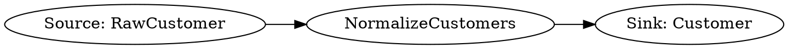

# Graphviz

Pipelantic can generate **Graphviz** diagrams from a validated Pipeline Plan.

Graphviz is well suited for complex pipeline graphs, detailed lineage views,
publication-quality diagrams, and programmatic export to formats such as SVG,
PNG, and PDF. Like every Pipelantic visualization, Graphviz output is derived
from the canonical Pipeline Plan rather than handwritten diagram source.

## Purpose

Graphviz generation supports:

- Complex pipeline DAGs
- Detailed data lineage
- Contract relationship graphs
- Subpipeline expansion
- Dependency analysis
- Architecture documentation
- Publication-ready exports

## Philosophy

Visualizations should be generated from the validated model.

```text
Pipeline
    │
    ▼
Validation
    │
    ▼
Planning
    │
    ▼
Pipeline Plan (IR)
    │
    ▼
Graphviz Generator
    │
    ▼
DOT / SVG / PNG / PDF
```

The diagram is a view of the pipeline semantics, not a separate source of truth.

## Why Graphviz?

Graphviz provides:

- Mature graph layout algorithms
- Strong support for large DAGs
- Multiple export formats
- Fine-grained styling
- Stable text-based DOT source
- Good automation support

It complements Mermaid by offering more control for complex or
publication-quality output.

## Pipeline Graphs

A simple generated DOT graph may resemble:



Each node should correspond to a stable Pipeline Plan identity.

## Lineage Graphs

Graphviz can represent lineage at several levels:

- Dataset
- Transformation
- Field
- Pipeline
- Contract

A lineage graph may show how multiple sources and transformations contribute to
one published output.

## Subpipelines

Subpipelines may be represented with Graphviz clusters.

```dot
subgraph cluster_customer_curation {
    label="Customer Curation";

    normalize;
    validate;
}
```

Generated views may be:

- Collapsed
- Expanded
- Mixed

The public subpipeline boundary must remain visible in every view.

## Contract Relationships

Graphviz may also show relationships between:

- ODCS data contracts
- DTCS transformation contracts
- DPCS pipeline contracts
- Plugin and runtime bindings

These views are useful for architecture and governance reviews.

## Generation API

Conceptually:

```python
dot = pipeline.to_graphviz()
```

or:

```python
dot = plan.to_graphviz()
```

The generator should consume the validated Pipeline Plan.

## Export Formats

A Graphviz integration may export:

- DOT
- SVG
- PNG
- PDF

DOT should remain the canonical generated source because it is text-based and
friendly to version control.

## Layout

Pipelantic may support Graphviz layout engines such as:

- `dot` for directed graphs
- `neato` for relationship graphs
- `fdp` for force-directed layouts
- `sfdp` for large graphs

The default pipeline view should use a directed layout appropriate for DAGs.

## Styling

Generated diagrams should distinguish logical node categories such as:

- Sources
- Steps
- Sinks
- Subpipelines
- Data contracts
- Transformation contracts
- Pipeline contracts

Styling should remain consistent and deterministic.

Runtime-specific styling should be optional and must not replace logical
semantics.

## Stable Identifiers

Graphviz node identifiers should derive from stable Pipeline Plan identities,
not display labels or serialization order.

Display labels may change without changing graph identity.

## Determinism

Equivalent Pipeline Plans should produce semantically equivalent DOT output.

Generators should use stable ordering for:

- Nodes
- Edges
- Clusters
- Attributes

This minimizes unnecessary version-control changes.

## Large Pipelines

For large graphs, Pipelantic should support:

- Filtering by source or sink
- Limiting traversal depth
- Collapsing subpipelines
- Grouping by domain
- Grouping by contract
- Highlighting impact paths
- Exporting focused subgraphs

These options affect presentation only.

## Diagnostics

Visualization generation may produce diagnostics for:

- Missing labels
- Invalid graph references
- Unsupported layout features
- Unresolved contract references
- Graphviz executable availability

Visualization failures must not change the Pipeline Plan.

## CI/CD

A typical documentation workflow is:

1. Validate the pipeline.
2. Build the Pipeline Plan.
3. Generate DOT.
4. Render SVG or PNG.
5. Publish documentation.

Generated Graphviz artifacts may also be attached to releases or architecture
review documents.

## Mermaid and Graphviz

Pipelantic should support both formats.

### Mermaid

Best for:

- Markdown documentation
- GitHub rendering
- Lightweight diagrams
- Simple reviewable output

### Graphviz

Best for:

- Large graphs
- Advanced layout
- Publication-quality exports
- Fine-grained visual control

Both formats must derive from the same Pipeline Plan.

## Best Practices

- Generate DOT from validated Pipeline Plans.
- Keep node identities stable.
- Store DOT when reviewable source is useful.
- Use SVG for documentation.
- Collapse subpipelines in high-level views.
- Keep logical and runtime views distinct.

## Anti-Patterns

Avoid:

- Maintaining DOT manually.
- Deriving graphs from execution logs alone.
- Using display labels as node identities.
- Allowing Graphviz layout choices to imply pipeline semantics.
- Producing different logical graphs for different execution backends.

## Key Principle

> Graphviz is a rendering target for the canonical Pipeline Plan. It provides
> detailed and publication-quality views without becoming a separate pipeline
> definition or source of truth.

## Next Step

Continue with **HTML.md** to learn how Pipelantic can generate navigable,
self-contained pipeline documentation from contracts, lineage, diagnostics, and
visualizations.
