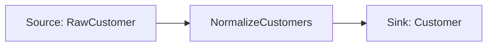
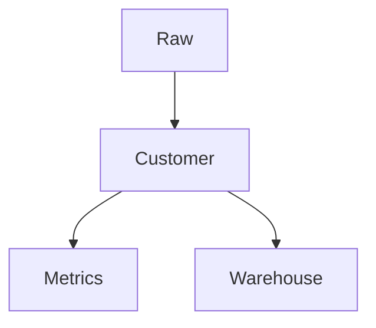
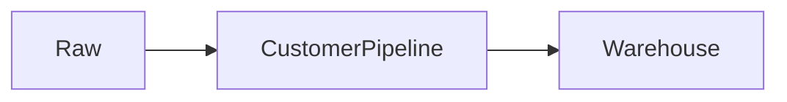
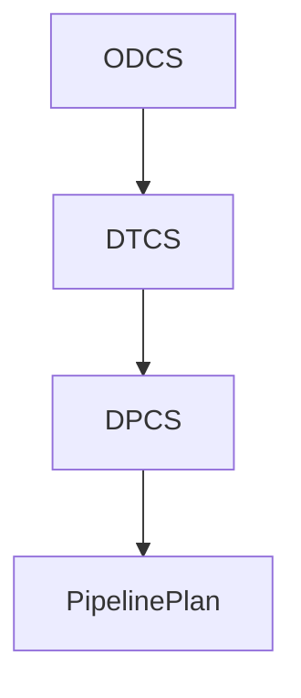

# Mermaid

Pipelantic can generate **Mermaid** diagrams directly from a validated
Pipeline Plan.

Mermaid provides a lightweight, text-based diagram format that renders in
Markdown viewers, documentation sites, GitHub, GitLab, and many IDEs. Because
Mermaid diagrams are generated from the Pipeline Plan, they always reflect the
validated logical model rather than handwritten documentation.

## Purpose

Mermaid generation enables:

- Pipeline DAG visualization
- Data lineage diagrams
- Contract relationship diagrams
- Subpipeline visualization
- Architecture documentation
- CI-generated documentation

## Philosophy

Never hand-maintain diagrams.

Always generate them.

```text
Pipeline
    │
    ▼
Validation
    │
    ▼
Planning
    │
    ▼
Pipeline Plan (IR)
    │
    ▼
Mermaid Generator
    │
    ▼
Markdown Documentation
```

## Why Mermaid?

Mermaid offers:

- Plain text source
- Git-friendly diffs
- Wide documentation support
- Easy code review
- Deterministic output
- Version control friendliness

## Pipeline Graphs

Example:



Every node corresponds to a stable identity in the Pipeline Plan.

## Lineage Diagrams

Mermaid can visualize lineage.



Logical lineage remains independent of runtime execution.

## Subpipelines

Subpipelines may be rendered:

- Collapsed
- Expanded
- Hybrid

Collapsed example:



Expanded views expose internal steps while preserving the same semantics.

## Contract Relationships

Mermaid may illustrate relationships among standards.



## Generation

Conceptually:

```python
diagram = pipeline.to_mermaid()
```

or

```python
diagram = plan.to_mermaid()
```

Generation should always use the validated Pipeline Plan.

## Determinism

Equivalent Pipeline Plans should produce equivalent Mermaid output.

Stable ordering and node identifiers improve documentation reviews and reduce
unnecessary version-control diffs.

## Styling

Generated diagrams should:

- Use stable identifiers
- Label nodes clearly
- Minimize edge crossings where practical
- Group subpipelines consistently
- Avoid runtime-specific details

## CI/CD

Mermaid generation is well suited for automation:

1. Validate
2. Plan
3. Generate Mermaid
4. Commit or publish documentation

## Best Practices

- Generate diagrams automatically.
- Keep diagrams derived from the Pipeline Plan.
- Use stable node identities.
- Store generated diagrams with documentation.
- Prefer logical names over implementation details.

## Anti-Patterns

Avoid:

- Editing generated Mermaid manually.
- Generating diagrams from runtime logs.
- Embedding orchestrator-specific nodes.
- Maintaining separate hand-drawn pipeline diagrams.

## Key Principle

> Mermaid diagrams are another view of the canonical Pipeline Plan. They provide
> lightweight, version-controlled documentation that stays synchronized with
> pipeline semantics through automatic generation.

## Next Step

Continue with **GRAPHVIZ.md** to learn about generating publication-quality
graph visualizations from the same Pipeline Plan.
