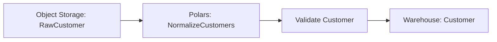

# Airflow Pipeline

!!! warning "Future design—not a ETLantic 0.14 API guide"
    This page is a design study. It may describe packages, commands, or
    interfaces beyond the shipped API surface. Prefer Current Capabilities,
    the runnable examples under `examples/`, the API reference, and the CLI
    reference for installable behavior.


This example builds a complete ETLantic pipeline that validates and plans a
typed data workflow, then compiles the resulting Pipeline Plan into an Apache
Airflow DAG.

The example demonstrates Airflow as an orchestration backend rather than a
pipeline authoring model. Pipeline authors define portable contracts,
transformations, sources, steps, and sinks. The Airflow plugin translates the
validated plan into Airflow tasks while preserving DPCS semantics.

## Goal

Build a pipeline that:

1. Reads customer data from object storage.
2. Normalizes the records with a typed transformation.
3. Validates the curated output.
4. Publishes the result to a warehouse.
5. Defines scheduling intent through a profile.
6. Compiles the Pipeline Plan into an Airflow DAG.
7. Preserves retries, dependencies, callbacks, and lineage.
8. Generates ODCS, DTCS, DPCS, and documentation artifacts.

## Architecture

```text
Portable Pipeline
       │
       ▼
Validation
       │
       ▼
Pipeline Plan
       │
       ▼
Airflow Compilation
       │
       ▼
Airflow DAG
```

The logical workflow remains:

```text
RawCustomer
      │
      ▼
NormalizeCustomers
      │
      ▼
Customer
```

Airflow coordinates execution but does not define the pipeline semantics.

## Project Structure

```text
airflow-pipeline/
├── pyproject.toml
├── src/
│   └── airflow_pipeline/
│       ├── __init__.py
│       ├── contracts.py
│       ├── transformations.py
│       ├── implementations.py
│       ├── pipeline.py
│       └── profiles.py
├── dags/
│   └── customer_pipeline.py
├── contracts/
│   ├── data/
│   ├── transformations/
│   └── pipelines/
├── docs/
└── tests/
    ├── test_pipeline.py
    └── test_airflow_compilation.py
```

## Step 1 — Define the Data Contracts

```python
# src/airflow_pipeline/contracts.py

from typing import Annotated

from pydantic import Field

from etlantic import DataContractModel


class RawCustomer(DataContractModel):
    customer_id: Annotated[int, Field(strict=True, gt=0)]
    first_name: str
    last_name: str
    email: str


class Customer(DataContractModel):
    customer_id: Annotated[int, Field(strict=True, gt=0)]
    full_name: str
    email: str
```

The contracts are independent of Airflow.

## Step 2 — Define the Transformation Contract

```python
# src/airflow_pipeline/transformations.py

from etlantic import Input, Output, Parameter, Transformation

from .contracts import Customer, RawCustomer


class NormalizeCustomers(Transformation):
    customers: Input[RawCustomer]
    lowercase_email: Parameter[bool] = True
    result: Output[Customer]
```

The transformation contract describes the interface and semantics, not the
orchestrator.

## Step 3 — Add an Execution Implementation

This example uses Polars for transformation execution.

```python
# src/airflow_pipeline/implementations.py

import polars as pl

from .transformations import NormalizeCustomers


@NormalizeCustomers.implementation("polars")
def normalize_customers(
    customers: pl.LazyFrame,
    lowercase_email: bool,
) -> pl.LazyFrame:
    email = pl.col("email").str.strip_chars()

    if lowercase_email:
        email = email.str.to_lowercase()

    return customers.select(
        pl.col("customer_id"),
        pl.concat_str(
            [
                pl.col("first_name").str.strip_chars(),
                pl.col("last_name").str.strip_chars(),
            ],
            separator=" ",
        ).alias("full_name"),
        email.alias("email"),
    )
```

Airflow coordinates the step.

The Polars plugin executes the transformation.

## Step 4 — Define the Pipeline

```python
# src/airflow_pipeline/pipeline.py

from etlantic import Extract, Load, Pipeline

from .contracts import Customer, RawCustomer
from .transformations import NormalizeCustomers


class CustomerAirflowPipeline(Pipeline):
    raw: Extract[RawCustomer] = Extract(
        asset="customers_input",
    )

    normalized = NormalizeCustomers.step(
        customers=raw,
        lowercase_email=True,
    )

    curated: Load[Customer] = Load(
        input=normalized.result,
        asset="customers_output",
    )
```

The pipeline contains no `DAG`, `Operator`, `TaskGroup`, or Airflow decorator.

## Step 5 — Define the Airflow Profile

```python
# src/airflow_pipeline/profiles.py

from etlantic import Profile


production = Profile(
    name="production",
    orchestrator="airflow",
    dataframe_engine="polars",
    schedule={
        "type": "cron",
        "expression": "0 2 * * *",
        "timezone": "UTC",
        "catchup": False,
    },
    execution={
        "retries": 3,
        "retry_delay_seconds": 300,
        "timeout_seconds": 3600,
        "max_active_runs": 1,
    },
    assets={
        "customers_input": {
            "plugin": "s3-parquet",
            "resource": "data_lake",
            "path": "raw/customers/",
            "lazy": True,
        },
        "customers_output": {
            "plugin": "postgresql",
            "resource": "analytics_warehouse",
            "schema": "curated",
            "table": "customers",
            "write_mode": "replace",
        },
    },
    resources={
        "data_lake": {
            "provider": "s3",
            "credential": "data-lake-access",
        },
        "analytics_warehouse": {
            "provider": "postgresql",
            "credential": "analytics-warehouse-access",
        },
    },
)
```

The profile supplies scheduling and environment bindings without changing the
logical pipeline.

## Scheduling Intent

The profile expresses portable scheduling intent.

```text
Daily at 02:00 UTC
Catch-up disabled
One active run
```

The Airflow plugin maps that intent to Airflow configuration.

Airflow-specific syntax should remain inside the plugin.

## Step 6 — Validate the Pipeline

```python
from airflow_pipeline.pipeline import CustomerAirflowPipeline


report = CustomerAirflowPipeline.validate()
report.raise_for_errors()
```

Definition validation should verify:

- Source and sink declarations
- Transformation compatibility
- Contract references
- Graph integrity
- Step identity
- Public interface

## Step 7 — Validate the Airflow Profile

```python
from airflow_pipeline.pipeline import CustomerAirflowPipeline
from airflow_pipeline.profiles import production


profile_report = CustomerAirflowPipeline.validate_profile(
    production,
)
profile_report.raise_for_errors()
```

Capability validation should verify:

- The Airflow plugin is installed.
- The selected Airflow version is supported.
- Cron scheduling is available.
- Retries and timeouts are supported.
- The Polars implementation is available.
- Resource and storage bindings resolve.
- Required callbacks and failure semantics can be preserved.
- The target environment supports the required execution model.

## Step 8 — Build the Pipeline Plan

```python
plan = CustomerAirflowPipeline.plan(
    profile=production,
)
```

The plan should contain:

```text
Pipeline identity:
- customer-airflow-pipeline

Schedule:
- 0 2 * * *
- UTC
- catchup false

Steps:
- read customers
- normalize customers
- validate customer output
- publish customers

Execution:
- retries 3
- retry delay 300 seconds
- timeout 3600 seconds
```

## Step 9 — Compile to Airflow

```python
compiled = plan.compile(
    target="airflow",
)
```

The compiled artifact may expose:

```python
dag = compiled.dag
```

or generate a DAG module:

```python
compiled.write(
    "dags/customer_pipeline.py",
)
```

The exact API may evolve.

The compiled DAG remains derived from the Pipeline Plan.

## Generated DAG Structure

Conceptually:

```text
customer_airflow_pipeline
    │
    ├── read_customers
    │       │
    │       ▼
    ├── normalize_customers
    │       │
    │       ▼
    ├── validate_customers
    │       │
    │       ▼
    └── publish_customers
```

Each Airflow task should retain the corresponding stable ETLantic identity.

## Example Generated DAG Module

A generated module may resemble:

```python
from airflow import DAG

from etlantic_airflow import load_compiled_pipeline


dag: DAG = load_compiled_pipeline(
    pipeline="airflow_pipeline.pipeline:CustomerAirflowPipeline",
    profile="airflow_pipeline.profiles:production",
)
```

This lightweight loader pattern avoids duplicating the pipeline graph manually
inside the DAG file.

Another plugin implementation may emit a fully expanded DAG module.

## Task Mapping

ETLantic steps may compile into:

- Python tasks
- Deferrable operators
- External job tasks
- Spark submission tasks
- SQL execution tasks
- Storage transfer tasks
- Task groups
- Sensors

The selected task type depends on the compiled execution plan.

## Task Groups

Subpipelines may compile into Airflow `TaskGroup` structures.

```text
customer_curation
    ├── normalize
    ├── validate
    └── publish
```

Task groups are a presentation and coordination mechanism.

They do not replace subpipeline identity or DPCS semantics.

## Dynamic Task Mapping

The plugin may use dynamic task mapping when the Pipeline Plan explicitly
contains compatible dynamic behavior.

Dynamic mapping should not be inferred from arbitrary runtime data when doing so
would alter pipeline semantics.

## Dependencies

Airflow dependencies must reflect the Pipeline Plan graph.

```text
read_customers
      │
      ▼
normalize_customers
      │
      ▼
validate_customers
      │
      ▼
publish_customers
```

The plugin must not infer dependency order from source-code declaration order.

## Retries

The profile requests:

```text
retries: 3
retry delay: 300 seconds
```

The Airflow plugin maps these values to task or DAG configuration while
preserving sink idempotency requirements.

Retries should not be enabled blindly for non-idempotent writes.

## Timeouts

The plugin may map timeout requirements to:

- Execution timeout
- Sensor timeout
- DAG run timeout
- External job timeout

The selected mapping should preserve the intended failure semantics.

## Failure Handling

Portable failure semantics may include:

- Fail step
- Fail pipeline
- Retry
- Quarantine invalid data
- Invoke compensation
- Route to a recovery pipeline

The Airflow plugin maps supported semantics to Airflow behavior.

Unsupported mandatory semantics should fail compilation.

## Callbacks

ETLantic callbacks may map to:

- Task failure callbacks
- Task retry callbacks
- DAG success callbacks
- DAG failure callbacks
- External notification hooks

Only standardized callback behavior should become part of DPCS.

Environment-specific notification code belongs in bindings or plugin
configuration.

## Invalid-Data Quarantine

A validation step may produce:

```text
Valid customers ─────► publish customers
Invalid customers ───► quarantine sink
```

The Airflow plugin should preserve both branches and their dependencies.

## Resource Bindings

Airflow should not own resource semantics.

The compiled tasks use ETLantic Resource Providers for:

- Object storage
- Databases
- Secrets
- Spark sessions
- External services

Airflow connections may be used as one Resource Provider implementation.

## Airflow Connections

A profile may resolve a logical resource through an Airflow connection.

Conceptually:

```python
"analytics_warehouse": {
    "provider": "airflow-connection",
    "connection_id": "analytics_warehouse",
}
```

The pipeline should not contain the Airflow connection ID.

## Airflow Variables

Airflow Variables may provide operational configuration.

They should not become the canonical source for:

- Contract identity
- Pipeline topology
- Transformation semantics
- Required schema

Use them only for environment-specific settings.

## Secrets Backends

Airflow may integrate with secret backends.

The plugin should support approved backends without exposing secret values in:

- DAG source
- Pipeline Plans
- Contracts
- Logs
- Diagnostics
- Documentation

## XCom

Large datasets should not pass through XCom.

Tasks should exchange:

- Typed dataset references
- Storage locations
- Contract identities
- Small metadata
- Run identifiers

The data itself should remain in storage or an execution backend.

## Dataset References

Conceptually:

```python
DatasetReference[
    Customer
](
    binding="normalized_customers",
)
```

The Airflow plugin may serialize a lightweight reference through XCom.

## Local vs. External Execution

An Airflow task may:

- Execute locally in the worker
- Submit a Spark job
- Run a SQL statement
- Invoke a remote service
- Coordinate a storage operation

The Pipeline Plan determines the execution implementation.

Airflow remains the coordinator.

## Deferrable Operators

The plugin should use deferrable operators when:

- Waiting on external jobs
- Waiting on files or events
- Monitoring long-running remote execution
- Supported by the target Airflow version

Deferral is an optimization and resource-management choice.

## Sensors

Portable event or dependency intent may compile into sensors.

The plugin should avoid embedding vendor-specific sensor behavior into pipeline
contracts.

## Pools and Queues

Profiles may bind execution requirements to:

- Airflow pools
- Queues
- Worker classes
- Kubernetes executor settings

These are environment-specific scheduling controls.

## Concurrency

The plugin should map portable concurrency requirements to:

- `max_active_runs`
- Task concurrency
- Pools
- Executor capacity
- Dynamic task limits

The target environment must still satisfy the requested semantics.

## Compilation Diagnostics

Compilation should report:

- Task mapping
- Unsupported capabilities
- Retry safety
- Schedule translation
- Callback translation
- Resource requirements
- Generated DAG identity
- Airflow version compatibility

Example:

```text
PMAIRFLOW207

Pipeline: customer-airflow-pipeline
Step: publish-customers
Phase: compilation

The sink uses append semantics and is not declared idempotent.
Automatic task retries cannot be enabled safely.

Suggested actions:
- Use a staging-and-swap publication strategy.
- Declare an idempotency key.
- Disable retries for this step.
```

## Step 10 — Inspect the Compiled DAG

Conceptually:

```python
print(
    compiled.explain()
)
```

The report may include:

- DAG ID
- Schedule
- Task IDs
- Task groups
- Dependencies
- Retry settings
- Timeouts
- Pools
- Resource providers
- Execution implementations
- Callback mappings

## Step 11 — Test DAG Import

```python
from airflow.models import DagBag


def test_dag_imports() -> None:
    dag_bag = DagBag(
        dag_folder="dags/",
        include_examples=False,
    )

    assert not dag_bag.import_errors
    assert "customer_airflow_pipeline" in dag_bag.dags
```

A generated DAG must import successfully in the supported Airflow environment.

## Step 12 — Test the Portable Pipeline

```python
def test_pipeline_is_valid() -> None:
    report = CustomerAirflowPipeline.validate()
    assert report.valid, report.diagnostics
```

Pipeline validation should run without importing Airflow where practical.

## Step 13 — Test Compilation

```python
def test_airflow_compilation() -> None:
    plan = CustomerAirflowPipeline.plan(
        profile=production,
    )

    compiled = plan.compile(
        target="airflow",
    )

    assert compiled.dag_id == "customer_airflow_pipeline"
    assert compiled.task_ids == {
        "read_customers",
        "normalize_customers",
        "validate_customers",
        "publish_customers",
    }
```

The exact compiler test API may evolve.

## Step 14 — Test Dependencies

```python
def test_airflow_dependencies() -> None:
    compiled = CustomerAirflowPipeline.plan(
        profile=production,
    ).compile(
        target="airflow",
    )

    assert compiled.dependencies == {
        "normalize_customers": {"read_customers"},
        "validate_customers": {"normalize_customers"},
        "publish_customers": {"validate_customers"},
    }
```

Tests should validate graph semantics rather than only textual DAG output.

## Step 15 — Generate Contracts

```python
CustomerAirflowPipeline.write_contracts(
    "contracts/",
)
```

Expected output:

```text
contracts/
├── data/
│   ├── raw-customer.odcs.yaml
│   └── customer.odcs.yaml
├── transformations/
│   └── normalize-customers.dtcs.yaml
└── pipelines/
    └── customer-airflow-pipeline.dpcs.yaml
```

The DPCS artifact should describe scheduling intent and execution requirements
without embedding Airflow-specific Python APIs.

## Step 16 — Generate Documentation

```python
plan.write_html(
    "docs/customer-airflow-pipeline.html",
    self_contained=True,
)
```

Profile-aware documentation may include:

- Airflow compilation target
- DAG ID
- Schedule mapping
- Task graph
- Retry settings
- Timeout settings
- Resource bindings
- Capability checks
- Redacted Airflow connection references

## Step 17 — Generate Mermaid

```python
plan.write_mermaid(
    "docs/customer-airflow-lineage.mmd",
)
```

Example:



The diagram reflects logical pipeline semantics, not Airflow internals.

## Airflow Deployment

The generated DAG module may be deployed through:

- Git synchronization
- Container image
- Managed Airflow package
- Composer environment
- MWAA deployment
- Astronomer deployment
- Organization-specific release tooling

Deployment is outside the portable pipeline model.

## Version Compatibility

The Airflow plugin should publish compatibility for:

- ETLantic
- Plugin SDK
- Airflow
- Python
- Supported executors
- Supported providers
- Deferrable operator support
- Dynamic mapping support

Compilation should fail early for unsupported combinations.

## Airflow Executors

The same compiled DAG may run under:

- LocalExecutor
- CeleryExecutor
- KubernetesExecutor
- CeleryKubernetesExecutor
- Managed-Airflow executor variants

Executor selection belongs to the Airflow environment.

The Pipeline Plan may express resource requirements that the executor must
satisfy.

## Dataset-Aware Scheduling

Future profiles may express dataset-triggered scheduling.

Conceptually:

```python
schedule={
    "type": "dataset",
    "inputs": ["raw.customers"],
}
```

The Airflow plugin may map this to Airflow dataset scheduling when supported.

## Backfills

Portable backfill intent may include:

- Date range
- Partition key
- Catch-up policy
- Maximum concurrency
- Reprocessing behavior

The Airflow plugin should preserve idempotency and publication semantics during
backfills.

## Observability

The plugin may emit or link:

- DAG run ID
- Task instance IDs
- Airflow log links
- Retry history
- Duration
- Queue time
- Worker identity
- External job references

These supplement ETLantic's structured execution events.

## Lineage

Logical lineage comes from the Pipeline Plan.

The Airflow plugin may enrich runtime lineage with:

- DAG run identity
- Task instance identity
- Airflow dataset events
- Physical source and sink locations
- External job identifiers
- Publication commit metadata

## Security

The Airflow integration should enforce:

- No credentials in DAG source
- No secrets in XCom
- Redacted diagnostics
- Least-privilege connections
- Restricted DAG serialization
- Safe generated identifiers
- Controlled callback imports
- Secure log handling

## Failure Recovery

Airflow retries, clears, and backfills can re-execute tasks.

The plugin should preserve:

- Step idempotency metadata
- Checkpoint boundaries
- Sink transaction behavior
- Compensation requirements
- Quarantine semantics
- Stable run attribution

## Best Practices

- Keep Airflow APIs out of pipeline definitions.
- Compile from validated Pipeline Plans.
- Use stable task identities.
- Pass dataset references, not large data, through XCom.
- Validate retry safety.
- Keep schedules and environment bindings in profiles.
- Use Resource Providers for connections and secrets.
- Test DAG import and dependency structure.
- Generate contracts and documentation from the same plan.
- Preserve logical lineage through task mapping.

## Anti-Patterns

Avoid:

- Writing the pipeline directly as an Airflow DAG.
- Importing Airflow operators into transformation contracts.
- Passing dataframes through XCom.
- Embedding connection IDs in portable pipeline definitions.
- Enabling retries for non-idempotent sinks without safeguards.
- Treating task declaration order as dependency order.
- Rebuilding pipeline semantics inside generated DAG code.
- Hiding unsupported capabilities during compilation.
- Using Airflow Variables as contract definitions.
- Making Airflow the source of truth.

## Key Principle

> Airflow is an orchestration target for ETLantic. The Airflow plugin
> compiles a validated Pipeline Plan into a DAG while preserving contracts,
> dependencies, retries, failure semantics, lineage, and observable behavior.

## Next Step

Continue with [Multi-Output](MULTI_OUTPUT.md) to model explicit fan-out from one
typed transformation.
