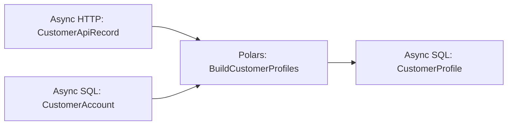

# Async Pipelines

This example demonstrates how Pipelantic coordinates asynchronous and
synchronous work within one validated pipeline.

Async execution is especially useful for I/O-bound operations such as:

- HTTP APIs
- Object storage
- Databases
- Message brokers
- Remote services
- Secret providers
- Notifications
- Concurrent independent branches

Pipelantic allows pipeline authors to combine `async def` and ordinary
`def` implementations without manually managing event loops, thread pools, or
callback scheduling.

## Goal

Build a pipeline that:

1. Reads customer records from an asynchronous HTTP source.
2. Reads account metadata from an asynchronous database source.
3. Joins and normalizes the datasets with a synchronous Polars transformation.
4. Publishes the curated result through an asynchronous sink.
5. Invokes synchronous and asynchronous callbacks.
6. Executes independent I/O operations concurrently.
7. Preserves typed contracts, retries, lineage, and diagnostics.
8. Generates ODCS, DTCS, and DPCS artifacts.

## Architecture

```text
Async HTTP Source ───────┐
                         ├──► Sync Polars Transformation ───► Async SQL Sink
Async Database Source ───┘
```

The execution model may coordinate:

```text
await HTTP read
await database read
        │
        ▼
run synchronous transformation safely
        │
        ▼
await output validation and write
```

## Project Structure

```text
async-pipelines/
├── pyproject.toml
├── src/
│   └── async_pipelines/
│       ├── __init__.py
│       ├── contracts.py
│       ├── transformations.py
│       ├── implementations.py
│       ├── callbacks.py
│       ├── pipeline.py
│       └── profiles.py
├── contracts/
├── docs/
└── tests/
    ├── test_async_pipeline.py
    ├── test_concurrency.py
    └── test_mixed_sync_async.py
```

## Step 1 — Define the Data Contracts

```python
# src/async_pipelines/contracts.py

from typing import Annotated

from pydantic import Field

from pipelantic import DataContractModel


class CustomerApiRecord(DataContractModel):
    customer_id: Annotated[int, Field(strict=True, gt=0)]
    first_name: str
    last_name: str
    email: str


class CustomerAccount(DataContractModel):
    customer_id: Annotated[int, Field(strict=True, gt=0)]
    account_status: str
    account_tier: str


class CustomerProfile(DataContractModel):
    customer_id: Annotated[int, Field(strict=True, gt=0)]
    full_name: str
    email: str
    account_status: str
    account_tier: str
```

The contracts remain independent of HTTP clients, async database drivers,
Polars, and the destination database.

## Step 2 — Define the Transformation Contract

```python
# src/async_pipelines/transformations.py

from pipelantic import Input, Output, Transformation

from .contracts import (
    CustomerAccount,
    CustomerApiRecord,
    CustomerProfile,
)


class BuildCustomerProfiles(Transformation):
    customers: Input[CustomerApiRecord]
    accounts: Input[CustomerAccount]
    result: Output[CustomerProfile]
```

The transformation interface does not declare whether its implementation is
sync or async.

## Step 3 — Add a Synchronous Polars Implementation

```python
# src/async_pipelines/implementations.py

import polars as pl

from .transformations import BuildCustomerProfiles


@BuildCustomerProfiles.implementation("polars")
def build_customer_profiles(
    customers: pl.LazyFrame,
    accounts: pl.LazyFrame,
) -> pl.LazyFrame:
    normalized_customers = customers.select(
        pl.col("customer_id"),
        pl.concat_str(
            [
                pl.col("first_name").str.strip_chars(),
                pl.col("last_name").str.strip_chars(),
            ],
            separator=" ",
        ).alias("full_name"),
        pl.col("email")
        .str.strip_chars()
        .str.to_lowercase()
        .alias("email"),
    )

    return (
        normalized_customers
        .join(
            accounts,
            on="customer_id",
            how="inner",
        )
        .select(
            "customer_id",
            "full_name",
            "email",
            "account_status",
            "account_tier",
        )
    )
```

The transformation remains synchronous and CPU-bound.

Pipelantic coordinates it safely inside the async pipeline.

## Step 4 — Define Async Source Implementations

Conceptually, the source plugins expose async reads.

```python
from pipelantic.sources import SourceReadContext


async def read_customer_api(
    context: SourceReadContext,
):
    response = await context.http.get(
        "/customers",
    )
    response.raise_for_status()
    return response.json()
```

An async database source may use an async driver:

```python
async def read_customer_accounts(
    context: SourceReadContext,
):
    return await context.database.fetch_all(
        '''
        SELECT
            customer_id,
            account_status,
            account_tier
        FROM customer_accounts
        '''
    )
```

Source behavior belongs in plugins and bindings rather than the pipeline class.

## Step 5 — Define Async and Sync Callbacks

```python
# src/async_pipelines/callbacks.py

from pipelantic.callbacks import (
    PipelineFailureContext,
    PipelineSuccessContext,
    RetryContext,
)


def log_retry(
    context: RetryContext,
) -> None:
    print(
        f"Retrying {context.step_id}: "
        f"attempt {context.next_attempt}"
    )


async def report_success(
    context: PipelineSuccessContext,
) -> None:
    await context.metrics.publish(
        "customer-profile-pipeline.completed",
        tags={
            "pipeline": context.pipeline_id,
        },
    )


async def report_failure(
    context: PipelineFailureContext,
) -> None:
    await context.notifications.send(
        channel="data-operations",
        message=(
            f"Pipeline {context.pipeline_id} failed "
            f"with diagnostic {context.diagnostic_code}"
        ),
    )
```

Pipelantic invokes each callback according to its declaration style.

## Step 6 — Define the Pipeline

```python
# src/async_pipelines/pipeline.py

from pipelantic import Pipeline, Sink, Source

from .callbacks import (
    log_retry,
    report_failure,
    report_success,
)
from .contracts import (
    CustomerAccount,
    CustomerApiRecord,
    CustomerProfile,
)
from .transformations import BuildCustomerProfiles


class CustomerProfilePipeline(Pipeline):
    customers: Source[CustomerApiRecord] = Source(
        binding="customer_api",
        on_retry=log_retry,
    )

    accounts: Source[CustomerAccount] = Source(
        binding="customer_accounts",
        on_retry=log_retry,
    )

    profiles = BuildCustomerProfiles.step(
        customers=customers,
        accounts=accounts,
    )

    output: Sink[CustomerProfile] = Sink(
        input=profiles.result,
        binding="customer_profiles",
        on_retry=log_retry,
    )

    callbacks = {
        "on_success": report_success,
        "on_failure": report_failure,
    }
```

The pipeline topology remains identical whether execution is synchronous or
asynchronous.

## Step 7 — Define the Async Profile

```python
# src/async_pipelines/profiles.py

from pipelantic import Profile


production = Profile(
    name="production",
    orchestrator="local-python",
    dataframe_engine="polars",
    execution={
        "mode": "async",
        "maximum_concurrency": 8,
        "maximum_attempts": 3,
        "retry_delay_seconds": 2,
    },
    bindings={
        "customer_api": {
            "plugin": "http-json",
            "resource": "customer_service",
            "path": "/customers",
        },
        "customer_accounts": {
            "plugin": "async-postgresql",
            "resource": "account_database",
            "query": '''
                SELECT
                    customer_id,
                    account_status,
                    account_tier
                FROM customer_accounts
            ''',
        },
        "customer_profiles": {
            "plugin": "async-postgresql",
            "resource": "analytics_database",
            "schema": "curated",
            "table": "customer_profiles",
            "write_mode": "replace",
        },
    },
    resources={
        "customer_service": {
            "provider": "async-http",
            "base_url": "https://customer.internal",
        },
        "account_database": {
            "provider": "async-postgresql",
            "credential": "account-database-access",
        },
        "analytics_database": {
            "provider": "async-postgresql",
            "credential": "analytics-database-access",
        },
        "metrics": {
            "provider": "async-metrics",
        },
        "notifications": {
            "provider": "async-notifications",
        },
    },
)
```

Credentials remain in external secret providers.

## Step 8 — Validate the Pipeline

```python
from async_pipelines.pipeline import CustomerProfilePipeline


report = CustomerProfilePipeline.validate()
report.raise_for_errors()
```

Definition validation should verify:

- Source and sink contracts
- Transformation compatibility
- Graph integrity
- Callback signatures
- Stable step identities

## Step 9 — Validate the Profile

```python
from async_pipelines.pipeline import CustomerProfilePipeline
from async_pipelines.profiles import production


profile_report = CustomerProfilePipeline.validate_profile(
    production,
)
profile_report.raise_for_errors()
```

Capability validation should verify:

- Both source plugins support async reads.
- The sink plugin supports async writes.
- The Polars implementation exists.
- Sync transformation invocation is supported in async mode.
- Callback resources resolve.
- The concurrency limit is valid.
- Retry and timeout semantics can be preserved.

## Step 10 — Build the Pipeline Plan

```python
plan = CustomerProfilePipeline.plan(
    profile=production,
)
```

The plan should expose execution styles:

```text
customer_api:
- async source read

customer_accounts:
- async source read

build_customer_profiles:
- synchronous Polars transformation

customer_profiles:
- async sink write
```

## Concurrent Source Reads

The two source reads are independent.

Pipelantic may execute them concurrently:

```text
┌───────────────────┐
│ await customer API│
└───────────────────┘
          │
          ├── concurrent
          │
┌───────────────────────┐
│ await account database│
└───────────────────────┘
          │
          ▼
both inputs available
```

This reduces total I/O wait time.

## Dependency-Aware Concurrency

Concurrency is allowed only when graph dependencies permit it.

```text
A ───┐
     ├──► C
B ───┘
```

`A` and `B` may run concurrently.

`C` waits for both.

## Step 11 — Execute Asynchronously

```python
result = await CustomerProfilePipeline.arun(
    profile=production,
)
```

`arun()` is the primary API for async-aware applications.

## Synchronous Entry Point

A synchronous application may still use:

```python
result = CustomerProfilePipeline.run(
    profile=production,
)
```

Pipelantic may manage the event loop internally when safe.

It should reject nested-loop misuse rather than attempting unsafe behavior.

## Event Loop Ownership

The framework should distinguish:

- No event loop is running.
- A user-owned event loop is running.
- An orchestrator owns the loop.
- A notebook owns the loop.
- A remote worker owns the loop.

`arun()` is preferred when the caller already runs asynchronously.

## Sync Transformation Invocation

The Polars transformation is synchronous.

Pipelantic may invoke it:

- Directly, when it is short and non-blocking for the execution context.
- Through a worker thread.
- Through a process worker.
- Through an execution plugin-specific strategy.

The selected strategy should be visible in the plan.

## Blocking I/O in Sync Functions

A synchronous function that performs blocking network or database I/O should
not run directly on the event-loop thread.

Bad:

```python
def read_remote_data():
    return requests.get(...).json()
```

Prefer an async source plugin or an explicitly isolated sync implementation.

## CPU-Bound Work

CPU-heavy synchronous work may block one async worker.

The execution profile may select:

```python
execution={
    "sync_strategy": "process",
}
```

Possible strategies include:

- Inline
- Thread
- Process
- Backend-managed worker

The strategy affects execution, not transformation semantics.

## Async Transformation Implementations

A transformation may also be async:

```python
@EnrichCustomers.implementation("async-http")
async def enrich_customers(
    customers,
    client,
):
    ...
```

Pipelantic awaits it directly.

Async transformations are most appropriate for I/O-bound enrichment rather than
dataframe computation.

## Async Generators

Future plugins may support async iterators for streaming bounded data:

```python
async def read_batches():
    yield batch
```

Batch and backpressure semantics must be explicit before selection.

## Resource Lifecycle

Async Resource Providers may use async context management.

Conceptually:

```python
async with provider.acquire(...) as resource:
    ...
```

Pipelantic should guarantee release on:

- Success
- Failure
- Cancellation
- Retry
- Timeout

## Step-Scoped Resources

Some resources should live only for one step:

- HTTP request session
- Database transaction
- Temporary file handle

## Run-Scoped Resources

Others may live for the entire pipeline run:

- Shared HTTP client
- Connection pool
- Metrics client
- Notification client

The provider declares lifecycle scope.

## Async Context Managers

A provider may implement:

```python
async def __aenter__(self):
    ...

async def __aexit__(self, exc_type, exc, tb):
    ...
```

The execution layer handles these lifecycle methods automatically.

## Connection Pools

Async database providers should use bounded pools.

Profile settings may include:

```python
"pool_min_size": 1,
"pool_max_size": 8,
```

Pool capacity should align with pipeline concurrency.

## Concurrency Limits

The profile may define:

```python
"maximum_concurrency": 8
```

Pipelantic should apply limits to prevent:

- API overload
- Database exhaustion
- Excessive memory use
- Too many open files
- Rate-limit violations

## Per-Resource Limits

Resource Providers may expose stricter limits.

For example:

```text
HTTP client: 8 concurrent requests
Database pool: 4 concurrent connections
Sink: 1 publication at a time
```

The scheduler should respect all active constraints.

## Backpressure

When producers are faster than consumers, Pipelantic should avoid unbounded
buffering.

Possible strategies include:

- Bounded queues
- Batch limits
- Source throttling
- Concurrency reduction
- Streaming checkpoints

Backpressure semantics should be plugin-defined.

## Timeouts

Profiles may configure:

- Source timeout
- Transformation timeout
- Sink timeout
- Callback timeout
- Pipeline timeout

Conceptually:

```python
execution={
    "source_timeout_seconds": 30,
    "sink_timeout_seconds": 60,
}
```

Timeouts should produce structured diagnostics and trigger cleanup.

## Cancellation

Cancellation should propagate through:

- Pending async tasks
- HTTP requests
- Database operations
- Sink writes
- Callbacks
- Resource providers

Sync work running in a thread may not stop immediately.

The plan should document cancellation limitations.

## Structured Concurrency

Pipelantic should prefer structured concurrency principles:

- Child tasks belong to a pipeline or step scope.
- Failures are collected predictably.
- Cancellation propagates downward.
- Resources close when the scope exits.
- No orphan background tasks remain.

## Failure Propagation

Suppose the account source fails while the customer API succeeds.

The planner should follow the declared policy:

```text
customer API succeeds
account database fails
        │
        ▼
cancel or retain sibling result
        │
        ▼
retry or fail source step
```

Successful sibling work may be reused only when the retry and resource semantics
permit it.

## Retries

Async retries should not use blocking `time.sleep()`.

The execution layer uses asynchronous delay.

Callbacks should observe retries rather than sleep manually.

## Retry Classification

Potentially retryable async failures include:

- Connection reset
- Timeout
- Rate limiting
- Temporary DNS failure
- Database serialization error
- Service unavailable

Non-retryable failures often include:

- Invalid schema
- Contract incompatibility
- Authentication failure
- Missing permission
- Invalid query

## Retry Jitter

Profiles may configure jitter to avoid synchronized retries.

Conceptually:

```python
retry={
    "strategy": "exponential",
    "base_seconds": 1,
    "maximum_seconds": 30,
    "jitter": True,
}
```

Retry configuration belongs in execution policy.

## Idempotency

Async sink retries must consider idempotency.

For example:

- Replace through staging may be safe.
- Append may duplicate records.
- Upsert may be safe with stable keys.
- HTTP publication may require an idempotency key.

The execution plan should record retry safety.

## Callback Execution

Sync callbacks may run inline or through the configured sync strategy.

Async callbacks are awaited.

A callback failure follows the configured callback failure policy.

## Callback Concurrency

Independent callbacks may run concurrently when:

- Their events are independent.
- No ordering guarantee is required.
- Resource limits allow it.

Pipeline outcome callbacks run after the terminal state is determined.

## Validation

Validation may include both sync and async work.

Examples:

- Sync dataframe schema validation
- Async registry lookup
- Async remote contract resolution
- Async sink compatibility check

Definition validation should remain executable without runtime I/O where
possible.

## Planning vs. Runtime I/O

Planning should avoid unnecessary remote calls.

Capabilities and metadata may be loaded from cached or provider-declared
information.

Runtime acquisition performs actual network and database connections.

## Materialization

The HTTP and database sources materialize bounded datasets before the Polars
join.

```text
Async I/O
   │
   ▼
In-memory frames
   │
   ▼
Polars transformation
```

For very large inputs, use SQL, PySpark, chunked processing, or streaming instead.

## Async Does Not Mean Distributed

Async execution improves I/O concurrency.

It does not automatically provide:

- Parallel CPU execution
- Distributed memory
- Cluster execution
- Large-scale data processing

Choose PySpark or another distributed backend when required.

## Observability

The runtime may emit:

- Task scheduled
- Task waiting
- Task started
- Task completed
- Concurrency slot acquired
- Resource acquired
- Resource released
- Retry delayed
- Cancellation requested
- Timeout
- Callback awaited

## Diagnostics

An async diagnostic should identify:

- Pipeline
- Step
- Execution style
- Task identity
- Resource
- Timeout
- Cancellation status
- Attempt
- Failure category
- Suggested remediation

Example:

```text
PMASYNC302

Pipeline: customer-profile-pipeline
Step: customer-accounts
Execution: async source read

The database operation exceeded its 30-second timeout.
The connection was cancelled and returned to the pool.
Attempt 2 of 3 will begin after asynchronous backoff.
```

## Lineage

Logical lineage remains:

```text
CustomerApiRecord + CustomerAccount
                 │
                 ▼
       BuildCustomerProfiles
                 │
                 ▼
          CustomerProfile
```

Runtime lineage may add:

- API endpoint identity
- Database source table
- Request or query identifiers
- Sink table
- Execution task IDs
- Materialization references

## Step 12 — Generate Contracts

```python
CustomerProfilePipeline.write_contracts(
    "contracts/",
)
```

Expected output:

```text
contracts/
├── data/
│   ├── customer-api-record.odcs.yaml
│   ├── customer-account.odcs.yaml
│   └── customer-profile.odcs.yaml
├── transformations/
│   └── build-customer-profiles.dtcs.yaml
└── pipelines/
    └── customer-profile-pipeline.dpcs.yaml
```

Sync or async implementation style should not redefine the logical contracts.

## Step 13 — Generate Documentation

```python
plan.write_html(
    "docs/customer-profile-pipeline.html",
    self_contained=True,
)
```

Profile-aware documentation may include:

- Async source steps
- Sync transformation step
- Async sink
- Concurrency opportunities
- Resource limits
- Timeout policies
- Retry behavior
- Callback execution style
- Cancellation support

## Step 14 — Generate Mermaid

```python
plan.write_mermaid(
    "docs/customer-profile-lineage.mmd",
)
```

Example:



## Testing the Async Pipeline

```python
import pytest


@pytest.mark.asyncio
async def test_async_pipeline(
    async_test_profile,
) -> None:
    result = await CustomerProfilePipeline.arun(
        profile=async_test_profile,
    )

    assert result.success
```

## Testing Concurrent Sources

```python
import asyncio
import time

import pytest


@pytest.mark.asyncio
async def test_sources_run_concurrently(
    delayed_source_profile,
) -> None:
    started = time.perf_counter()

    await CustomerProfilePipeline.arun(
        profile=delayed_source_profile,
    )

    duration = time.perf_counter() - started

    assert duration < 1.8
```

If both sources each take one second and are independent, total time should be
closer to one second than two.

Timing tests should use generous bounds and deterministic fake providers.

## Testing Mixed Sync and Async

```python
@pytest.mark.asyncio
async def test_sync_transformation_inside_async_pipeline(
    mixed_profile,
    execution_recorder,
) -> None:
    await CustomerProfilePipeline.arun(
        profile=mixed_profile,
    )

    assert execution_recorder.style(
        "build-customer-profiles"
    ) == "sync-worker"
```

## Testing Cancellation

```python
@pytest.mark.asyncio
async def test_pipeline_cancellation(
    slow_profile,
) -> None:
    task = asyncio.create_task(
        CustomerProfilePipeline.arun(
            profile=slow_profile,
        )
    )

    await asyncio.sleep(0.05)
    task.cancel()

    with pytest.raises(asyncio.CancelledError):
        await task
```

The test providers should verify that acquired resources were released.

## Testing Retry Without Blocking

```python
@pytest.mark.asyncio
async def test_async_retry(
    transient_failure_profile,
    retry_recorder,
) -> None:
    result = await CustomerProfilePipeline.arun(
        profile=transient_failure_profile,
    )

    assert result.success
    assert retry_recorder.attempts == 2
```

## Testing Resource Cleanup

```python
@pytest.mark.asyncio
async def test_resources_close_on_failure(
    failing_profile,
    resource_recorder,
) -> None:
    await CustomerProfilePipeline.arun(
        profile=failing_profile,
        raise_on_failure=False,
    )

    assert resource_recorder.all_released
```

## Notebook Environments

Notebook environments often already run an event loop.

Use:

```python
result = await CustomerProfilePipeline.arun(
    profile=production,
)
```

Do not wrap it with `asyncio.run()`.

## Web Applications

Inside FastAPI or another async framework:

```python
@app.post("/run-pipeline")
async def run_pipeline():
    result = await CustomerProfilePipeline.arun(
        profile=production,
    )
    return result.summary()
```

Long-running pipelines should normally use a job system rather than remain tied
to one HTTP request.

## Airflow Integration

Airflow may coordinate an async-capable pipeline through:

- A synchronous task that owns the run loop
- Deferrable operators
- Remote execution
- An async-aware plugin mechanism

The Airflow plugin determines the correct mapping.

## Async Source Fan-Out

A pipeline may fetch multiple independent APIs concurrently.

The profile should enforce:

- Global concurrency limit
- Per-host limit
- Rate limits
- Retry policy
- Timeout
- Circuit breaker where supported

## Circuit Breakers

Resource plugins may support circuit breakers for failing remote services.

Circuit-breaker state is operational and should not become pipeline semantics.

## Rate Limiting

An async HTTP provider may implement token-bucket or leaky-bucket limits.

The execution planner should respect provider-declared throughput constraints.

## Bounded Queues

For batched or streaming async workflows, bounded queues can prevent unbounded
memory growth.

Queue size is execution configuration.

## Security

Async execution should enforce:

- External credentials
- Redacted errors
- TLS verification
- Connection cleanup
- Controlled cancellation
- Safe callback resources
- No task leakage
- No secrets in task names or diagnostics

## Best Practices

- Use `arun()` in async applications.
- Keep I/O in async plugins and resources.
- Keep CPU-heavy work out of the event-loop thread.
- Let Pipelantic coordinate sync and async implementations.
- Use bounded concurrency.
- Configure timeouts and retries explicitly.
- Preserve resource cleanup on every exit path.
- Use typed callback contexts.
- Make backend transitions visible.
- Test concurrency with deterministic fakes.
- Treat async as I/O concurrency, not distributed computing.

## Anti-Patterns

Avoid:

- Calling `asyncio.run()` inside a running event loop.
- Using blocking HTTP or database clients in async steps.
- Calling `time.sleep()` in async callbacks.
- Starting orphan background tasks.
- Creating unbounded task fan-out.
- Sharing one mutable client without provider guarantees.
- Retrying non-idempotent writes blindly.
- Running CPU-heavy transforms directly on the event loop.
- Assuming async means parallel CPU execution.
- Skipping cancellation and cleanup tests.

## Key Principle

> Async pipelines let Pipelantic overlap independent I/O while safely
> coordinating synchronous transformations, typed resources, callbacks,
> retries, timeouts, cancellation, validation, and lineage through one
> execution model.

## Next Step

Continue with [Contract-First](CONTRACT_FIRST.md) to build a pipeline from
portable ODCS, DTCS, and DPCS artifacts.
