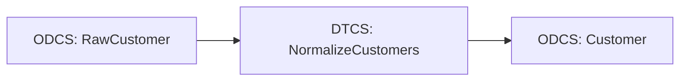

# Contract-First Pipeline

!!! warning "Future design—not a Pipelantic 0.5 API guide"
    This page is a design study. It may describe packages, commands, or
    interfaces that are not installable yet. Use Current Capabilities, the
    runnable examples under `examples/`, the API reference, and the CLI
    reference for shipped behavior.


This example demonstrates how to build a Pipelantic project from authored
ODCS, DTCS, and DPCS contract artifacts rather than starting from Python
classes.

Contract-first development is useful when:

- Contracts are reviewed before implementation.
- Multiple teams share language-neutral specifications.
- Governance requires approved artifacts.
- Pipelines are generated or implemented by different teams.
- Registries are the source of contract identity and versioning.
- Python is one implementation target among several.

Pipelantic should support both directions:

```text
Code-first
Python models ───► ODCS / DTCS / DPCS
```

and:

```text
Contract-first
ODCS / DTCS / DPCS ───► Typed Pipelantic objects
```

The two workflows should converge on the same normalized internal models and
validated Pipeline Plan.

## Goal

Build a pipeline that:

1. Authors a customer data contract in ODCS.
2. Authors a normalization transformation in DTCS.
3. Authors a CSV-to-Parquet pipeline in DPCS.
4. Loads all three artifacts into Pipelantic.
5. Generates or binds typed Python interfaces.
6. Registers a Polars implementation.
7. Validates implementation conformance.
8. Plans and executes the pipeline.
9. Generates documentation and lineage.
10. Detects contract drift and version incompatibility.

## Architecture

```text
ODCS ─────┐
          │
DTCS ─────┼──► Contract Loader ───► Normalized Models
          │                              │
DPCS ─────┘                              ▼
                                  Implementation Binding
                                           │
                                           ▼
                                      Pipeline Plan
                                           │
                              ┌────────────┼────────────┐
                              ▼            ▼            ▼
                          Execution    Documentation   Lineage
```

## Project Structure

```text
contract-first/
├── pyproject.toml
├── contracts/
│   ├── data/
│   │   ├── raw-customer.odcs.yaml
│   │   └── customer.odcs.yaml
│   ├── transformations/
│   │   └── normalize-customers.dtcs.yaml
│   └── pipelines/
│       └── customer-curation.dpcs.yaml
├── data/
│   └── customers.csv
├── output/
│   └── customers/
├── src/
│   └── contract_first/
│       ├── __init__.py
│       ├── generated/
│       │   ├── contracts.py
│       │   ├── transformations.py
│       │   └── pipelines.py
│       ├── implementations.py
│       └── profiles.py
├── docs/
└── tests/
    ├── test_contract_loading.py
    ├── test_implementation_conformance.py
    └── test_pipeline.py
```

## Step 1 — Author the Raw Customer ODCS Contract

Create `contracts/data/raw-customer.odcs.yaml`:

```yaml
apiVersion: odcs/v1
kind: DataContract

id: raw-customer
version: 1.0.0

info:
  title: Raw Customer
  description: Customer records as received from the source CSV.
  owner: customer-platform
  domain: customer

schema:
  type: object
  properties:
    customer_id:
      type: integer
    first_name:
      type: string
    last_name:
      type: string
    email:
      type:
        - string
        - "null"

  required:
    - customer_id
    - first_name
    - last_name
    - email
```

The exact ODCS syntax should follow the supported ODCS version.

The example focuses on the Pipelantic workflow rather than redefining the
normative standard.

## Step 2 — Author the Curated Customer ODCS Contract

Create `contracts/data/customer.odcs.yaml`:

```yaml
apiVersion: odcs/v1
kind: DataContract

id: customer
version: 1.0.0

info:
  title: Customer
  description: Normalized customer record.
  owner: customer-platform
  domain: customer

schema:
  type: object
  properties:
    customer_id:
      type: integer
      minimum: 1

    full_name:
      type: string
      minLength: 1

    email:
      type: string
      minLength: 1

  required:
    - customer_id
    - full_name
    - email
```

This artifact defines the output data contract independently of Python.

## Step 3 — Author the DTCS Transformation Contract

Create `contracts/transformations/normalize-customers.dtcs.yaml`:

```yaml
apiVersion: dtcs/v1
kind: TransformationContract

id: normalize-customers
version: 1.0.0

info:
  title: Normalize Customers
  description: Builds a full name and normalizes customer email addresses.
  owner: customer-platform

inputs:
  customers:
    contract:
      id: raw-customer
      version: 1.0.0

parameters:
  lowercase_email:
    type: boolean
    default: true

  trim_whitespace:
    type: boolean
    default: true

outputs:
  result:
    contract:
      id: customer
      version: 1.0.0

semantics:
  deterministic: true
  side_effects: none
```

The DTCS contract defines the transformation interface and portable semantics.

It does not contain Polars, Pandas, SQL, or PySpark code.

## Step 4 — Author the DPCS Pipeline Contract

Create `contracts/pipelines/customer-curation.dpcs.yaml`:

```yaml
apiVersion: dpcs/v1
kind: PipelineContract

id: customer-curation
version: 1.0.0

info:
  title: Customer Curation
  description: Reads raw customers, normalizes them, and publishes curated data.
  owner: customer-platform
  domain: customer

sources:
  raw_customers:
    contract:
      id: raw-customer
      version: 1.0.0
    binding: customers_input

steps:
  normalize:
    transformation:
      id: normalize-customers
      version: 1.0.0
    inputs:
      customers:
        source: raw_customers
    parameters:
      lowercase_email: true
      trim_whitespace: true

sinks:
  curated_customers:
    contract:
      id: customer
      version: 1.0.0
    input:
      step: normalize
      output: result
    binding: customers_output
```

The DPCS artifact defines the logical graph.

It does not contain physical paths, credentials, or execution-engine details.

## Step 5 — Load the Contract Project

Conceptually:

```python
from pipelantic.contracts import ContractProject


project = ContractProject.load(
    "contracts/",
)
```

The loader should:

- Discover ODCS, DTCS, and DPCS artifacts.
- Parse supported formats.
- Validate syntax.
- Resolve references.
- Normalize versions.
- Build typed internal models.
- Report structured diagnostics.

## Loader Result

Conceptually:

```python
project.data_contracts
project.transformations
project.pipelines
project.diagnostics
```

The project should expose contract identities rather than raw dictionaries.

## Step 6 — Validate the Contract Graph

```python
report = project.validate()
report.raise_for_errors()
```

Validation should verify:

- Every referenced contract exists.
- Every referenced version is compatible.
- Every pipeline step references a valid transformation.
- Step input names match DTCS inputs.
- Step parameter names and values are valid.
- Sink input contracts match step output contracts.
- Identifiers are unique.
- The pipeline graph is acyclic.

## Missing Reference Example

Suppose DPCS references:

```yaml
contract:
  id: customer
  version: 2.0.0
```

but only `customer@1.0.0` exists.

Pipelantic should emit a structured diagnostic rather than silently selecting
another version.

Example:

```text
PMCONTRACT404

Pipeline: customer-curation@1.0.0
Reference: customer@2.0.0

The referenced data contract could not be resolved.
Available versions:
- customer@1.0.0
```

## Step 7 — Generate Typed Python Models

Pipelantic may generate typed Python interfaces:

```python
project.generate_python(
    output="src/contract_first/generated/",
)
```

Expected output:

```text
generated/
├── contracts.py
├── transformations.py
└── pipelines.py
```

## Generated Data Models

A generated `contracts.py` may resemble:

```python
from typing import Annotated

from pydantic import Field
from pipelantic import DataContractModel


class RawCustomer(DataContractModel):
    customer_id: int
    first_name: str
    last_name: str
    email: str | None


class Customer(DataContractModel):
    customer_id: Annotated[int, Field(gt=0)]
    full_name: Annotated[str, Field(min_length=1)]
    email: Annotated[str, Field(min_length=1)]
```

Generated code is a projection of the ODCS artifacts.

The contract artifacts remain authoritative in a contract-first project.

## Generated Transformation Interface

A generated `transformations.py` may resemble:

```python
from pipelantic import Input, Output, Parameter, Transformation

from .contracts import Customer, RawCustomer


class NormalizeCustomers(Transformation):
    customers: Input[RawCustomer]
    lowercase_email: Parameter[bool] = True
    trim_whitespace: Parameter[bool] = True
    result: Output[Customer]
```

## Generated Pipeline Interface

A generated `pipelines.py` may resemble:

```python
from pipelantic import Pipeline, Sink, Source

from .contracts import Customer, RawCustomer
from .transformations import NormalizeCustomers


class CustomerCuration(Pipeline):
    raw_customers: Source[RawCustomer] = Source(
        binding="customers_input",
    )

    normalize = NormalizeCustomers.step(
        customers=raw_customers,
        lowercase_email=True,
        trim_whitespace=True,
    )

    curated_customers: Sink[Customer] = Sink(
        input=normalize.result,
        binding="customers_output",
    )
```

The generated code should be deterministic.

## Generated vs. Authored Code

Generated interfaces should live in a dedicated directory.

Avoid manually editing generated files.

Recommended separation:

```text
generated/          # Regenerated from contracts
implementations.py  # Authored execution logic
profiles.py         # Authored environment bindings
```

## Step 8 — Bind a Polars Implementation

Create `src/contract_first/implementations.py`:

```python
import polars as pl

from .generated.transformations import NormalizeCustomers


@NormalizeCustomers.implementation("polars")
def normalize_customers(
    customers: pl.LazyFrame,
    lowercase_email: bool,
    trim_whitespace: bool,
) -> pl.LazyFrame:
    first_name = pl.col("first_name")
    last_name = pl.col("last_name")
    email = pl.col("email")

    if trim_whitespace:
        first_name = first_name.str.strip_chars()
        last_name = last_name.str.strip_chars()
        email = email.str.strip_chars()

    if lowercase_email:
        email = email.str.to_lowercase()

    return customers.select(
        pl.col("customer_id"),
        pl.concat_str(
            [first_name, last_name],
            separator=" ",
        ).alias("full_name"),
        email.alias("email"),
    )
```

The implementation binds to the generated transformation interface.

## Implementation Without Code Generation

Pipelantic may also support direct binding by contract identity.

Conceptually:

```python
@project.transformation(
    "normalize-customers",
    version="1.0.0",
).implementation("polars")
def normalize_customers(...):
    ...
```

This may be useful when teams prefer not to commit generated Python interfaces.

Generated interfaces generally provide stronger editor and type-checker support.

## Step 9 — Validate Implementation Conformance

```python
implementation_report = project.validate_implementations()
implementation_report.raise_for_errors()
```

Conformance validation should verify:

- Required implementation exists.
- Input names match DTCS.
- Parameter names and types match.
- Declared output names match.
- Output can satisfy the referenced ODCS contract.
- Implementation metadata is compatible.
- Backend capabilities satisfy requirements.

## Invalid Signature Example

This implementation should fail conformance:

```python
@NormalizeCustomers.implementation("polars")
def invalid_implementation(
    records,
    lowercase,
):
    ...
```

The parameters do not match the DTCS interface.

## Missing Output Example

A multi-output transformation implementation that omits a required output should
fail before execution.

## Step 10 — Define the Execution Profile

Create `src/contract_first/profiles.py`:

```python
from pipelantic import Profile


local = Profile(
    name="local",
    orchestrator="local-python",
    dataframe_engine="polars",
    bindings={
        "customers_input": {
            "plugin": "csv",
            "path": "data/customers.csv",
            "lazy": True,
        },
        "customers_output": {
            "plugin": "parquet",
            "path": "output/customers/",
            "write_mode": "overwrite",
        },
    },
)
```

The profile supplies physical bindings and execution choices.

It is separate from the DPCS contract.

## Step 11 — Resolve the Pipeline

Conceptually:

```python
pipeline = project.pipeline(
    "customer-curation",
    version="1.0.0",
)
```

The returned object should behave like a normalized Pipelantic pipeline.

## Step 12 — Validate the Profile

```python
profile_report = pipeline.validate_profile(
    local,
)
profile_report.raise_for_errors()
```

Validation should verify:

- Source and sink bindings resolve.
- The Polars implementation is available.
- CSV and Parquet plugins are installed.
- Type mappings preserve contract semantics.
- Required execution capabilities exist.

## Step 13 — Build the Pipeline Plan

```python
plan = pipeline.plan(
    profile=local,
)
```

The Pipeline Plan should be equivalent to the plan produced by an equivalent
code-first definition.

## Canonical Normalization

Both workflows should converge:

```text
Contract-first artifacts
          │
          ▼
Normalized Pipelantic objects
          │
          ▼
Pipeline Plan
```

and:

```text
Code-first Python classes
          │
          ▼
Normalized Pipelantic objects
          │
          ▼
Pipeline Plan
```

Downstream planning, execution, visualization, and documentation should not care
which authoring path was used.

## Step 14 — Execute

```python
result = pipeline.run(
    profile=local,
)
```

Async orchestration is also available:

```python
result = await pipeline.arun(
    profile=local,
)
```

## Expected Output

The Parquet output should contain:

| customer_id | full_name | email |
|---|---|---|
| 1 | Ada Lovelace | ada@example.com |
| 2 | Grace Hopper | grace@example.com |
| 3 | Alan Turing | alan@example.com |

## Step 15 — Generate Documentation

```python
plan.write_html(
    "docs/customer-curation.html",
    self_contained=True,
)
```

Documentation should link:

- Raw customer ODCS
- Customer ODCS
- Normalize Customers DTCS
- Customer Curation DPCS
- Bound Polars implementation
- Execution profile
- Lineage
- Validation diagnostics

## Step 16 — Generate Mermaid

```python
plan.write_mermaid(
    "docs/customer-curation.mmd",
)
```

Example:



## Step 17 — Regenerate Contracts from the Normalized Model

Pipelantic may support round-trip export:

```python
project.write_contracts(
    "build/contracts/",
)
```

The generated artifacts should be semantically equivalent to the loaded
artifacts.

Formatting and field order may differ unless canonical serialization is
enabled.

## Canonical Serialization

A canonical serializer should provide stable:

- Key ordering
- Reference formatting
- Version representation
- Identifier normalization
- Optional-field behavior

This supports deterministic diffs and registries.

## Round-Trip Testing

A useful invariant is:

```text
load
  │
  ▼
normalize
  │
  ▼
serialize
  │
  ▼
load again
```

The second normalized model should be semantically equivalent to the first.

## Contract-First Source of Truth

In this workflow, the contract artifacts are authoritative.

Generated Python files should include a warning such as:

```python
# Generated from contracts. Do not edit manually.
```

Implementation files remain authored.

## Preventing Drift

Pipelantic should detect when generated Python no longer matches the source
contracts.

Conceptually:

```bash
pipelantic generate --check
```

CI should fail if regeneration changes committed generated files.

## Contract Drift

Contract drift occurs when:

- A contract artifact changes without regenerating interfaces.
- An implementation signature no longer matches DTCS.
- A pipeline references an outdated output.
- A profile binds a removed source or sink.
- Documentation reflects an older contract version.

The validation and generation workflow should detect these conditions.

## Versioning

Contract-first projects should reference explicit versions.

Prefer:

```yaml
id: customer
version: 1.0.0
```

Avoid unpinned references such as:

```yaml
id: customer
version: latest
```

Aliases such as `latest` may be useful for browsing but should not be the
canonical dependency identity.

## Compatible Upgrades

Suppose `customer@1.1.0` adds an optional field.

Pipelantic may determine that:

- The output implementation can still satisfy the contract.
- Existing consumers remain compatible.
- The DPCS pipeline may upgrade within the allowed range.

Version ranges should be explicit if supported.

## Breaking Upgrades

Suppose `customer@2.0.0` removes `email`.

The planner should not silently upgrade.

The project should require:

- DTCS update
- Implementation update
- DPCS update
- Consumer impact review
- Migration documentation

## Registry Loading

Contracts may come from a registry.

Conceptually:

```python
project = ContractProject.load(
    registry="company-contracts",
    pipeline="customer-curation@1.0.0",
)
```

The registry plugin should resolve all transitive references.

## Offline Builds

A registry-backed project should support locked offline builds.

Conceptually:

```text
contract-lock.yaml
```

The lock may record:

- Contract IDs
- Versions
- Digests
- Registry locations
- Specification versions

## Contract Lock File

Example concept:

```yaml
contracts:
  raw-customer@1.0.0:
    digest: sha256:...
  customer@1.0.0:
    digest: sha256:...
  normalize-customers@1.0.0:
    digest: sha256:...
  customer-curation@1.0.0:
    digest: sha256:...
```

Digests detect mutable or replaced artifacts.

## Security

Contract loaders should treat artifacts as untrusted input.

Requirements include:

- Safe YAML parsing
- No arbitrary code execution
- Restricted external references
- Digest verification
- Schema validation
- Maximum file and graph sizes
- Redacted diagnostics
- Approved registry origins

Loading a contract must never import arbitrary Python code.

## Extension Fields

Standards may allow extension fields.

Pipelantic should preserve supported extensions without letting them override
core semantics silently.

Vendor extensions should be namespaced.

## Code Generation Safety

Generated names should be:

- Valid Python identifiers
- Collision safe
- Stable
- Derived from canonical identities
- Escaped or transformed deterministically

The generator should report collisions rather than silently overwrite classes.

## Naming Example

A contract ID:

```text
customer-order-summary
```

may generate:

```python
class CustomerOrderSummary(...)
```

The mapping should be deterministic and documented.

## Contract Comments and Descriptions

Descriptions may become:

- Python docstrings
- Field descriptions
- Generated documentation
- IDE hints

User-controlled text must be escaped safely in generated source.

## Custom Templates

Advanced projects may configure generation templates.

Templates may control:

- Module layout
- Import style
- Naming conventions
- Docstring format
- Package namespace

Templates must not alter normalized contract semantics.

## Manual Implementations

A team may load contracts without generating code and bind implementations
manually by identity.

This reduces generated files but provides less static typing.

Pipelantic should support both styles.

## Mixed Code-First and Contract-First Projects

A project may contain:

- Contract-first shared data contracts
- Code-first local transformations
- Contract-first published pipelines
- Code-first experimental pipelines

The normalized model should track the source of each artifact.

## Source Metadata

An artifact may record:

- Source file
- Source registry
- Source line
- Authoring mode
- Digest
- Generation timestamp
- Generator version

Source metadata improves diagnostics and governance.

## Conflict Detection

Suppose both a Python class and ODCS artifact define `customer@1.0.0`.

Pipelantic should compare them.

Possible policies include:

- Require semantic equality
- Prefer contract artifact
- Prefer code
- Reject duplicates

The policy must be explicit.

## Semantic Equality

Two representations may differ in formatting while expressing the same contract.

Conflict detection should compare normalized semantics rather than raw text.

## Testing Contract Loading

Create `tests/test_contract_loading.py`:

```python
from pipelantic.contracts import ContractProject


def test_contract_project_loads() -> None:
    project = ContractProject.load(
        "contracts/",
    )

    report = project.validate()

    assert report.valid, report.diagnostics
    assert project.has_data_contract(
        "customer",
        version="1.0.0",
    )
    assert project.has_transformation(
        "normalize-customers",
        version="1.0.0",
    )
    assert project.has_pipeline(
        "customer-curation",
        version="1.0.0",
    )
```

## Testing Generated Code

```python
def test_generated_code_is_current(
    tmp_path,
) -> None:
    project = ContractProject.load(
        "contracts/",
    )

    project.generate_python(
        output=tmp_path,
    )

    assert directories_match(
        tmp_path,
        "src/contract_first/generated/",
    )
```

## Testing Implementation Conformance

```python
def test_polars_implementation_conforms() -> None:
    project = ContractProject.load(
        "contracts/",
    )

    report = project.validate_implementations()

    assert report.valid, report.diagnostics
```

## Testing Execution

```python
def test_contract_first_pipeline(
    tmp_path,
    local_profile,
) -> None:
    project = ContractProject.load(
        "contracts/",
    )

    pipeline = project.pipeline(
        "customer-curation",
        version="1.0.0",
    )

    result = pipeline.run(
        profile=local_profile,
    )

    assert result.success
```

## Testing Round Trips

```python
def test_contract_round_trip(
    tmp_path,
) -> None:
    original = ContractProject.load(
        "contracts/",
    )

    original.write_contracts(
        tmp_path,
        canonical=True,
    )

    reloaded = ContractProject.load(
        tmp_path,
    )

    assert reloaded.semantically_equals(
        original,
    )
```

## Testing Version Conflicts

```python
def test_missing_contract_version_fails() -> None:
    project = ContractProject.load(
        "tests/fixtures/missing-version/",
    )

    report = project.validate()

    assert not report.valid
    assert report.has_diagnostic(
        "PMCONTRACT404",
    )
```

## CI Workflow

A contract-first CI pipeline may run:

1. Validate contract syntax.
2. Resolve references.
3. Verify lock-file digests.
4. Check compatibility.
5. Regenerate Python interfaces.
6. Verify generated files are current.
7. Validate implementation conformance.
8. Build Pipeline Plans.
9. Run tests.
10. Generate documentation.

## CLI Workflow

Conceptually:

```bash
pipelantic contracts validate contracts/
pipelantic contracts lock contracts/
pipelantic generate python contracts/ --output src/generated/
pipelantic implementations validate
pipelantic plan customer-curation@1.0.0 --profile local
pipelantic docs build
```

The exact CLI may evolve.

## Contract-First vs. Code-First

### Contract-first advantages

- Language-neutral artifacts
- Governance before implementation
- Strong registry workflows
- Clear review boundaries
- Easier cross-team integration
- Stable public interfaces

### Code-first advantages

- Fast Python development
- Native editor experience
- Less generation overhead
- Familiar class-based APIs
- Simple experimentation

Pipelantic should not force one workflow.

## Recommended Workflow

A practical pattern is:

```text
Shared public contracts:
- Contract-first

Local implementation details:
- Code-first

Generated typed interfaces:
- Derived from contracts

Execution profiles:
- Environment-specific code or configuration
```

## What This Example Demonstrates

This example shows:

- ODCS authored before Python
- DTCS authored before implementation
- DPCS authored before execution
- Contract graph loading
- Reference resolution
- Typed Python generation
- Implementation binding
- Conformance validation
- Deterministic planning
- Execution through the same Pipeline Plan architecture
- Round-trip serialization
- Contract lock files
- Drift detection
- Version compatibility
- Registry-ready workflows

## Best Practices

- Pin explicit contract versions.
- Keep generated code separate from authored code.
- Validate the complete contract graph.
- Generate deterministic typed interfaces.
- Bind implementations through stable contract identities.
- Check implementation conformance in CI.
- Use lock files for registry-backed builds.
- Detect generated-code drift.
- Keep profiles outside portable contracts.
- Compare normalized semantics, not raw formatting.
- Treat contract files as untrusted input.
- Publish compatibility reports for changes.

## Anti-Patterns

Avoid:

- Editing generated Python files manually.
- Using `latest` as a canonical dependency version.
- Loading YAML with unsafe constructors.
- Embedding Python code inside contract artifacts.
- Silently resolving missing versions.
- Treating generated code as more authoritative than the source contracts.
- Mixing credentials into DPCS bindings.
- Skipping implementation conformance checks.
- Comparing contract files only by text.
- Allowing code-first and contract-first duplicates to conflict silently.
- Publishing mutable artifacts without digests.

## Key Principle

> Contract-first Pipelantic projects author ODCS, DTCS, and DPCS artifacts as
> the portable source of truth, then derive typed interfaces, implementation
> bindings, Pipeline Plans, execution, lineage, and documentation from those
> validated contracts.

## Next Step

Continue with **CODE_FIRST.md** to build the equivalent pipeline from Python
models and generate semantically equivalent ODCS, DTCS, and DPCS artifacts.
