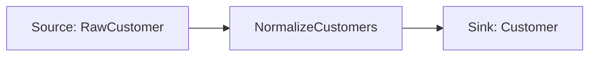

# CSV to CSV

!!! warning "Future design—not a Pipelantic 0.5 API guide"
    This page is a design study. It may describe packages, commands, or
    interfaces that are not installable yet. Use Current Capabilities, the
    runnable examples under `examples/`, the API reference, and the CLI
    reference for shipped behavior.


This example builds a complete Pipelantic pipeline that reads customer data
from a CSV file, validates it against a data contract, normalizes the records
with a typed transformation, and writes the curated results to another CSV file.

The example demonstrates the full Pipelantic lifecycle:

```text
Data Contract
      │
      ▼
Transformation
      │
      ▼
Pipeline
      │
      ▼
Validation
      │
      ▼
Planning
      │
      ▼
Local Execution
      │
      ▼
Generated Contracts and Documentation
```

## Goal

Build a pipeline that:

1. Reads `customers.csv`.
2. Validates each record against `RawCustomer`.
3. Normalizes names and email addresses.
4. Produces `Customer` records.
5. Writes `customers_curated.csv`.
6. Generates ODCS, DTCS, and DPCS artifacts.

## Project Structure

```text
csv-to-csv/
├── pyproject.toml
├── data/
│   ├── customers.csv
│   └── customers_curated.csv
├── src/
│   └── csv_to_csv/
│       ├── __init__.py
│       ├── contracts.py
│       ├── transformations.py
│       ├── implementations.py
│       ├── pipeline.py
│       └── profiles.py
├── contracts/
│   ├── data/
│   ├── transformations/
│   └── pipelines/
└── tests/
    └── test_pipeline.py
```

## Input Data

Create `data/customers.csv`:

```csv
customer_id,first_name,last_name,email
1,Ada,Lovelace,ADA@EXAMPLE.COM
2,Grace,Hopper, grace@example.com
3,Alan,Turing,alan@example.com
```

## Step 1 — Define the Data Contracts

```python
# src/csv_to_csv/contracts.py

from typing import Annotated

from pydantic import Field

from pipelantic import DataContractModel


class RawCustomer(DataContractModel):
    customer_id: Annotated[int, Field(strict=True, gt=0)]
    first_name: str
    last_name: str
    email: str


class Customer(DataContractModel):
    customer_id: Annotated[int, Field(strict=True, gt=0)]
    full_name: str
    email: str
```

`RawCustomer` describes the source records.

`Customer` describes the curated output records.

ContractModel owns the Pydantic validation behavior and ODCS generation for
both models.

## Step 2 — Define the Transformation Contract

```python
# src/csv_to_csv/transformations.py

from pipelantic import Input, Output, Parameter, Transformation

from .contracts import Customer, RawCustomer


class NormalizeCustomers(Transformation):
    customers: Input[RawCustomer]
    lowercase_email: Parameter[bool] = True
    result: Output[Customer]
```

The transformation declares its logical interface without depending on Pandas,
Polars, or any other dataframe engine.

## Step 3 — Add a Polars Implementation

```python
# src/csv_to_csv/implementations.py

import polars as pl

from .transformations import NormalizeCustomers


@NormalizeCustomers.implementation("polars")
def normalize_customers(
    customers: pl.DataFrame,
    lowercase_email: bool,
) -> pl.DataFrame:
    email_expression = pl.col("email").str.strip_chars()

    if lowercase_email:
        email_expression = email_expression.str.to_lowercase()

    return customers.select(
        pl.col("customer_id"),
        pl.concat_str(
            [
                pl.col("first_name").str.strip_chars(),
                pl.col("last_name").str.strip_chars(),
            ],
            separator=" ",
        ).alias("full_name"),
        email_expression.alias("email"),
    )
```

The Polars implementation is runtime-specific.

The transformation contract remains portable.

## Step 4 — Define the Pipeline

```python
# src/csv_to_csv/pipeline.py

from pipelantic import Pipeline, Sink, Source

from .contracts import Customer, RawCustomer
from .transformations import NormalizeCustomers


class CustomerCsvPipeline(Pipeline):
    raw: Source[RawCustomer] = Source(
        binding="customers_input",
    )

    normalized = NormalizeCustomers.step(
        customers=raw,
        lowercase_email=True,
    )

    curated: Sink[Customer] = Sink(
        input=normalized.result,
        binding="customers_output",
    )
```

The pipeline describes the logical flow:

```text
customers_input
      │
      ▼
NormalizeCustomers
      │
      ▼
customers_output
```

The pipeline does not contain file paths or Polars-specific code.

## Step 5 — Define the Local Profile

```python
# src/csv_to_csv/profiles.py

from pipelantic import Profile


local = Profile(
    name="local",
    orchestrator="local-python",
    dataframe_engine="polars",
    bindings={
        "customers_input": {
            "plugin": "csv",
            "path": "data/customers.csv",
        },
        "customers_output": {
            "plugin": "csv",
            "path": "data/customers_curated.csv",
        },
    },
)
```

The exact profile API may evolve, but the responsibility remains the same:
resolve logical bindings and select runtime plugins without changing the
pipeline model.

## Step 6 — Validate the Pipeline

```python
from csv_to_csv.pipeline import CustomerCsvPipeline


report = CustomerCsvPipeline.validate()
report.raise_for_errors()
```

Validation should verify:

- Source and sink declarations
- Graph integrity
- Input and output compatibility
- Transformation parameter values
- Implementation availability
- Profile capability requirements
- Contract references

Validation does not execute the pipeline.

## Step 7 — Build the Pipeline Plan

```python
from csv_to_csv.pipeline import CustomerCsvPipeline
from csv_to_csv.profiles import local


plan = CustomerCsvPipeline.plan(
    profile=local,
)
```

The plan resolves:

- The Polars transformation implementation
- The Local Python orchestrator plugin
- The CSV source and sink plugins
- Validation requirements
- Execution order
- Runtime bindings

The returned Pipeline Plan is the canonical execution-ready intermediate
representation.

## Step 8 — Execute Locally

Synchronous execution:

```python
result = CustomerCsvPipeline.run(
    profile=local,
)
```

Asynchronous execution:

```python
result = await CustomerCsvPipeline.arun(
    profile=local,
)
```

Pipelantic handles sync and async invocation without requiring the pipeline
author to manage event loops or worker coordination manually.

## Expected Output

The pipeline writes `data/customers_curated.csv`:

```csv
customer_id,full_name,email
1,Ada Lovelace,ada@example.com
2,Grace Hopper,grace@example.com
3,Alan Turing,alan@example.com
```

## Step 9 — Generate Contract Artifacts

```python
CustomerCsvPipeline.write_contracts(
    "contracts/",
)
```

Expected output:

```text
contracts/
├── data/
│   ├── raw-customer.odcs.yaml
│   └── customer.odcs.yaml
├── transformations/
│   └── normalize-customers.dtcs.yaml
└── pipelines/
    └── customer-csv-pipeline.dpcs.yaml
```

The Python models remain the code-first source of truth.

The generated artifacts are portable representations suitable for version
control, review, registries, and external tooling.

## Step 10 — Generate a Mermaid Diagram

```python
plan.write_mermaid(
    "docs/customer-csv-pipeline.mmd",
)
```

Generated diagram:



## Step 11 — Generate HTML Documentation

```python
plan.write_html(
    "docs/customer-csv-pipeline.html",
    self_contained=True,
)
```

The documentation may include:

- Pipeline overview
- Data contracts
- Transformation interface
- Source and sink bindings
- Lineage
- Validation results
- Pipeline graph
- Referenced ODCS, DTCS, and DPCS artifacts

## Testing

Create `tests/test_pipeline.py`:

```python
from pathlib import Path

import polars as pl

from csv_to_csv.pipeline import CustomerCsvPipeline
from csv_to_csv.profiles import local


def test_pipeline_is_valid() -> None:
    report = CustomerCsvPipeline.validate()
    assert report.valid, report.diagnostics


def test_pipeline_executes(tmp_path: Path) -> None:
    input_path = tmp_path / "customers.csv"
    output_path = tmp_path / "customers_curated.csv"

    input_path.write_text(
        "customer_id,first_name,last_name,email\n"
        "1,Ada,Lovelace,ADA@EXAMPLE.COM\n",
        encoding="utf-8",
    )

    test_profile = local.with_bindings(
        {
            "customers_input": {
                "plugin": "csv",
                "path": str(input_path),
            },
            "customers_output": {
                "plugin": "csv",
                "path": str(output_path),
            },
        }
    )

    CustomerCsvPipeline.run(
        profile=test_profile,
    )

    output = pl.read_csv(output_path)

    assert output.to_dicts() == [
        {
            "customer_id": 1,
            "full_name": "Ada Lovelace",
            "email": "ada@example.com",
        }
    ]
```

The exact test helpers may evolve, but examples should verify both model validity
and observable runtime behavior.

## Invalid Data Example

Suppose the source contains:

```csv
customer_id,first_name,last_name,email
0,Ada,Lovelace,ADA@EXAMPLE.COM
```

The value `0` violates the `customer_id > 0` constraint.

The configured validation policy determines whether Pipelantic:

- Fails the source
- Rejects the record
- Quarantines the record
- Continues with valid records
- Invokes an invalid-data callback

Invalid output from `NormalizeCustomers` should fail the transformation by
default because it would violate the declared `Output[Customer]` contract.

## What This Example Demonstrates

This example shows:

- ContractModel-compatible Pydantic data contracts
- Typed `Input[T]`, `Parameter[T]`, and `Output[T]`
- A reusable transformation contract
- A Polars implementation
- Logical source and sink bindings
- Profile-driven runtime configuration
- Pipeline validation
- Pipeline planning
- Local Python execution
- ODCS, DTCS, and DPCS generation
- Mermaid and HTML documentation
- Automated tests

## Design Takeaways

The example contains several intentional boundaries:

- CSV paths live in the profile, not the pipeline.
- Polars code lives in the implementation, not the transformation contract.
- Schemas live in `DataContractModel`, not source or sink definitions.
- The pipeline describes topology, not execution mechanics.
- Generated artifacts derive from the validated model.
- Local execution consumes the same Pipeline Plan architecture as external
  orchestrators.

## Key Principle

> Even the smallest CSV pipeline should use the same portable modeling,
> validation, planning, and execution lifecycle as a production pipeline. The
> scale and backend may change; the pipeline semantics do not.

## Next Step

Continue with [CSV to SQL](CSV_TO_SQL.md) to add a persistent relational sink to
the same typed modeling workflow.
