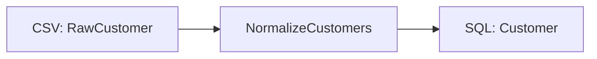

# CSV to SQL

!!! warning "Design study—not a runnable ETLantic 0.18 API guide. Prefer CAPABILITIES and examples/."
    This page is a design study. It may describe packages, commands, or
    interfaces beyond the shipped API surface. Prefer Current Capabilities,
    the runnable examples under `examples/`, the API reference, and the CLI
    reference for installable behavior.


This example builds a complete ETLantic pipeline that reads customer data
from a CSV file, validates it against data contracts, normalizes the records
with a typed transformation, and writes the curated results to a SQL database.

The example demonstrates how ETLantic keeps the logical pipeline unchanged
while execution profiles and plugins supply the physical source, sink, and
dataframe implementations.

## Goal

Build a pipeline that:

1. Reads `customers.csv`.
2. Validates source records against `RawCustomer`.
3. Normalizes names and email addresses.
4. Produces `Customer` records.
5. Writes the curated dataset to a SQL table.
6. Generates ODCS, DTCS, and DPCS artifacts.
7. Executes locally using Polars and SQLite.

## Project Structure

```text
csv-to-sql/
├── pyproject.toml
├── data/
│   └── customers.csv
├── database/
│   └── customers.db
├── src/
│   └── csv_to_sql/
│       ├── __init__.py
│       ├── contracts.py
│       ├── transformations.py
│       ├── implementations.py
│       ├── pipeline.py
│       └── profiles.py
├── contracts/
│   ├── data/
│   ├── transformations/
│   └── pipelines/
├── docs/
└── tests/
    └── test_pipeline.py
```

## Input Data

Create `data/customers.csv`:

```csv
customer_id,first_name,last_name,email
1,Ada,Lovelace,ADA@EXAMPLE.COM
2,Grace,Hopper, grace@example.com
3,Alan,Turing,alan@example.com
```

## Step 1 — Define the Data Contracts

```python
# src/csv_to_sql/contracts.py

from typing import Annotated

from pydantic import Field

from etlantic import DataContractModel


class RawCustomer(DataContractModel):
    customer_id: Annotated[int, Field(strict=True, gt=0)]
    first_name: str
    last_name: str
    email: str


class Customer(DataContractModel):
    customer_id: Annotated[int, Field(strict=True, gt=0)]
    full_name: str
    email: str
```

`RawCustomer` governs the CSV source.

`Customer` governs the curated SQL table.

The contracts remain independent of both CSV and SQL.

## Step 2 — Define the Transformation Contract

```python
# src/csv_to_sql/transformations.py

from etlantic import Input, Output, Parameter, Transformation

from .contracts import Customer, RawCustomer


class NormalizeCustomers(Transformation):
    customers: Input[RawCustomer]
    lowercase_email: Parameter[bool] = True
    result: Output[Customer]
```

The transformation interface defines logical inputs, parameters, and outputs
without depending on a dataframe or database library.

## Step 3 — Add the Polars Implementation

```python
# src/csv_to_sql/implementations.py

import polars as pl

from .transformations import NormalizeCustomers


@NormalizeCustomers.implementation("polars")
def normalize_customers(
    customers: pl.DataFrame,
    lowercase_email: bool,
) -> pl.DataFrame:
    email_expression = pl.col("email").str.strip_chars()

    if lowercase_email:
        email_expression = email_expression.str.to_lowercase()

    return customers.select(
        pl.col("customer_id"),
        pl.concat_str(
            [
                pl.col("first_name").str.strip_chars(),
                pl.col("last_name").str.strip_chars(),
            ],
            separator=" ",
        ).alias("full_name"),
        email_expression.alias("email"),
    )
```

The runtime-specific code is isolated in the implementation module.

## Step 4 — Define the Pipeline

```python
# src/csv_to_sql/pipeline.py

from etlantic import Extract, Load, Pipeline

from .contracts import Customer, RawCustomer
from .transformations import NormalizeCustomers


class CustomerWarehousePipeline(Pipeline):
    raw: Extract[RawCustomer] = Extract(
        asset="customers_csv",
    )

    normalized = NormalizeCustomers.step(
        customers=raw,
        lowercase_email=True,
    )

    curated: Load[Customer] = Load(
        input=normalized.result,
        asset="customers_table",
    )
```

The pipeline describes:

```text
CSV Source
    │
    ▼
NormalizeCustomers
    │
    ▼
SQL Sink
```

Neither the CSV path nor SQL connection string appears in the pipeline class.

## Step 5 — Define the Local Profile

```python
# src/csv_to_sql/profiles.py

from etlantic import Profile


local = Profile(
    name="local",
    orchestrator="local-python",
    dataframe_engine="polars",
    assets={
        "customers_csv": {
            "plugin": "csv",
            "path": "data/customers.csv",
        },
        "customers_table": {
            "plugin": "sql",
            "url": "sqlite:///database/customers.db",
            "table": "customers",
            "write_mode": "replace",
        },
    },
)
```

The profile resolves the logical bindings into concrete runtime configuration.

A production profile could map the same sink binding to PostgreSQL, Snowflake,
or another SQL backend without modifying the pipeline.

## Step 6 — Validate

```python
from csv_to_sql.pipeline import CustomerWarehousePipeline


report = CustomerWarehousePipeline.validate()
report.raise_for_errors()
```

Validation should verify:

- Source and sink declarations
- Graph integrity
- Contract compatibility
- Transformation parameter types
- Implementation availability
- SQL storage plugin availability
- Required profile capabilities

## Step 7 — Plan

```python
from csv_to_sql.pipeline import CustomerWarehousePipeline
from csv_to_sql.profiles import local


plan = CustomerWarehousePipeline.plan(
    profile=local,
)
```

Planning resolves:

- CSV source plugin
- Polars dataframe plugin
- SQL sink plugin
- Local Python orchestrator
- Runtime bindings
- Validation policy
- Execution order

## Step 8 — Execute

Synchronous execution:

```python
result = CustomerWarehousePipeline.run(
    profile=local,
)
```

Asynchronous execution:

```python
result = await CustomerWarehousePipeline.arun(
    profile=local,
)
```

The Local Python execution plugin consumes the same Pipeline Plan architecture
used by external orchestrators.

## Expected SQL Table

The `customers` table should contain:

| customer_id | full_name | email |
|---|---|---|
| 1 | Ada Lovelace | ada@example.com |
| 2 | Grace Hopper | grace@example.com |
| 3 | Alan Turing | alan@example.com |

## SQL Write Modes

The SQL storage plugin may support modes such as:

- `append`
- `replace`
- `fail`
- `merge`
- `upsert`

These are storage-plugin capabilities and profile settings.

They should not alter the `Customer` contract or transformation semantics.

## Transactions

Where supported, the SQL plugin should use transactions to preserve sink
integrity.

Conceptually:

```text
Validate sink input
        │
        ▼
Begin transaction
        │
        ▼
Write records
        │
        ▼
Commit
```

If the write fails:

```text
Write failure
      │
      ▼
Rollback
      │
      ▼
Structured diagnostic
```

Transaction support should be declared through plugin capabilities.

## Schema Creation

The SQL plugin may optionally derive table definitions from `Customer`.

Conceptually:

```python
CustomerWarehousePipeline.run(
    profile=local,
    create_missing_tables=True,
)
```

The exact API may evolve.

ContractModel and the storage plugin should cooperate to map logical contract
types into SQL column types.

Automatic schema creation must report unsupported or lossy mappings rather than
silently changing semantics.

## Contract Validation Before Write

The sink input should be validated against `Customer` before publication.

This protects the SQL table from invalid transformation output.

Recommended default:

```text
Transformation output
        │
        ▼
Validate Customer contract
        │
        ▼
SQL transaction
        │
        ▼
Commit
```

## Step 9 — Generate Contracts

```python
CustomerWarehousePipeline.write_contracts(
    "contracts/",
)
```

Expected output:

```text
contracts/
├── data/
│   ├── raw-customer.odcs.yaml
│   └── customer.odcs.yaml
├── transformations/
│   └── normalize-customers.dtcs.yaml
└── pipelines/
    └── customer-warehouse-pipeline.dpcs.yaml
```

The DPCS artifact references the source, transformation, sink, and associated
ODCS and DTCS contracts without embedding SQLite-specific credentials or
implementation details.

## Step 10 — Generate Lineage

```python
plan.write_mermaid(
    "docs/customer-warehouse-lineage.mmd",
)
```

Example:



The logical lineage is the same whether the destination is SQLite, PostgreSQL,
Snowflake, or another compatible SQL backend.

## Testing

Create `tests/test_pipeline.py`:

```python
from pathlib import Path
import sqlite3

from csv_to_sql.pipeline import CustomerWarehousePipeline
from csv_to_sql.profiles import local


def test_pipeline_is_valid() -> None:
    report = CustomerWarehousePipeline.validate()
    assert report.valid, report.diagnostics


def test_csv_to_sql_pipeline(tmp_path: Path) -> None:
    csv_path = tmp_path / "customers.csv"
    database_path = tmp_path / "customers.db"

    csv_path.write_text(
        "customer_id,first_name,last_name,email\n"
        "1,Ada,Lovelace,ADA@EXAMPLE.COM\n",
        encoding="utf-8",
    )

    test_profile = local.with_bindings(
        {
            "customers_csv": {
                "plugin": "csv",
                "path": str(csv_path),
            },
            "customers_table": {
                "plugin": "sql",
                "url": f"sqlite:///{database_path}",
                "table": "customers",
                "write_mode": "replace",
            },
        }
    )

    CustomerWarehousePipeline.run(
        profile=test_profile,
    )

    with sqlite3.connect(database_path) as connection:
        rows = connection.execute(
            '''
            SELECT customer_id, full_name, email
            FROM customers
            ORDER BY customer_id
            '''
        ).fetchall()

    assert rows == [
        (1, "Ada Lovelace", "ada@example.com"),
    ]
```

The test verifies both pipeline validity and the externally observable SQL
result.

## Production Profile Example

The same pipeline may use PostgreSQL in production:

```python
production = Profile(
    name="production",
    orchestrator="airflow",
    dataframe_engine="polars",
    assets={
        "customers_csv": {
            "plugin": "s3-csv",
            "binding": "raw/customers.csv",
        },
        "customers_table": {
            "plugin": "postgres",
            "resource": "customer_warehouse",
            "schema": "curated",
            "table": "customers",
            "write_mode": "merge",
        },
    },
)
```

The connection credentials belong to a Resource Provider or secret manager, not
the pipeline or DPCS artifact.

## Invalid Data Handling

Invalid source records may be:

- Rejected
- Quarantined
- Logged
- Passed to a callback
- Cause the source step to fail

Invalid transformation output should fail before the SQL write by default.

Example invalid source:

```csv
customer_id,first_name,last_name,email
0,Ada,Lovelace,ADA@EXAMPLE.COM
```

The `customer_id > 0` constraint is violated.

## Write Failure Handling

A SQL write may fail because of:

- Authentication errors
- Network failures
- Missing permissions
- Schema incompatibility
- Constraint violations
- Deadlocks
- Transaction conflicts

The storage plugin should translate backend exceptions into structured
ETLantic diagnostics.

A failure callback may choose a declarative retry or fail action when supported
by the active execution environment.

## What This Example Demonstrates

This example shows:

- CSV source ingestion
- SQL sink publication
- ContractModel-compatible data contracts
- Typed transformation interfaces
- Polars execution
- Logical storage bindings
- Profile-driven environment configuration
- Sink validation
- Transactional write expectations
- Local execution
- SQL verification tests
- ODCS, DTCS, and DPCS generation
- Backend-independent lineage

## Design Takeaways

The logical pipeline does not depend on CSV, SQLite, PostgreSQL, Polars, or
Airflow.

Those technologies appear only in:

- Transformation implementations
- Plugins
- Profiles
- Runtime resources

The portable pipeline remains:

```text
RawCustomer
      │
      ▼
NormalizeCustomers
      │
      ▼
Customer
```

## Key Principle

> A CSV-to-SQL pipeline should remain a portable contract-driven workflow. CSV,
> SQL, Polars, SQLite, PostgreSQL, and Airflow are interchangeable execution and
> storage choices—not part of the pipeline's logical identity.

## Next Step

Continue with [SQL to SQL](SQL_TO_SQL.md) to keep both data and transformation
execution inside a relational engine.
