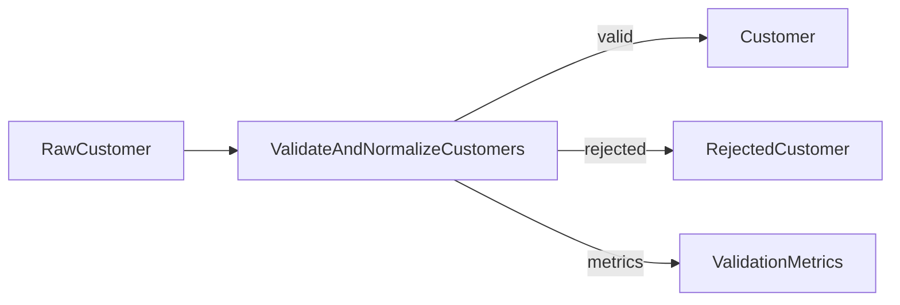

# Multi-Output Pipeline

!!! warning "Future design—not a ETLantic 0.7 API guide"
    This page is a design study. It may describe packages, commands, or
    interfaces that are not installable yet. Use Current Capabilities, the
    runnable examples under `examples/`, the API reference, and the CLI
    reference for shipped behavior.


This example builds a ETLantic pipeline with a transformation that produces
multiple typed outputs.

Multi-output transformations are useful when one logical operation naturally
creates several datasets, such as:

- Valid and invalid records
- Accepted and rejected records
- Facts and dimensions
- Main output and audit output
- Curated data and quality metrics
- Enriched records and unmatched records

Each output has its own contract, lineage, validation policy, and downstream
consumers.

## Goal

Build a pipeline that:

1. Reads raw customer records.
2. Validates and normalizes the records.
3. Produces three named outputs:
   - Valid customers
   - Rejected customers
   - Validation metrics
4. Publishes each output to an independent sink.
5. Preserves output-specific contracts and lineage.
6. Supports partial success without hiding failures.
7. Generates ODCS, DTCS, and DPCS artifacts.

## Architecture

```text
RawCustomer
     │
     ▼
ValidateAndNormalizeCustomers
     │
     ├── valid ───────► Customer sink
     ├── rejected ────► Rejection sink
     └── metrics ─────► Metrics sink
```

The transformation executes once and produces three logical datasets.

## Project Structure

```text
multi-output/
├── pyproject.toml
├── data/
│   └── customers.csv
├── output/
│   ├── valid/
│   ├── rejected/
│   └── metrics/
├── src/
│   └── multi_output/
│       ├── __init__.py
│       ├── contracts.py
│       ├── transformations.py
│       ├── polars_implementations.py
│       ├── pipeline.py
│       └── profiles.py
├── contracts/
│   ├── data/
│   ├── transformations/
│   └── pipelines/
├── docs/
└── tests/
    └── test_pipeline.py
```

## Input Data

Create `data/customers.csv`:

```csv
customer_id,first_name,last_name,email
1,Ada,Lovelace,ADA@EXAMPLE.COM
0,Invalid,Identifier,invalid-id@example.com
2,Grace,Hopper,
3,Alan,Turing,alan@example.com
```

## Step 1 — Define the Data Contracts

```python
# src/multi_output/contracts.py

from typing import Annotated, Literal

from pydantic import Field

from etlantic import DataContractModel


class RawCustomer(DataContractModel):
    customer_id: int
    first_name: str
    last_name: str
    email: str | None


class Customer(DataContractModel):
    customer_id: Annotated[
        int,
        Field(strict=True, gt=0),
    ]
    full_name: str
    email: str


class RejectedCustomer(DataContractModel):
    customer_id: int
    first_name: str
    last_name: str
    email: str | None

    reason_code: Literal[
        "INVALID_CUSTOMER_ID",
        "MISSING_EMAIL",
    ]
    reason: str


class ValidationMetrics(DataContractModel):
    input_count: Annotated[int, Field(ge=0)]
    valid_count: Annotated[int, Field(ge=0)]
    rejected_count: Annotated[int, Field(ge=0)]
```

Each output has a distinct contract and purpose.

## Step 2 — Define the Multi-Output Transformation

```python
# src/multi_output/transformations.py

from etlantic import Input, Output, Transformation

from .contracts import (
    Customer,
    RawCustomer,
    RejectedCustomer,
    ValidationMetrics,
)


class ValidateAndNormalizeCustomers(Transformation):
    customers: Input[RawCustomer]

    valid: Output[Customer]
    rejected: Output[RejectedCustomer]
    metrics: Output[ValidationMetrics]
```

The output names become stable parts of the transformation interface.

## Named Outputs

Downstream steps reference outputs explicitly:

```python
step.valid
step.rejected
step.metrics
```

This is clearer and safer than positional tuples.

Avoid:

```python
valid, rejected, metrics = step
```

Named outputs make generated contracts, diagnostics, and lineage more stable.

## Step 3 — Add the Polars Implementation

```python
# src/multi_output/polars_implementations.py

import polars as pl

from etlantic import TransformationOutputs

from .transformations import ValidateAndNormalizeCustomers


@ValidateAndNormalizeCustomers.implementation("polars")
def validate_and_normalize_customers(
    customers: pl.LazyFrame,
) -> TransformationOutputs:
    normalized = customers.with_columns(
        pl.concat_str(
            [
                pl.col("first_name").str.strip_chars(),
                pl.col("last_name").str.strip_chars(),
            ],
            separator=" ",
        ).alias("full_name"),
        pl.col("email")
        .str.strip_chars()
        .str.to_lowercase()
        .alias("normalized_email"),
    )

    invalid_id = pl.col("customer_id") <= 0
    missing_email = (
        pl.col("normalized_email").is_null()
        | (pl.col("normalized_email") == "")
    )

    valid = (
        normalized
        .filter(~invalid_id & ~missing_email)
        .select(
            "customer_id",
            "full_name",
            pl.col("normalized_email").alias("email"),
        )
    )

    rejected = (
        normalized
        .filter(invalid_id | missing_email)
        .with_columns(
            pl.when(invalid_id)
            .then(pl.lit("INVALID_CUSTOMER_ID"))
            .otherwise(pl.lit("MISSING_EMAIL"))
            .alias("reason_code"),
            pl.when(invalid_id)
            .then(pl.lit("customer_id must be greater than zero"))
            .otherwise(pl.lit("email is required"))
            .alias("reason"),
        )
        .select(
            "customer_id",
            "first_name",
            "last_name",
            "email",
            "reason_code",
            "reason",
        )
    )

    metrics = (
        normalized
        .select(
            pl.len().alias("input_count"),
            (~invalid_id & ~missing_email)
            .sum()
            .alias("valid_count"),
            (invalid_id | missing_email)
            .sum()
            .alias("rejected_count"),
        )
    )

    return TransformationOutputs(
        valid=valid,
        rejected=rejected,
        metrics=metrics,
    )
```

The exact `TransformationOutputs` API may evolve.

Its purpose is to associate each returned dataset with its declared output name.

## Output Type Checking

ETLantic should verify that:

- Every required output is returned.
- No undeclared output is returned.
- Each output is compatible with its declared contract.
- Output names match the transformation declaration.

A missing `metrics` output should fail before downstream execution.

## Step 4 — Define the Pipeline

```python
# src/multi_output/pipeline.py

from etlantic import Pipeline, Sink, Source

from .contracts import (
    Customer,
    RawCustomer,
    RejectedCustomer,
    ValidationMetrics,
)
from .transformations import ValidateAndNormalizeCustomers


class CustomerValidationPipeline(Pipeline):
    raw: Source[RawCustomer] = Source(
        binding="customers_input",
    )

    classified = ValidateAndNormalizeCustomers.step(
        customers=raw,
    )

    valid_customers: Sink[Customer] = Sink(
        input=classified.valid,
        binding="valid_customers_output",
    )

    rejected_customers: Sink[RejectedCustomer] = Sink(
        input=classified.rejected,
        binding="rejected_customers_output",
    )

    validation_metrics: Sink[ValidationMetrics] = Sink(
        input=classified.metrics,
        binding="validation_metrics_output",
    )
```

Each sink consumes one named output.

## Step 5 — Define the Profile

```python
# src/multi_output/profiles.py

from etlantic import Profile


local = Profile(
    name="local",
    orchestrator="local-python",
    dataframe_engine="polars",
    bindings={
        "customers_input": {
            "plugin": "csv",
            "path": "data/customers.csv",
            "lazy": True,
        },
        "valid_customers_output": {
            "plugin": "parquet",
            "path": "output/valid/",
            "write_mode": "overwrite",
        },
        "rejected_customers_output": {
            "plugin": "parquet",
            "path": "output/rejected/",
            "write_mode": "overwrite",
        },
        "validation_metrics_output": {
            "plugin": "json",
            "path": "output/metrics/validation.json",
            "write_mode": "replace",
        },
    },
)
```

The three outputs may use different storage plugins.

## Step 6 — Validate the Pipeline

```python
from multi_output.pipeline import CustomerValidationPipeline


report = CustomerValidationPipeline.validate()
report.raise_for_errors()
```

Validation should verify:

- Every transformation output has a unique name.
- All output contracts resolve.
- Sink input types match their selected outputs.
- No required output is omitted.
- The graph contains valid branching edges.
- The implementation declares all required outputs.

## Step 7 — Build the Pipeline Plan

```python
from multi_output.pipeline import CustomerValidationPipeline
from multi_output.profiles import local


plan = CustomerValidationPipeline.plan(
    profile=local,
)
```

The plan should represent one transformation with three output edges:

```text
validate-and-normalize-customers
    ├── valid
    ├── rejected
    └── metrics
```

## Step 8 — Execute

```python
result = CustomerValidationPipeline.run(
    profile=local,
)
```

Asynchronous orchestration is also supported:

```python
result = await CustomerValidationPipeline.arun(
    profile=local,
)
```

## Expected Valid Output

| customer_id | full_name | email |
|---|---|---|
| 1 | Ada Lovelace | ada@example.com |
| 3 | Alan Turing | alan@example.com |

## Expected Rejected Output

| customer_id | first_name | last_name | email | reason_code | reason |
|---:|---|---|---|---|---|
| 0 | Invalid | Identifier | invalid-id@example.com | INVALID_CUSTOMER_ID | customer_id must be greater than zero |
| 2 | Grace | Hopper | null | MISSING_EMAIL | email is required |

## Expected Metrics Output

```json
{
  "input_count": 4,
  "valid_count": 2,
  "rejected_count": 2
}
```

## Multi-Output Semantics

A multi-output transformation should be one logical operation when:

- All outputs result from the same input scan or classification.
- The outputs share one transformation identity.
- The outputs must remain consistent with one another.
- Recomputing each output independently would duplicate work.
- The outputs form one atomic semantic result.

Separate transformations may be clearer when outputs are logically unrelated.

## Output Independence

After the transformation completes, each output may have independent downstream
consumers.

```text
valid ─────► publish curated customers
       └───► calculate customer metrics

rejected ──► quarantine
         └─► alert data steward

metrics ───► observability sink
```

## Multiple Downstream Consumers

One output can fan out:

```python
customer_metrics = CalculateMetrics.step(
    customers=classified.valid,
)

customer_export = ExportCustomers.step(
    customers=classified.valid,
)
```

ETLantic should preserve one output identity across all edges.

## Output Validation

Each output should be validated independently.

```text
valid
  │
  ▼
Validate Customer

rejected
  │
  ▼
Validate RejectedCustomer

metrics
  │
  ▼
Validate ValidationMetrics
```

One valid output does not prove the others are valid.

## Partial Output Failure

Suppose:

- `valid` satisfies `Customer`.
- `rejected` satisfies `RejectedCustomer`.
- `metrics` violates `ValidationMetrics`.

The transformation result is incomplete.

By default, ETLantic should fail the step because one declared output is
invalid.

A profile may permit output-specific failure behavior only when the
transformation contract explicitly allows it.

## Required and Optional Outputs

ETLantic may eventually support optional outputs.

Conceptually:

```python
audit: Output[AuditRecord] | None
```

Optional output semantics must distinguish:

- Output absent by design
- Empty dataset
- Output generation failure
- Output disabled by profile

For the initial API, required named outputs are simpler and safer.

## Atomic Output Semantics

The transformation may declare that all outputs are atomic.

```text
Either:
- valid, rejected, and metrics all succeed

Or:
- the entire transformation fails
```

This is the recommended default.

Atomicity concerns the logical transformation result, not necessarily one
physical storage transaction across all sinks.

## Sink Publication Atomicity

Publishing three sinks atomically may be impossible across unrelated systems.

Possible strategies include:

- Independent publication
- Staging all outputs before commit
- Coordinated commit where supported
- Compensation on partial failure
- One sink designated as non-critical
- Parent transaction in one shared backend

The Pipeline Plan should state the publication guarantees.

## Critical and Non-Critical Sinks

Profiles may classify sinks operationally.

Conceptually:

```python
"validation_metrics_output": {
    "critical": False,
}
```

Failure of a non-critical metrics sink may emit a warning after the primary
outputs succeed.

This must not change the transformation's logical output validity.

## Output-Specific Callbacks

Callbacks may target one output:

```python
@CustomerValidationPipeline.on_output_failure(
    output="rejected",
)
def handle_rejection_sink_failure(context):
    ...
```

The callback should receive:

- Pipeline identity
- Step identity
- Output identity
- Sink identity
- Failure category
- Attempt
- Redacted diagnostics

## Output Identity

Every output should have a stable identity derived from:

- Transformation identity
- Transformation version
- Output name

Example:

```text
validate-and-normalize-customers@1.0.0#rejected
```

This identity supports lineage, diagnostics, registries, and compatibility
analysis.

## Lineage

Logical lineage:

```text
RawCustomer
      │
      ▼
ValidateAndNormalizeCustomers
      │
      ├── Customer
      ├── RejectedCustomer
      └── ValidationMetrics
```

Field-level lineage may show:

- `Customer.full_name` derives from `first_name` and `last_name`.
- `Customer.email` derives from normalized `email`.
- `RejectedCustomer.reason_code` derives from validation rules.
- Metrics derive from classification counts.

## DPCS Representation

The DPCS pipeline graph should represent each output edge independently.

Conceptually:

```yaml
steps:
  - id: validate-and-normalize-customers
    outputs:
      valid:
        contract: customer
      rejected:
        contract: rejected-customer
      metrics:
        contract: validation-metrics
```

The full normative syntax belongs to the DPCS specification.

## DTCS Representation

The DTCS contract should describe all declared outputs and their semantics.

A breaking change may include:

- Removing an output
- Renaming an output
- Changing an output contract incompatibly
- Changing atomicity guarantees
- Changing classification behavior

## Compatibility

Potentially compatible changes include:

- Adding optional metadata to an output
- Adding an optional output when supported by the compatibility model
- Expanding diagnostics without changing data semantics

Potentially breaking changes include:

- Renaming `rejected` to `invalid`
- Removing `metrics`
- Changing `valid` to a different data contract
- Changing rejected-record classification rules incompatibly

## Metrics as Data

The metrics output is modeled as a dataset rather than only runtime telemetry.

This is appropriate because it is:

- Deterministic from the input
- Versioned with the transformation
- Contract-governed
- Consumable by downstream pipelines
- Part of logical lineage

Runtime metrics such as CPU time or memory use remain observability metadata.

## Rejected Data as a First-Class Output

Rejected data should not be hidden in logs.

A typed rejected output provides:

- Original values
- Stable reason codes
- Human-readable reasons
- Contract version
- Transformation identity
- Downstream remediation opportunities

## Multiple Rejection Categories

A more advanced transformation may produce separate outputs:

```python
invalid_schema: Output[SchemaRejectedCustomer]
invalid_business_rule: Output[BusinessRejectedCustomer]
valid: Output[Customer]
```

Use separate outputs when downstream handling differs materially.

## Dynamic Outputs

The framework should be cautious about dynamic output names.

Avoid generating outputs from arbitrary runtime values because this makes:

- Planning harder
- Contracts unstable
- Orchestrator compilation unpredictable
- Documentation incomplete
- Compatibility analysis unreliable

Prefer statically declared named outputs.

## Backend Implementation Equivalence

Every implementation must produce the same named outputs.

For example:

```python
@ValidateAndNormalizeCustomers.implementation("pandas")
def pandas_impl(...) -> TransformationOutputs:
    ...

@ValidateAndNormalizeCustomers.implementation("pyspark")
def pyspark_impl(...) -> TransformationOutputs:
    ...
```

All implementations must agree on:

- Output names
- Output contracts
- Classification rules
- Empty-output behavior
- Metrics semantics

## Empty Outputs

An output may contain zero rows.

That is different from the output being absent.

For example, if all records are valid:

```text
valid: 4 rows
rejected: 0 rows
metrics: 1 row
```

All three outputs still exist.

## PySpark Implementation Pattern

A PySpark implementation may return three lazy Spark DataFrames:

```python
return TransformationOutputs(
    valid=valid_dataframe,
    rejected=rejected_dataframe,
    metrics=metrics_dataframe,
)
```

ETLantic should avoid evaluating each output through redundant Spark
actions.

Shared upstream plans should be reused or cached when beneficial.

## SQL Implementation Pattern

A SQL implementation may compile shared classification logic into CTEs and
produce multiple queries or materialized outputs.

Conceptually:

```text
classified CTE
    ├── SELECT valid rows
    ├── SELECT rejected rows
    └── SELECT metrics
```

The SQL plugin should preserve one logical transformation identity.

## Shared Computation Optimization

All outputs may depend on the same normalized input.

The planner should avoid recomputing normalization three times.

Possible strategies include:

- Shared lazy subplan
- Cache or persist
- Common table expression
- Temporary table
- One-pass classification
- Multi-sink execution where supported

Optimization must preserve logical output semantics.

## Execution Ordering

Downstream branches may execute concurrently after all outputs are valid.

```text
Validate outputs
      │
      ├── publish valid
      ├── publish rejected
      └── publish metrics
```

If sink publication requires coordinated semantics, the plan may impose
additional ordering or staging.

## Failure Scenarios

### Transformation execution failure

No outputs are produced.

### Missing declared output

The transformation step fails.

### Invalid output contract

The transformation step fails by default.

### One sink fails

The pipeline follows its publication and compensation policy.

### Non-critical metrics sink fails

The pipeline may succeed with a warning if explicitly configured.

## Diagnostics

A multi-output diagnostic should identify the output.

Example:

```text
PMOUT203

Pipeline: customer-validation
Step: validate-and-normalize-customers
Output: metrics
Contract: validation-metrics

The output is missing required field "rejected_count".
```

## Observability

Runtime events may include:

- Transformation started
- Output produced
- Output validated
- Output row count
- Sink publication started
- Sink publication completed
- Sink publication failed

Events should reference stable output identities.

## Testing

Create `tests/test_pipeline.py`:

```python
from pathlib import Path

import polars as pl

from multi_output.pipeline import CustomerValidationPipeline
from multi_output.profiles import local


def test_pipeline_is_valid() -> None:
    report = CustomerValidationPipeline.validate()
    assert report.valid, report.diagnostics


def test_multi_output_pipeline(
    tmp_path: Path,
) -> None:
    input_path = tmp_path / "customers.csv"
    valid_path = tmp_path / "valid"
    rejected_path = tmp_path / "rejected"
    metrics_path = tmp_path / "metrics.json"

    input_path.write_text(
        "customer_id,first_name,last_name,email\n"
        "1,Ada,Lovelace,ADA@EXAMPLE.COM\n"
        "0,Invalid,Identifier,invalid@example.com\n",
        encoding="utf-8",
    )

    profile = local.with_bindings(
        {
            "customers_input": {
                "plugin": "csv",
                "path": str(input_path),
                "lazy": True,
            },
            "valid_customers_output": {
                "plugin": "parquet",
                "path": str(valid_path),
                "write_mode": "overwrite",
            },
            "rejected_customers_output": {
                "plugin": "parquet",
                "path": str(rejected_path),
                "write_mode": "overwrite",
            },
            "validation_metrics_output": {
                "plugin": "json",
                "path": str(metrics_path),
                "write_mode": "replace",
            },
        }
    )

    CustomerValidationPipeline.run(
        profile=profile,
    )

    valid = pl.read_parquet(valid_path)
    rejected = pl.read_parquet(rejected_path)

    assert valid.height == 1
    assert rejected.height == 1
```

## Test All Output Contracts

```python
def test_all_outputs_are_declared() -> None:
    outputs = ValidateAndNormalizeCustomers.outputs()

    assert set(outputs) == {
        "valid",
        "rejected",
        "metrics",
    }
```

## Test Empty Rejection Output

```python
def test_empty_rejected_output(
    all_valid_profile,
) -> None:
    result = CustomerValidationPipeline.run(
        profile=all_valid_profile,
    )

    assert result.output("rejected").row_count == 0
    assert result.output("metrics").value(
        "rejected_count"
    ) == 0
```

## Test Missing Output Failure

```python
def test_missing_output_fails(
    broken_implementation_profile,
) -> None:
    result = CustomerValidationPipeline.run(
        profile=broken_implementation_profile,
        raise_on_failure=False,
    )

    assert not result.success
    assert result.has_diagnostic(
        "PMOUT201",
    )
```

## Generate Contracts

```python
CustomerValidationPipeline.write_contracts(
    "contracts/",
)
```

Expected output:

```text
contracts/
├── data/
│   ├── raw-customer.odcs.yaml
│   ├── customer.odcs.yaml
│   ├── rejected-customer.odcs.yaml
│   └── validation-metrics.odcs.yaml
├── transformations/
│   └── validate-and-normalize-customers.dtcs.yaml
└── pipelines/
    └── customer-validation-pipeline.dpcs.yaml
```

## Generate Documentation

```python
plan.write_html(
    "docs/customer-validation-pipeline.html",
    self_contained=True,
)
```

Documentation should show:

- All named outputs
- Output contracts
- Downstream consumers
- Output-specific lineage
- Validation policy
- Publication guarantees
- Critical and non-critical sinks

## Generate Mermaid

```python
plan.write_mermaid(
    "docs/customer-validation-lineage.mmd",
)
```

Example:



## Best Practices

- Use stable named outputs.
- Give every output a data contract.
- Validate each output independently.
- Keep classification rules deterministic.
- Treat empty output as distinct from missing output.
- Preserve shared computation across outputs.
- Make publication guarantees explicit.
- Use typed rejection records instead of logs.
- Keep dynamic outputs out of the initial API.
- Test every implementation for output equivalence.

## Anti-Patterns

Avoid:

- Returning positional tuples.
- Returning undeclared outputs.
- Hiding rejected records in logs.
- Recomputing the same transformation independently per output.
- Treating one valid output as proof that all outputs are valid.
- Assuming multiple sink writes are globally atomic.
- Renaming outputs casually after publication.
- Using dynamic runtime output names.
- Mixing runtime telemetry with logical metrics without distinction.

## Key Principle

> A multi-output transformation is one typed logical operation with several
> stable, independently contract-governed results. ETLantic preserves each
> output's identity, validation, lineage, and downstream behavior without
> requiring duplicate transformation execution.

## Next Step

Continue with [Callbacks](CALLBACKS.md) to add invalid-data and execution-failure
policies to a typed pipeline.
