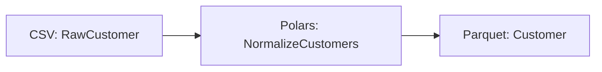

# Polars Pipeline

!!! warning "Design study—not a runnable ETLantic 0.18 API guide. Prefer CAPABILITIES and examples/."
    This page is a design study. It may describe packages, commands, or
    interfaces beyond the shipped API surface. Prefer Current Capabilities,
    the runnable examples under `examples/`, the API reference, and the CLI
    reference for installable behavior.


This example builds a complete ETLantic pipeline that reads customer data
from CSV, executes transformations with Polars, validates the output against
typed data contracts, and writes the curated result to Parquet.

The example demonstrates Polars as ETLantic's recommended reference
dataframe backend while keeping the logical pipeline independent of Polars
itself.

## Goal

Build a pipeline that:

1. Reads customer data from CSV.
2. Validates source records against `RawCustomer`.
3. Normalizes names and email addresses with a Polars implementation.
4. Produces `Customer` records.
5. Writes the curated dataset to Parquet.
6. Generates ODCS, DTCS, and DPCS artifacts.
7. Executes locally through the standard Pipeline Plan lifecycle.
8. Preserves lazy execution where practical.

## Architecture

```text
CSV Source
    │
    ▼
Polars Transformation
    │
    ▼
Contract Validation
    │
    ▼
Parquet Sink
```

The logical pipeline remains portable:

```text
RawCustomer
      │
      ▼
NormalizeCustomers
      │
      ▼
Customer
```

## Project Structure

```text
polars-pipeline/
├── pyproject.toml
├── data/
│   ├── customers.csv
│   └── curated/
├── src/
│   └── polars_pipeline/
│       ├── __init__.py
│       ├── contracts.py
│       ├── transformations.py
│       ├── polars_implementations.py
│       ├── pipeline.py
│       └── profiles.py
├── contracts/
│   ├── data/
│   ├── transformations/
│   └── pipelines/
├── docs/
└── tests/
    ├── test_pipeline.py
    └── test_backend_equivalence.py
```

## Input Data

Create `data/customers.csv`:

```csv
customer_id,first_name,last_name,email
1,Ada,Lovelace,ADA@EXAMPLE.COM
2,Grace,Hopper, grace@example.com
3,Alan,Turing,alan@example.com
```

## Step 1 — Define the Data Contracts

```python
# src/polars_pipeline/contracts.py

from typing import Annotated

from pydantic import Field

from etlantic import DataContractModel


class RawCustomer(DataContractModel):
    customer_id: Annotated[int, Field(strict=True, gt=0)]
    first_name: str
    last_name: str
    email: str


class Customer(DataContractModel):
    customer_id: Annotated[int, Field(strict=True, gt=0)]
    full_name: str
    email: str
```

The contracts define logical records.

They do not depend on Polars, CSV, Parquet, or local execution.

## Step 2 — Define the Transformation Contract

```python
# src/polars_pipeline/transformations.py

from etlantic import Input, Output, Parameter, Transformation

from .contracts import Customer, RawCustomer


class NormalizeCustomers(Transformation):
    customers: Input[RawCustomer]

    lowercase_email: Parameter[bool] = True
    trim_whitespace: Parameter[bool] = True

    result: Output[Customer]
```

The transformation interface remains backend-independent.

## Step 3 — Add the Polars Implementation

```python
# src/polars_pipeline/polars_implementations.py

import polars as pl

from .transformations import NormalizeCustomers


@NormalizeCustomers.implementation("polars")
def normalize_customers(
    customers: pl.LazyFrame,
    lowercase_email: bool,
    trim_whitespace: bool,
) -> pl.LazyFrame:
    first_name = pl.col("first_name")
    last_name = pl.col("last_name")
    email = pl.col("email")

    if trim_whitespace:
        first_name = first_name.str.strip_chars()
        last_name = last_name.str.strip_chars()
        email = email.str.strip_chars()

    if lowercase_email:
        email = email.str.to_lowercase()

    return customers.select(
        pl.col("customer_id"),
        pl.concat_str(
            [first_name, last_name],
            separator=" ",
        ).alias("full_name"),
        email.alias("email"),
    )
```

This implementation uses a `LazyFrame` so Polars can optimize the query before
materialization.

## LazyFrame vs. DataFrame

ETLantic should prefer `pl.LazyFrame` inside Polars execution regions.

Benefits include:

- Predicate pushdown
- Projection pruning
- Query optimization
- Reduced unnecessary materialization
- Better fusion across adjacent transformations

A `pl.DataFrame` implementation may still be supported for compatibility.

## Step 4 — Define the Pipeline

```python
# src/polars_pipeline/pipeline.py

from etlantic import Extract, Load, Pipeline

from .contracts import Customer, RawCustomer
from .transformations import NormalizeCustomers


class CustomerPolarsPipeline(Pipeline):
    raw: Extract[RawCustomer] = Extract(
        asset="customers_input",
    )

    normalized = NormalizeCustomers.step(
        customers=raw,
        lowercase_email=True,
        trim_whitespace=True,
    )

    curated: Load[Customer] = Load(
        input=normalized.result,
        asset="customers_output",
    )
```

The pipeline contains no Polars-specific types or paths.

## Step 5 — Define the Local Profile

```python
# src/polars_pipeline/profiles.py

from etlantic import Profile


local = Profile(
    name="local",
    orchestrator="local-python",
    dataframe_engine="polars",
    assets={
        "customers_input": {
            "plugin": "csv",
            "path": "data/customers.csv",
            "lazy": True,
        },
        "customers_output": {
            "plugin": "parquet",
            "path": "data/curated/customers",
            "write_mode": "overwrite",
        },
    },
)
```

The profile selects:

- Local Python orchestration
- Polars execution
- CSV source plugin
- Parquet sink plugin
- Lazy source loading

## Step 6 — Validate the Pipeline

```python
from polars_pipeline.pipeline import CustomerPolarsPipeline


report = CustomerPolarsPipeline.validate()
report.raise_for_errors()
```

Validation should verify:

- Source and sink declarations
- Graph integrity
- Transformation inputs and outputs
- Parameter types
- Contract references
- Polars implementation availability

## Step 7 — Validate the Profile

```python
from polars_pipeline.pipeline import CustomerPolarsPipeline
from polars_pipeline.profiles import local


profile_report = CustomerPolarsPipeline.validate_profile(
    local,
)
profile_report.raise_for_errors()
```

Capability validation should verify:

- The Polars plugin is installed.
- Lazy CSV reading is supported.
- Parquet writing is supported.
- Contract types map safely to Polars dtypes.
- Output validation can be preserved.

## Step 8 — Build the Pipeline Plan

```python
plan = CustomerPolarsPipeline.plan(
    profile=local,
)
```

The plan should identify:

```text
Source:
- Lazy scan of customers.csv

Polars region:
- Trim first_name
- Trim last_name
- Trim email
- Lowercase email
- Build full_name

Validation boundary:
- Validate Customer

Sink:
- Write Parquet
```

## Step 9 — Inspect the Plan

```python
print(
    plan.explain()
)
```

The explanation may include:

- Selected Polars implementation
- Lazy source scan
- Projected columns
- Validation strategy
- Materialization boundary
- Sink write mode

## Step 10 — Execute

Synchronous execution:

```python
result = CustomerPolarsPipeline.run(
    profile=local,
)
```

Asynchronous orchestration:

```python
result = await CustomerPolarsPipeline.arun(
    profile=local,
)
```

The Polars implementation itself may remain synchronous.

ETLantic handles invocation inside the async execution system.

## Expected Output

| customer_id | full_name | email |
|---|---|---|
| 1 | Ada Lovelace | ada@example.com |
| 2 | Grace Hopper | grace@example.com |
| 3 | Alan Turing | alan@example.com |

## Query Optimization

Polars may optimize the lazy plan through:

- Predicate pushdown
- Projection pruning
- Expression simplification
- Common subplan elimination
- Streaming execution where supported
- Join optimization

ETLantic should preserve these opportunities by avoiding premature
collection.

## Materialization

The lazy plan should materialize only at an intentional boundary.

In this example, the primary materialization is the Parquet sink write.

Conceptually:

```text
scan_csv
    │
    ▼
select / normalize
    │
    ▼
validate
    │
    ▼
sink_parquet
```

## Accidental Materialization

Implementations should avoid:

```python
lazy_frame.collect()
```

inside ordinary transformation logic.

Collection should be coordinated by the execution plugin.

## Polars Data Types

The Polars plugin should map logical contract types to physical dtypes such as:

- `pl.Int8`
- `pl.Int16`
- `pl.Int32`
- `pl.Int64`
- `pl.UInt*`
- `pl.Float32`
- `pl.Float64`
- `pl.Decimal`
- `pl.Boolean`
- `pl.String`
- `pl.Binary`
- `pl.Date`
- `pl.Time`
- `pl.Datetime`
- `pl.Duration`
- `pl.List`
- `pl.Struct`

Physical dtype choice must preserve the logical contract.

## Nullability

Polars columns may contain nulls regardless of the dtype.

The plugin must validate:

- Contract requiredness
- Actual null values
- Nested nulls
- Nulls inside lists or structs
- Output nullability

## Decimal Semantics

For exact numeric contracts, the plugin should preserve:

- Precision
- Scale
- Rounding
- Aggregate result types
- Overflow behavior

Lossy conversion to floating point should not occur silently.

## Date and Time Semantics

The plugin should define behavior for:

- Date
- Time
- Naive datetime
- Zoned datetime
- Time zones
- Precision
- Duration

Profiles should set time-zone assumptions explicitly where necessary.

## Schema Validation

The plugin may validate:

- Required columns
- Unexpected columns
- Dtype compatibility
- Nullability
- Aliases
- Nested structures
- Decimal behavior
- Date and time types

Schema validation alone does not replace row-level validation.

## Row-Level Validation

Portable constraints may be compiled into Polars expressions.

Conceptually:

```python
invalid = lazy_frame.filter(
    (pl.col("customer_id") <= 0)
    | pl.col("email").is_null()
)
```

The validation result may remain lazy until a quality gate or sink requires
execution.

## Invalid-Data Splitting

Conceptually:

```text
Input LazyFrame
      │
      ├── Valid rows ─────► Continue
      └── Invalid rows ───► Quarantine
```

Partial acceptance must be explicitly configured.

## Streaming Engine

Polars may execute some lazy queries in streaming mode.

A profile may request:

```python
Profile(
    dataframe_engine="polars",
    polars={
        "engine": "streaming",
    },
)
```

The plugin should verify that every operation in the region supports the chosen
engine.

## Streaming Compatibility

Not every Polars operation can execute through the streaming engine.

The plugin should report:

- Fully streamable region
- Partially streamable region
- Required materialization
- Unsupported operation
- Fallback strategy

## Multiple Transformations

Adjacent Polars-capable steps may be fused into one lazy region.

```text
NormalizeCustomers
      │
      ▼
FilterCustomers
      │
      ▼
SelectCustomerFields
```

may compile into one optimized lazy query.

Logical step identities must remain visible for lineage and diagnostics.

## Caching and Reuse

If one lazy result feeds multiple downstream branches, the planner may choose:

- Recompute
- Cache
- Materialize once
- Write a temporary Parquet or Arrow artifact

The choice should depend on cost and reuse.

## Backend Selection

The planner should prefer Polars when:

- A compatible Polars implementation exists.
- The profile selects Polars.
- Data fits local or supported streaming execution.
- Required operations are available.
- Contract semantics can be preserved.

SQL may be preferable when data already lives in one capable database.

PySpark may be preferable for distributed workloads.

## Arrow Interoperability

Polars uses Arrow-compatible memory representations.

This supports transitions to:

- PyArrow
- Pandas
- PySpark
- SQL drivers
- Parquet
- IPC / Feather

Backend transitions should remain explicit in the Pipeline Plan.

## Source Pushdown

For supported sources, Polars may push:

- Filters
- Projections
- Slice limits
- Partition predicates

The source plugin should expose its pushdown capabilities.

## Error Handling

Potential failures include:

- CSV parse errors
- Missing columns
- Invalid casts
- Contract violations
- Unsupported lazy operation
- Out-of-memory errors
- Sink write failures
- Permission failures

Plugins should translate backend exceptions into structured ETLantic
diagnostics.

## Retry and Idempotency

Retry safety depends on the sink.

For overwrite Parquet publication, retries may be safe with staging and atomic
replacement.

For append mode, retries may duplicate rows.

The execution plan should record retry safety.

## Lineage

Logical lineage:

```text
RawCustomer
      │
      ▼
NormalizeCustomers
      │
      ▼
Customer
```

Runtime lineage may add:

- Input CSV path
- Polars plugin version
- Lazy region identity
- Output Parquet path
- Validation metrics
- Execution run identity

## Step 11 — Generate Contracts

```python
CustomerPolarsPipeline.write_contracts(
    "contracts/",
)
```

Expected output:

```text
contracts/
├── data/
│   ├── raw-customer.odcs.yaml
│   └── customer.odcs.yaml
├── transformations/
│   └── normalize-customers.dtcs.yaml
└── pipelines/
    └── customer-polars-pipeline.dpcs.yaml
```

The generated artifacts remain independent of Polars.

## Step 12 — Generate Documentation

```python
plan.write_html(
    "docs/customer-polars-pipeline.html",
    self_contained=True,
)
```

Profile-aware documentation may include:

- Selected Polars implementation
- Lazy execution region
- Pushdown opportunities
- Materialization boundary
- Streaming-engine compatibility
- Validation strategy
- Source and sink plugins

## Step 13 — Generate Mermaid

```python
plan.write_mermaid(
    "docs/customer-polars-lineage.mmd",
)
```

Example:



## Testing

Create `tests/test_pipeline.py`:

```python
from pathlib import Path

import polars as pl

from polars_pipeline.pipeline import CustomerPolarsPipeline
from polars_pipeline.profiles import local


def test_pipeline_is_valid() -> None:
    report = CustomerPolarsPipeline.validate()
    assert report.valid, report.diagnostics


def test_polars_pipeline(
    tmp_path: Path,
) -> None:
    input_path = tmp_path / "customers.csv"
    output_path = tmp_path / "curated"

    input_path.write_text(
        "customer_id,first_name,last_name,email\n"
        "1,Ada,Lovelace,ADA@EXAMPLE.COM\n",
        encoding="utf-8",
    )

    profile = local.with_bindings(
        {
            "customers_input": {
                "plugin": "csv",
                "path": str(input_path),
                "lazy": True,
            },
            "customers_output": {
                "plugin": "parquet",
                "path": str(output_path),
                "write_mode": "overwrite",
            },
        }
    )

    CustomerPolarsPipeline.run(
        profile=profile,
    )

    output = pl.read_parquet(output_path)

    assert output.to_dicts() == [
        {
            "customer_id": 1,
            "full_name": "Ada Lovelace",
            "email": "ada@example.com",
        }
    ]
```

## Backend Equivalence

Create `tests/test_backend_equivalence.py`:

```python
def test_polars_matches_pandas(
    polars_result,
    pandas_result,
) -> None:
    assert normalize(polars_result) == normalize(pandas_result)
```

Tests should normalize container and dtype differences while checking logical
contract values.

## Equivalence Concerns

Polars and other backends may differ in:

- Null behavior
- Decimal behavior
- Date and time behavior
- String handling
- Row ordering
- Integer widths
- Aggregate result types

Equivalence tests should focus on observable contract semantics.

## Optional Pandas Implementation

The same transformation may provide a Pandas implementation:

```python
@NormalizeCustomers.implementation("pandas")
def normalize_customers_pandas(...):
    ...
```

A profile can select it without changing the pipeline.

## Optional PySpark Implementation

For distributed execution:

```python
@NormalizeCustomers.implementation("pyspark")
def normalize_customers_pyspark(...):
    ...
```

The logical transformation remains unchanged.

## Production Profile Example

```python
production = Profile(
    name="production",
    orchestrator="airflow",
    dataframe_engine="polars",
    assets={
        "customers_input": {
            "plugin": "s3-csv",
            "binding": "raw/customers.csv",
            "lazy": True,
        },
        "customers_output": {
            "plugin": "s3-parquet",
            "binding": "curated/customers/",
            "write_mode": "replace",
        },
    },
)
```

Credentials remain in Resource Providers.

## Performance Guidance

For effective Polars pipelines:

- Prefer `LazyFrame`.
- Use expressions instead of Python loops.
- Read only required columns.
- Push filters toward sources.
- Avoid unnecessary `collect()`.
- Use streaming execution when supported.
- Preserve Arrow-compatible types.
- Avoid Python UDFs when native expressions exist.
- Materialize only at explicit boundaries.

## Best Practices

- Use Polars-native expressions.
- Prefer lazy execution.
- Keep contracts and pipelines independent of Polars.
- Validate outputs before publication.
- Preserve exact decimal and time semantics.
- Keep materialization explicit.
- Test equivalence with other backends.
- Let the planner fuse compatible Polars steps.

## Anti-Patterns

Avoid:

- Using `pl.DataFrame` or `pl.LazyFrame` in public transformation contracts.
- Calling `collect()` inside ordinary transformation implementations.
- Using Python loops for vectorizable logic.
- Assuming every lazy query is streamable.
- Skipping validation because a Polars schema exists.
- Using append sinks without considering retry duplication.
- Treating Polars optimization decisions as pipeline semantics.

## Key Principle

> Polars is ETLantic's recommended reference dataframe backend, not a
> modeling dependency. It provides high-performance, lazy, expression-based
> execution while preserving portable contracts, validation, lineage, and
> pipeline semantics.

## Next Step

Continue with [Airflow Pipeline](AIRFLOW_PIPELINE.md) to compile a portable
pipeline for an external orchestrator.
