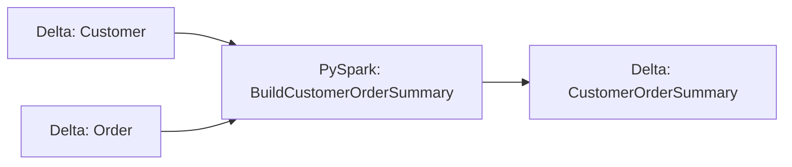

# PySpark to Delta

!!! warning "Future design—not a Pipelantic 0.5 API guide"
    This page is a design study. It may describe packages, commands, or
    interfaces that are not installable yet. Use Current Capabilities, the
    runnable examples under `examples/`, the API reference, and the CLI
    reference for shipped behavior.


This example builds a complete Pipelantic pipeline that reads distributed
customer and order data with PySpark, performs typed transformations on Spark,
and publishes the curated result to a Delta Lake table.

The example demonstrates a Spark-native lakehouse workflow:

```text
Delta Sources
     │
     ▼
PySpark Transformation Region
     │
     ▼
Contract Validation
     │
     ▼
Delta Merge
```

Pipelantic preserves one portable set of ODCS, DTCS, and DPCS semantics while
the execution profile selects PySpark, a Spark Provider, and the Delta storage
plugin.

## Goal

Build a pipeline that:

1. Reads customer and order datasets from Delta.
2. Validates both source contracts.
3. Joins and aggregates the datasets as a lazy Spark plan.
4. Produces `CustomerOrderSummary` records.
5. Validates the output contract.
6. Publishes the result with Delta `MERGE`.
7. Supports incremental updates and idempotent retries.
8. Records Delta versions for lineage and reproducibility.
9. Generates ODCS, DTCS, DPCS, diagrams, and documentation.

## Project Structure

```text
pyspark-to-delta/
├── pyproject.toml
├── lakehouse/
│   ├── raw/
│   │   ├── customers/
│   │   └── orders/
│   └── curated/
│       └── customer_order_summary/
├── src/
│   └── pyspark_to_delta/
│       ├── contracts.py
│       ├── transformations.py
│       ├── pyspark_implementations.py
│       ├── pipeline.py
│       └── profiles.py
├── contracts/
├── docs/
└── tests/
```

## Data Contracts

```python
from datetime import datetime
from decimal import Decimal
from typing import Annotated, Literal

from pydantic import Field
from pipelantic import DataContractModel


class Customer(DataContractModel):
    customer_id: Annotated[int, Field(strict=True, gt=0)]
    full_name: str
    email: str
    updated_at: datetime


class Order(DataContractModel):
    order_id: Annotated[int, Field(strict=True, gt=0)]
    customer_id: Annotated[int, Field(strict=True, gt=0)]
    order_total: Annotated[Decimal, Field(ge=0)]
    status: Literal["paid", "cancelled", "refunded"]
    updated_at: datetime


class CustomerOrderSummary(DataContractModel):
    customer_id: Annotated[int, Field(strict=True, gt=0)]
    full_name: str
    email: str
    paid_order_count: Annotated[int, Field(ge=0)]
    paid_order_total: Annotated[Decimal, Field(ge=0)]
    source_updated_at: datetime
    pipeline_updated_at: datetime
```

## Transformation Contract

```python
from typing import Literal

from pipelantic import Input, Output, Parameter, Transformation


class BuildCustomerOrderSummary(Transformation):
    customers: Input[Customer]
    orders: Input[Order]

    included_status: Parameter[
        Literal["paid", "cancelled", "refunded"]
    ] = "paid"

    result: Output[CustomerOrderSummary]
```

## PySpark Implementation

```python
from pyspark.sql import functions as F
from pipelantic.pyspark import SparkDataFrame


@BuildCustomerOrderSummary.implementation("pyspark")
def build_customer_order_summary(
    customers: SparkDataFrame[Customer],
    orders: SparkDataFrame[Order],
    included_status: str,
) -> SparkDataFrame[CustomerOrderSummary]:
    included_orders = (
        orders.native
        .filter(F.col("status") == F.lit(included_status))
        .groupBy("customer_id")
        .agg(
            F.count("order_id").alias("paid_order_count"),
            F.sum("order_total").alias("paid_order_total"),
            F.max("updated_at").alias("orders_updated_at"),
        )
    )

    result = (
        customers.native
        .join(included_orders, on="customer_id", how="left")
        .select(
            "customer_id",
            "full_name",
            "email",
            F.coalesce(
                F.col("paid_order_count"),
                F.lit(0),
            ).alias("paid_order_count"),
            F.coalesce(
                F.col("paid_order_total"),
                F.lit(0),
            ).alias("paid_order_total"),
            F.greatest(
                F.col("updated_at"),
                F.col("orders_updated_at"),
            ).alias("source_updated_at"),
            F.current_timestamp().alias("pipeline_updated_at"),
        )
    )

    return SparkDataFrame[
        CustomerOrderSummary
    ].from_native(result)
```

The implementation stays lazy until validation or publication requires an
action.

## Pipeline Definition

```python
from pipelantic import Pipeline, Sink, Source


class CustomerOrderDeltaPipeline(Pipeline):
    customers: Source[Customer] = Source(
        binding="customers_delta",
    )

    orders: Source[Order] = Source(
        binding="orders_delta",
    )

    summary = BuildCustomerOrderSummary.step(
        customers=customers,
        orders=orders,
        included_status="paid",
    )

    curated: Sink[CustomerOrderSummary] = Sink(
        input=summary.result,
        binding="customer_summary_delta",
    )
```

The pipeline contains no Delta paths, catalogs, Spark sessions, or merge syntax.

## Local Profile

```python
from pipelantic import Profile


local = Profile(
    name="local",
    orchestrator="local-python",
    transformation_engine="pyspark",
    bindings={
        "customers_delta": {
            "plugin": "delta",
            "path": "lakehouse/raw/customers/",
        },
        "orders_delta": {
            "plugin": "delta",
            "path": "lakehouse/raw/orders/",
        },
        "customer_summary_delta": {
            "plugin": "delta",
            "path": "lakehouse/curated/customer_order_summary/",
            "write_mode": "merge",
            "merge_keys": ["customer_id"],
        },
    },
    resources={
        "spark": {
            "provider": "local-spark",
            "master": "local[*]",
            "session_timezone": "UTC",
            "adaptive_execution": True,
            "extensions": ["delta"],
        },
    },
)
```

## Validate and Plan

```python
report = CustomerOrderDeltaPipeline.validate()
report.raise_for_errors()

profile_report = CustomerOrderDeltaPipeline.validate_profile(local)
profile_report.raise_for_errors()

plan = CustomerOrderDeltaPipeline.plan(profile=local)
```

Capability validation should verify:

- The PySpark implementation exists.
- The Spark Provider supports Delta.
- Source tables satisfy their contracts.
- The sink supports merge.
- Merge keys exist and are compatible.
- Decimal and timestamp mappings are safe.
- Output validation occurs before commit.
- Required transaction semantics are available.

## Inspect the Plan

```python
compiled = plan.compile(target="pyspark")

print(compiled.optimization_report())
```

The report may include:

- Source Delta versions
- Spark region fusion
- Predicate and projection pushdown
- Join strategy
- Adaptive Query Execution status
- Validation actions
- Merge predicate
- Update and insert mappings
- Schema compatibility
- Change Data Feed settings

## Execute

```python
result = CustomerOrderDeltaPipeline.run(
    profile=local,
)
```

Async orchestration is also available:

```python
result = await CustomerOrderDeltaPipeline.arun(
    profile=local,
)
```

## Delta Merge Semantics

The sink plugin should compile the publication as a Delta merge.

```text
Target: customer_order_summary
Source: validated transformation result
Key: customer_id
```

Behavior:

```text
Matched row:
- Update curated fields

Unmatched row:
- Insert new summary
```

The binding should define:

- Merge keys
- Match conditions
- Update columns
- Insert columns
- Delete behavior
- Duplicate-source handling
- Null-key policy

## Duplicate Source Keys

A merge must not receive multiple ambiguous source rows for one target key.

Pipelantic should require a deterministic policy:

- Reject duplicates
- Deduplicate by timestamp
- Aggregate duplicates
- Select the latest record
- Fail validation

Business-semantic deduplication belongs in the transformation contract.

## Incremental Processing

The pipeline may read only changed data using:

- `updated_at` watermarks
- Delta Change Data Feed
- Snapshot-version comparison
- Partition filtering
- External checkpoint state

Incremental execution must preserve the same output contract.

Conceptual watermark configuration:

```python
incremental = local.with_execution(
    {
        "incremental": {
            "strategy": "watermark",
            "field": "updated_at",
            "checkpoint": "customer-summary-watermark",
        },
    }
)
```

Checkpoint state belongs in a Resource Provider.

## Change Data Feed

A source binding may request Delta Change Data Feed:

```python
"customers_delta": {
    "plugin": "delta",
    "table": "raw.customers",
    "read_mode": "change-data-feed",
}
```

Change records may include:

- Insert
- Update preimage
- Update postimage
- Delete
- Commit version
- Commit timestamp

These should map into an explicit change-event contract rather than being
treated as ordinary snapshots.

## Delete Propagation

Upstream deletes require an explicit policy:

- Hard delete
- Soft delete
- Tombstone output
- Retain history
- Ignore delete

Delete behavior belongs in pipeline or transformation semantics.

## Schema Enforcement

Recommended publication flow:

```text
Spark result
    │
    ▼
ODCS validation
    │
    ▼
Delta schema compatibility
    │
    ▼
Merge transaction
```

Delta's physical schema checks supplement, but do not replace, Pipelantic
contract validation.

## Schema Evolution

Pipelantic should distinguish:

- Compatible contract evolution
- Physical schema evolution
- Automatic column addition
- Type widening
- Breaking changes

A storage engine's ability to evolve schema must not override contract
compatibility rules.

## Time Travel and Reproducibility

Delta sources may bind to:

- Current snapshot
- Version number
- Timestamp

The execution report should record:

- Source table versions
- Source commit timestamps
- Target starting version
- Target committed version
- Pipeline version
- Contract versions
- Implementation version
- Spark and Delta versions

## Optimistic Concurrency

Delta write conflicts may occur when concurrent writers modify overlapping data.

The plugin should classify:

- Retryable transaction conflicts
- Non-retryable semantic conflicts
- Concurrent schema changes
- Concurrent protocol changes

Retries require an idempotent and deterministic source batch.

## Partitioning and Optimization

Physical tuning may include:

- Partitioning
- File compaction
- Data skipping
- Z-ordering
- Liquid clustering
- Optimized writes
- Automatic compaction

These are execution and storage concerns, not logical pipeline semantics.

Avoid high-cardinality partition keys such as `customer_id`.

## Structured Streaming

The same sink may support streaming execution:

```text
Streaming source
      │
      ▼
PySpark Structured Streaming
      │
      ▼
foreachBatch Delta merge
```

The plugin should manage:

- Batch identity
- Idempotency
- Checkpoints
- Merge transactions
- Failure recovery
- Duplicate batch replay

## Validation and Quarantine

The PySpark plugin may validate:

- Required columns
- Types
- Nullability
- Numeric ranges
- Decimal precision
- Timestamps
- Merge-key uniqueness
- Quality gates

Invalid rows may:

- Fail the pipeline
- Route to a Delta quarantine table
- Continue through a valid-row output
- Trigger callbacks

Partial acceptance must be explicit.

## Lineage

Logical lineage:

```text
Customer + Order
        │
        ▼
BuildCustomerOrderSummary
        │
        ▼
CustomerOrderSummary
```

Runtime lineage may add:

- Source Delta table or path
- Source versions
- Spark application ID
- Spark query execution ID
- Target Delta version
- Merge metrics
- Change Data Feed metadata
- Checkpoint identity

## Failure Handling

Potential failures include:

- Spark session failure
- Missing Delta extension
- Source table failure
- Contract incompatibility
- Duplicate merge keys
- Concurrent write conflict
- Schema mismatch
- Permission failure
- Checkpoint failure
- Commit failure
- Cleanup failure

Plugins should translate these into structured diagnostics.

Example:

```text
PMDELTA307

Pipeline: customer-order-delta-pipeline
Sink: customer-summary-delta
Operation: merge

The source contains multiple rows for customer_id=42.
The merge requires one deterministic source row per target key.
```

## Testing

```python
from pyspark.sql import SparkSession


def test_pyspark_to_delta_pipeline(
    tmp_path,
    spark: SparkSession,
) -> None:
    customers_path = tmp_path / "customers"
    orders_path = tmp_path / "orders"
    output_path = tmp_path / "summary"

    spark.createDataFrame(
        [
            (
                1,
                "Ada Lovelace",
                "ada@example.com",
                "2026-07-01T00:00:00Z",
            ),
        ],
        schema=[
            "customer_id",
            "full_name",
            "email",
            "updated_at",
        ],
    ).write.format("delta").mode("overwrite").save(
        str(customers_path)
    )

    spark.createDataFrame(
        [
            (
                1001,
                1,
                125.50,
                "paid",
                "2026-07-02T00:00:00Z",
            ),
            (
                1002,
                1,
                80.00,
                "paid",
                "2026-07-03T00:00:00Z",
            ),
        ],
        schema=[
            "order_id",
            "customer_id",
            "order_total",
            "status",
            "updated_at",
        ],
    ).write.format("delta").mode("overwrite").save(
        str(orders_path)
    )

    profile = local.with_updates(
        bindings={
            "customers_delta": {
                "plugin": "delta",
                "path": str(customers_path),
            },
            "orders_delta": {
                "plugin": "delta",
                "path": str(orders_path),
            },
            "customer_summary_delta": {
                "plugin": "delta",
                "path": str(output_path),
                "write_mode": "merge",
                "merge_keys": ["customer_id"],
            },
        },
        resources={
            "spark": {
                "provider": "existing-session",
                "session": spark,
            },
        },
    )

    CustomerOrderDeltaPipeline.run(
        profile=profile,
    )

    rows = (
        spark.read.format("delta")
        .load(str(output_path))
        .orderBy("customer_id")
        .collect()
    )

    assert len(rows) == 1
    assert rows[0]["customer_id"] == 1
    assert rows[0]["paid_order_count"] == 2
```

## Test Incremental Merge

```python
def test_incremental_merge_updates_existing_customer(
    initialized_profile,
    spark,
) -> None:
    CustomerOrderDeltaPipeline.run(
        profile=initialized_profile,
    )

    add_new_paid_order(
        customer_id=1,
        amount="20.00",
    )

    CustomerOrderDeltaPipeline.run(
        profile=initialized_profile,
    )

    row = read_customer_summary(
        spark,
        customer_id=1,
    )

    assert row.paid_order_count == 3
    assert row.paid_order_total == 225.50
```

## Production Databricks Profile

```python
databricks = Profile(
    name="databricks",
    orchestrator="airflow",
    transformation_engine="pyspark",
    bindings={
        "customers_delta": {
            "plugin": "delta",
            "resource": "unity_catalog",
            "table": "main.raw.customers",
        },
        "orders_delta": {
            "plugin": "delta",
            "resource": "unity_catalog",
            "table": "main.raw.orders",
        },
        "customer_summary_delta": {
            "plugin": "delta",
            "resource": "unity_catalog",
            "table": "main.curated.customer_order_summary",
            "write_mode": "merge",
            "merge_keys": ["customer_id"],
        },
    },
    resources={
        "spark": {
            "provider": "databricks",
            "runtime": "serverless",
            "session_timezone": "UTC",
        },
        "unity_catalog": {
            "provider": "databricks-catalog",
        },
    },
)
```

## Generate Contracts and Documentation

```python
CustomerOrderDeltaPipeline.write_contracts(
    "contracts/",
)

plan.write_html(
    "docs/customer-order-delta-pipeline.html",
    self_contained=True,
)

plan.write_mermaid(
    "docs/customer-order-delta-lineage.mmd",
)
```

Expected contract output:

```text
contracts/
├── data/
│   ├── customer.odcs.yaml
│   ├── order.odcs.yaml
│   └── customer-order-summary.odcs.yaml
├── transformations/
│   └── build-customer-order-summary.dtcs.yaml
└── pipelines/
    └── customer-order-delta-pipeline.dpcs.yaml
```

Example diagram:



## Best Practices

- Keep Delta configuration out of pipeline definitions.
- Validate contracts before merge.
- Use stable merge keys.
- Reject ambiguous duplicate source keys.
- Record source and target Delta versions.
- Treat schema evolution as a compatibility decision.
- Make delete propagation explicit.
- Use durable checkpoints for streaming.
- Test idempotent replay.
- Keep retention and vacuum policies explicit.
- Preserve exact decimal and timestamp semantics.
- Use Resource Providers for catalogs and credentials.

## Anti-Patterns

Avoid:

- Calling Delta APIs directly inside the pipeline class.
- Enabling schema evolution without compatibility checks.
- Merging duplicate source keys unpredictably.
- Assuming every merge is idempotent.
- Using high-cardinality partition columns.
- Vacuuming aggressively without retention analysis.
- Treating Change Data Feed rows as ordinary snapshots.
- Hiding delete behavior.
- Embedding credentials in bindings.
- Assuming every Spark environment exposes identical Delta capabilities.

## Key Principle

> PySpark-to-Delta execution combines distributed Spark transformation with
> Delta Lake's transactional table model while Pipelantic preserves portable
> contracts, validation, lineage, compatibility, incremental semantics, and
> reproducible execution.

## Next Step

Continue with **STREAMING_PYSPARK.md** to build an event-time Structured
Streaming pipeline with Kafka, watermarks, stateful aggregation, Delta
checkpointing, and contract-governed late-data handling.
