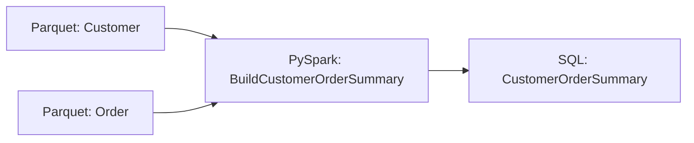

# PySpark to SQL

This example builds a complete Pipelantic pipeline that reads distributed
data with PySpark, performs transformation and validation on Spark, and
publishes the resulting records to a relational SQL database.

The example demonstrates a deliberate backend transition:

```text
Spark Source
    │
    ▼
PySpark Transformation Region
    │
    ▼
Contract Validation
    │
    ▼
SQL Publication
```

Pipelantic keeps data contracts, transformation semantics, pipeline topology,
lineage, and validation portable. The execution profile selects the PySpark
backend, Spark Provider, SQL sink plugin, and publication strategy.

## Goal

Build a pipeline that:

1. Reads customer and order data with PySpark.
2. Validates both source contracts.
3. Executes joins and aggregations as a lazy Spark plan.
4. Produces `CustomerOrderSummary` records.
5. Validates the output contract before publication.
6. Writes the result to SQL.
7. Generates ODCS, DTCS, and DPCS artifacts.
8. Executes locally with Parquet, local Spark, and SQLite.
9. Remains portable to Delta Lake, Iceberg, PostgreSQL, Snowflake, SQL Server,
   and other supported backends.

## When to Use This Pattern

PySpark-to-SQL execution is useful when:

- Source data already lives in a lakehouse or distributed file system.
- Transformations require distributed joins or aggregations.
- The final result is suitable for relational publication.
- A serving database needs the curated output.
- Spark is the compute layer, but SQL is the publication boundary.
- Contract validation should occur before transactional publication.

## Architecture

```text
Customers Parquet ─────┐
                       ├──► PySpark Transformation ───► SQL Sink
Orders Parquet ────────┘
```

Physical execution:

```text
Distributed Source Files
        │
        ▼
Spark Logical Plan
        │
        ▼
Catalyst and AQE
        │
        ▼
Validated Spark Result
        │
        ▼
SQL Staging or Batch Write
        │
        ▼
Transactional Publication
```

## Project Structure

```text
pyspark-to-sql/
├── pyproject.toml
├── data/
│   ├── customers/
│   └── orders/
├── database/
│   └── warehouse.db
├── src/
│   └── pyspark_to_sql/
│       ├── __init__.py
│       ├── contracts.py
│       ├── transformations.py
│       ├── pyspark_implementations.py
│       ├── pipeline.py
│       └── profiles.py
├── contracts/
├── docs/
└── tests/
    ├── test_pipeline.py
    └── test_publication_semantics.py
```

## Step 1 — Define the Data Contracts

```python
from decimal import Decimal
from typing import Annotated, Literal

from pydantic import Field
from contractmodel import DataContractModel


class Customer(DataContractModel):
    customer_id: Annotated[int, Field(strict=True, gt=0)]
    full_name: str
    email: str


class Order(DataContractModel):
    order_id: Annotated[int, Field(strict=True, gt=0)]
    customer_id: Annotated[int, Field(strict=True, gt=0)]
    order_total: Annotated[Decimal, Field(ge=0)]
    status: Literal["paid", "cancelled", "refunded"]


class CustomerOrderSummary(DataContractModel):
    customer_id: Annotated[int, Field(strict=True, gt=0)]
    full_name: str
    email: str
    paid_order_count: Annotated[int, Field(ge=0)]
    paid_order_total: Annotated[Decimal, Field(ge=0)]
```

The contracts remain independent of Spark and SQL.

## Step 2 — Define the Transformation Contract

```python
from typing import Literal

from pipelantic import Input, Output, Parameter, Transformation


class BuildCustomerOrderSummary(Transformation):
    customers: Input[Customer]
    orders: Input[Order]

    included_status: Parameter[
        Literal["paid", "cancelled", "refunded"]
    ] = "paid"

    result: Output[CustomerOrderSummary]
```

The transformation contract defines the logical operation only.

## Step 3 — Add the PySpark Implementation

```python
from pyspark.sql import functions as F
from pipelantic.pyspark import SparkDataFrame


@BuildCustomerOrderSummary.implementation("pyspark")
def build_customer_order_summary(
    customers: SparkDataFrame[Customer],
    orders: SparkDataFrame[Order],
    included_status: str,
) -> SparkDataFrame[CustomerOrderSummary]:
    included_orders = (
        orders.native
        .filter(F.col("status") == F.lit(included_status))
        .groupBy("customer_id")
        .agg(
            F.count("order_id").alias("paid_order_count"),
            F.sum("order_total").alias("paid_order_total"),
        )
    )

    result = (
        customers.native
        .join(
            included_orders,
            on="customer_id",
            how="left",
        )
        .select(
            "customer_id",
            "full_name",
            "email",
            F.coalesce(
                F.col("paid_order_count"),
                F.lit(0),
            ).alias("paid_order_count"),
            F.coalesce(
                F.col("paid_order_total"),
                F.lit(0),
            ).alias("paid_order_total"),
        )
    )

    return SparkDataFrame[
        CustomerOrderSummary
    ].from_native(result)
```

The transformation remains lazy until validation or the sink introduces an
action.

## Step 4 — Define the Pipeline

```python
from pipelantic import Pipeline, Sink, Source


class CustomerOrderWarehousePipeline(Pipeline):
    customers: Source[Customer] = Source(
        binding="customers_spark",
    )

    orders: Source[Order] = Source(
        binding="orders_spark",
    )

    summary = BuildCustomerOrderSummary.step(
        customers=customers,
        orders=orders,
        included_status="paid",
    )

    warehouse: Sink[CustomerOrderSummary] = Sink(
        input=summary.result,
        binding="customer_summary_sql",
    )
```

The pipeline contains no Spark paths, database URLs, or JDBC options.

## Step 5 — Define the Local Profile

```python
from pipelantic import Profile


local = Profile(
    name="local",
    orchestrator="local-python",
    transformation_engine="pyspark",
    bindings={
        "customers_spark": {
            "plugin": "parquet",
            "path": "data/customers",
        },
        "orders_spark": {
            "plugin": "parquet",
            "path": "data/orders",
        },
        "customer_summary_sql": {
            "plugin": "jdbc",
            "resource": "warehouse_database",
            "table": "customer_order_summary",
            "write_mode": "replace",
        },
    },
    resources={
        "spark": {
            "provider": "local-spark",
            "master": "local[*]",
            "session_timezone": "UTC",
            "adaptive_execution": True,
        },
        "warehouse_database": {
            "provider": "sql",
            "url": "jdbc:sqlite:database/warehouse.db",
            "driver": "org.sqlite.JDBC",
        },
    },
)
```

The profile selects local Spark execution, Parquet sources, a JDBC sink, and the
required resource providers.

## Step 6 — Validate and Plan

```python
report = CustomerOrderWarehousePipeline.validate()
report.raise_for_errors()

profile_report = CustomerOrderWarehousePipeline.validate_profile(local)
profile_report.raise_for_errors()

plan = CustomerOrderWarehousePipeline.plan(profile=local)
```

Capability validation should verify:

- The PySpark implementation exists.
- The Spark Provider is available.
- Parquet sources satisfy the source contracts.
- The SQL sink supports the selected write mode.
- Spark-to-SQL type mappings are compatible.
- Decimal precision can be preserved.
- Required JDBC drivers are available.
- Output validation occurs before publication.

## Spark-to-SQL Boundary

The transition from Spark to SQL is a materialization and publication boundary.

```text
Spark DataFrame
      │
      ▼
Contract Validation
      │
      ▼
JDBC or Bulk Writer
      │
      ▼
SQL Table
```

The Pipeline Plan should make this boundary explicit.

## Step 7 — Inspect the Compiled Plan

```python
compiled = plan.compile(
    target="pyspark",
)

print(compiled.optimization_report())
```

The report may include:

- Spark region fusion
- Source pruning
- Join strategy
- Adaptive Query Execution status
- Validation actions
- JDBC write strategy
- Batch size
- Transaction expectations
- Required drivers and packages

## Step 8 — Execute

```python
result = CustomerOrderWarehousePipeline.run(
    profile=local,
)
```

Asynchronous orchestration is also supported:

```python
result = await CustomerOrderWarehousePipeline.arun(
    profile=local,
)
```

## Expected SQL Output

| customer_id | full_name | email | paid_order_count | paid_order_total |
|---|---|---|---:|---:|
| 1 | Ada Lovelace | ada@example.com | 2 | 205.50 |
| 2 | Grace Hopper | grace@example.com | 1 | 300.00 |
| 3 | Alan Turing | alan@example.com | 0 | 0.00 |

## SQL Publication Strategies

Possible strategies include:

- JDBC append
- JDBC overwrite
- Truncate and insert
- Staging table plus transactional swap
- Staging table plus merge
- Partitioned batch writes
- Database-specific bulk loading

The selected strategy should be capability-validated.

## Transaction Semantics

A distributed JDBC write may not be one atomic database transaction.

The sink plugin should declare whether it provides:

- Per-partition transactions
- Whole-write atomicity
- Staging-based atomicity
- Best-effort cleanup
- Idempotent retry

The planner must not assume stronger guarantees than the plugin provides.

## Contract Validation Before Write

Recommended flow:

```text
Spark result
    │
    ▼
Schema validation
    │
    ▼
Row-level validation
    │
    ▼
Quality gates
    │
    ▼
SQL publication
```

Invalid data should not reach the SQL sink unless explicitly permitted.

## SQL-Side Validation

The sink may also validate the staged table using SQL.

This can confirm:

- Column types
- Required fields
- Row counts
- Uniqueness
- Database constraints
- Publication-specific rules

SQL-side checks supplement Spark validation.

## Type Mapping

The Spark and SQL plugins must agree on mappings for:

- Integers
- Decimal precision and scale
- Strings
- Booleans
- Dates
- Timestamps
- Nullability

Lossy mappings should prevent planning or require explicit acceptance.

## Decimal Semantics

`paid_order_total` should use exact decimal semantics.

The planner should verify:

- Spark decimal precision
- Aggregate result precision
- JDBC driver behavior
- SQL destination precision
- Rounding expectations

## Partitioned Writes

Spark may write one JDBC partition per Spark partition.

The sink plugin should tune:

- Number of partitions
- Partition size
- Connection count
- Batch size
- Commit frequency

Excessive partitions can overload the destination database.

## Coalesce Before Write

For small outputs, the planner may reduce partitions before publication.

```python
result.coalesce(4)
```

This is an execution optimization and should be inspectable.

## Bulk-Load Alternatives

For large outputs, a database-native bulk-load path may be better than JDBC.

Examples include:

- PostgreSQL `COPY`
- Snowflake staged load
- SQL Server bulk copy
- BigQuery load jobs
- Redshift `COPY`

A storage plugin may:

1. Write Spark output to staging files.
2. Invoke a database-native bulk loader.
3. Validate the staged destination.
4. Publish transactionally.

## Failure Handling

Potential failures include:

- Spark session failure
- Source read failure
- Transformation failure
- Validation failure
- JDBC driver failure
- Connection exhaustion
- Partial partition write
- Transaction failure
- Constraint violation
- Staging cleanup failure
- Permission failure

Plugins should emit structured diagnostics.

## Retry and Idempotency

Retries must consider publication strategy.

- **Append** may duplicate rows.
- **Replace** may be safe with staging and atomic swap.
- **Merge** may be safe with stable keys and deterministic conditions.
- **Partitioned JDBC write** may partially succeed before failure.

The execution plan should record retry safety.

## Cancellation

Cancellation should propagate to:

- Spark job groups
- Active JDBC writes where possible
- Remote Spark applications
- Sink publication workflows

Cleanup should address partial staging artifacts.

## Lineage

Logical lineage remains:

```text
Customer + Order
        │
        ▼
BuildCustomerOrderSummary
        │
        ▼
CustomerOrderSummary
```

Runtime lineage may add:

- Parquet source paths
- Spark application ID
- Spark query execution ID
- JDBC sink table
- Staging table
- Publication transaction or batch identifier

## Generate Contracts

```python
CustomerOrderWarehousePipeline.write_contracts(
    "contracts/",
)
```

Expected output:

```text
contracts/
├── data/
│   ├── customer.odcs.yaml
│   ├── order.odcs.yaml
│   └── customer-order-summary.odcs.yaml
├── transformations/
│   └── build-customer-order-summary.dtcs.yaml
└── pipelines/
    └── customer-order-warehouse-pipeline.dpcs.yaml
```

## Generate Documentation

```python
plan.write_html(
    "docs/customer-order-warehouse-pipeline.html",
    self_contained=True,
)

plan.write_mermaid(
    "docs/customer-order-warehouse-lineage.mmd",
)
```

Example diagram:



## Testing

```python
from pathlib import Path
import sqlite3

from pyspark.sql import SparkSession


def test_pyspark_to_sql_pipeline(
    tmp_path: Path,
    spark: SparkSession,
) -> None:
    customers_path = tmp_path / "customers"
    orders_path = tmp_path / "orders"
    database_path = tmp_path / "warehouse.db"

    spark.createDataFrame(
        [(1, "Ada Lovelace", "ada@example.com")],
        schema=["customer_id", "full_name", "email"],
    ).write.mode("overwrite").parquet(
        str(customers_path)
    )

    spark.createDataFrame(
        [
            (1001, 1, 125.50, "paid"),
            (1002, 1, 80.00, "paid"),
        ],
        schema=[
            "order_id",
            "customer_id",
            "order_total",
            "status",
        ],
    ).write.mode("overwrite").parquet(
        str(orders_path)
    )

    profile = local.with_updates(
        bindings={
            "customers_spark": {
                "plugin": "parquet",
                "path": str(customers_path),
            },
            "orders_spark": {
                "plugin": "parquet",
                "path": str(orders_path),
            },
            "customer_summary_sql": {
                "plugin": "jdbc",
                "resource": "warehouse_database",
                "table": "customer_order_summary",
                "write_mode": "replace",
            },
        },
        resources={
            "spark": {
                "provider": "existing-session",
                "session": spark,
            },
            "warehouse_database": {
                "provider": "sql",
                "url": f"jdbc:sqlite:{database_path}",
                "driver": "org.sqlite.JDBC",
            },
        },
    )

    CustomerOrderWarehousePipeline.run(
        profile=profile,
    )

    with sqlite3.connect(database_path) as connection:
        rows = connection.execute(
            '''
            SELECT
                customer_id,
                full_name,
                email,
                paid_order_count,
                paid_order_total
            FROM customer_order_summary
            ORDER BY customer_id
            '''
        ).fetchall()

    assert rows == [
        (
            1,
            "Ada Lovelace",
            "ada@example.com",
            2,
            205.5,
        )
    ]
```

## Publication Semantics Testing

```python
def test_failed_publication_does_not_replace_destination(
    failing_profile,
    existing_destination,
) -> None:
    result = CustomerOrderWarehousePipeline.run(
        profile=failing_profile,
        raise_on_failure=False,
    )

    assert not result.success
    assert existing_destination.is_unchanged()
```

The SQL sink plugin's guarantees should be tested explicitly.

## Production Profile Example

```python
production = Profile(
    name="production",
    orchestrator="airflow",
    transformation_engine="pyspark",
    bindings={
        "customers_spark": {
            "plugin": "delta",
            "table": "raw.customers",
        },
        "orders_spark": {
            "plugin": "delta",
            "table": "raw.orders",
        },
        "customer_summary_sql": {
            "plugin": "postgresql",
            "resource": "serving_database",
            "schema": "analytics",
            "table": "customer_order_summary",
            "write_mode": "merge",
        },
    },
    resources={
        "spark": {
            "provider": "databricks",
            "runtime": "serverless",
            "session_timezone": "UTC",
        },
        "serving_database": {
            "provider": "postgresql",
            "secret": "serving-database-credentials",
        },
    },
)
```

Secrets remain in approved secret providers.

## What This Example Demonstrates

This example shows:

- Spark-native source reads
- Typed PySpark transformations
- Lazy Spark execution
- Contract validation on Spark
- Spark-to-SQL backend transition
- JDBC and bulk-load publication strategies
- Transaction and atomicity considerations
- Retry and idempotency analysis
- Spark Provider lifecycle
- SQL Resource Provider integration
- ODCS, DTCS, and DPCS generation
- Logical and runtime lineage
- Publication semantics testing

## Design Takeaways

The logical workflow remains:

```text
Customer + Order
        │
        ▼
BuildCustomerOrderSummary
        │
        ▼
CustomerOrderSummary
```

The profile chooses the physical path:

```text
Parquet / Delta
      │
      ▼
PySpark
      │
      ▼
PostgreSQL / Snowflake / SQLite
```

The pipeline author does not rewrite the logical transformation to change the
source, Spark environment, SQL database, or publication strategy.

## Key Principle

> PySpark-to-SQL execution uses Spark for distributed transformation and SQL as
> a validated publication boundary. Pipelantic makes materialization,
> validation, transaction, retry, and lineage semantics explicit while
> preserving one portable pipeline definition.

## Next Step

Continue with [PySpark to Delta](PYSPARK_TO_DELTA.md) to build a Spark-native
lakehouse pipeline with Delta merge, schema enforcement, change data feed, and
incremental publication.
