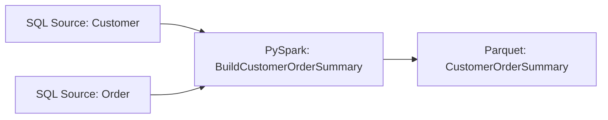

# SQL to PySpark

This example builds a complete Pipelantic pipeline that reads typed datasets
from SQL, executes transformations with PySpark, and publishes the resulting
distributed dataset through a Spark-compatible sink.

The example demonstrates a deliberate backend transition:

```text
SQL Source
    │
    ▼
JDBC / SQL Read
    │
    ▼
PySpark Transformation Region
    │
    ▼
Spark-Compatible Sink
```

Pipelantic keeps the source contracts, transformation contracts, pipeline
topology, validation, and lineage portable. The execution profile selects the
SQL source plugin, PySpark transformation backend, Spark Provider, and sink
implementation.

## Goal

Build a pipeline that:

1. Reads customers and orders from SQL.
2. Validates source schemas and contracts.
3. Materializes the inputs as typed Spark DataFrames.
4. Joins and aggregates them with a PySpark implementation.
5. Produces `CustomerOrderSummary` records.
6. Publishes the output to Parquet or Delta Lake.
7. Generates ODCS, DTCS, and DPCS artifacts.
8. Executes locally with SQLite and local Spark.
9. Remains portable to PostgreSQL, Databricks, EMR, Kubernetes, and other
   supported environments.

## When to Use This Pattern

SQL-to-PySpark execution is useful when:

- The source system is relational.
- The source data is too large for one machine.
- Transformations benefit from distributed execution.
- Multiple SQL systems must be combined.
- The destination is a lakehouse or distributed file format.
- Spark-native features are required.
- SQL pushdown cannot preserve all transformation semantics.

When all data is co-located in one capable database and the transformation is
SQL-compatible, `SQL_TO_SQL.md` may be more efficient.

## Architecture

```text
Customers SQL ─────┐
                   ├──► PySpark Transformation ───► Parquet / Delta Sink
Orders SQL ────────┘
```

Physical execution:

```text
SQL Tables
    │
    ▼
Partitioned JDBC Reads
    │
    ▼
Spark Logical Plan
    │
    ▼
Catalyst and AQE
    │
    ▼
Distributed Sink Write
```

## Project Structure

```text
sql-to-pyspark/
├── pyproject.toml
├── database/
│   └── source.db
├── output/
│   └── customer_order_summary/
├── src/
│   └── sql_to_pyspark/
│       ├── __init__.py
│       ├── contracts.py
│       ├── transformations.py
│       ├── pyspark_implementations.py
│       ├── pipeline.py
│       └── profiles.py
├── contracts/
│   ├── data/
│   ├── transformations/
│   └── pipelines/
├── docs/
└── tests/
    ├── test_pipeline.py
    └── test_backend_equivalence.py
```

## Source Tables

### `customers`

```sql
CREATE TABLE customers (
    customer_id INTEGER PRIMARY KEY,
    full_name TEXT NOT NULL,
    email TEXT NOT NULL
);
```

### `orders`

```sql
CREATE TABLE orders (
    order_id INTEGER PRIMARY KEY,
    customer_id INTEGER NOT NULL,
    order_total NUMERIC NOT NULL,
    status TEXT NOT NULL
);
```

Example rows:

```text
customers
---------
1 | Ada Lovelace | ada@example.com
2 | Grace Hopper | grace@example.com
3 | Alan Turing  | alan@example.com

orders
------
1001 | 1 | 125.50 | paid
1002 | 1 | 80.00  | paid
1003 | 2 | 300.00 | paid
1004 | 3 | 50.00  | cancelled
```

## Step 1 — Define the Data Contracts

```python
# src/sql_to_pyspark/contracts.py

from decimal import Decimal
from typing import Annotated, Literal

from pydantic import Field

from contractmodel import DataContractModel


class Customer(DataContractModel):
    customer_id: Annotated[int, Field(strict=True, gt=0)]
    full_name: str
    email: str


class Order(DataContractModel):
    order_id: Annotated[int, Field(strict=True, gt=0)]
    customer_id: Annotated[int, Field(strict=True, gt=0)]
    order_total: Annotated[
        Decimal,
        Field(ge=0),
    ]
    status: Literal[
        "paid",
        "cancelled",
        "refunded",
    ]


class CustomerOrderSummary(DataContractModel):
    customer_id: Annotated[int, Field(strict=True, gt=0)]
    full_name: str
    email: str
    paid_order_count: Annotated[int, Field(ge=0)]
    paid_order_total: Annotated[
        Decimal,
        Field(ge=0),
    ]
```

The contracts remain independent of SQL and Spark.

## Step 2 — Define the Transformation Contract

```python
# src/sql_to_pyspark/transformations.py

from typing import Literal

from pipelantic import Input, Output, Parameter, Transformation

from .contracts import Customer, CustomerOrderSummary, Order


class BuildCustomerOrderSummary(Transformation):
    customers: Input[Customer]
    orders: Input[Order]

    included_status: Parameter[
        Literal["paid", "cancelled", "refunded"]
    ] = "paid"

    result: Output[CustomerOrderSummary]
```

The transformation contract does not know whether execution occurs in SQL,
PySpark, Polars, or another backend.

## Step 3 — Add the PySpark Implementation

```python
# src/sql_to_pyspark/pyspark_implementations.py

from pyspark.sql import functions as F

from pipelantic.pyspark import SparkDataFrame

from .contracts import Customer, CustomerOrderSummary, Order
from .transformations import BuildCustomerOrderSummary


@BuildCustomerOrderSummary.implementation("pyspark")
def build_customer_order_summary(
    customers: SparkDataFrame[Customer],
    orders: SparkDataFrame[Order],
    included_status: str,
) -> SparkDataFrame[CustomerOrderSummary]:
    paid_orders = (
        orders.native
        .filter(
            F.col("status") == F.lit(included_status)
        )
        .groupBy("customer_id")
        .agg(
            F.count("order_id").alias(
                "paid_order_count"
            ),
            F.sum("order_total").alias(
                "paid_order_total"
            ),
        )
    )

    result = (
        customers.native
        .join(
            paid_orders,
            on="customer_id",
            how="left",
        )
        .select(
            "customer_id",
            "full_name",
            "email",
            F.coalesce(
                F.col("paid_order_count"),
                F.lit(0),
            ).alias("paid_order_count"),
            F.coalesce(
                F.col("paid_order_total"),
                F.lit(0),
            ).alias("paid_order_total"),
        )
    )

    return SparkDataFrame[
        CustomerOrderSummary
    ].from_native(result)
```

The exact typed wrapper API may evolve.

The implementation should preserve:

- Contract identity
- Spark schema compatibility
- Logical lineage
- Lazy execution
- No unintended actions

## Step 4 — Define the Pipeline

```python
# src/sql_to_pyspark/pipeline.py

from pipelantic import Pipeline, Sink, Source

from .contracts import Customer, CustomerOrderSummary, Order
from .transformations import BuildCustomerOrderSummary


class CustomerOrderSparkPipeline(Pipeline):
    customers: Source[Customer] = Source(
        binding="customers_sql",
    )

    orders: Source[Order] = Source(
        binding="orders_sql",
    )

    summary = BuildCustomerOrderSummary.step(
        customers=customers,
        orders=orders,
        included_status="paid",
    )

    output: Sink[CustomerOrderSummary] = Sink(
        input=summary.result,
        binding="summary_output",
    )
```

The pipeline remains declarative and backend-independent.

## Step 5 — Define the Local Spark Profile

```python
# src/sql_to_pyspark/profiles.py

from pipelantic import Profile


local_spark = Profile(
    name="local-spark",
    orchestrator="local-python",
    transformation_engine="pyspark",
    bindings={
        "customers_sql": {
            "plugin": "jdbc",
            "resource": "source_database",
            "table": "customers",
        },
        "orders_sql": {
            "plugin": "jdbc",
            "resource": "source_database",
            "table": "orders",
        },
        "summary_output": {
            "plugin": "parquet",
            "path": "output/customer_order_summary",
            "write_mode": "overwrite",
        },
    },
    resources={
        "source_database": {
            "provider": "sql",
            "url": "jdbc:sqlite:database/source.db",
            "driver": "org.sqlite.JDBC",
        },
        "spark": {
            "provider": "local-spark",
            "master": "local[*]",
            "session_timezone": "UTC",
            "adaptive_execution": True,
        },
    },
)
```

The profile selects:

- Local Python orchestration
- PySpark transformation execution
- JDBC source reads
- Parquet sink writes
- Local Spark session provider

## JDBC Driver Requirement

Local SQLite JDBC execution requires the appropriate driver JAR.

The Spark Provider may resolve it through:

- Maven coordinates
- A configured JAR path
- A locked dependency bundle

Conceptually:

```python
"spark": {
    "provider": "local-spark",
    "packages": [
        "org.xerial:sqlite-jdbc:<version>",
    ],
}
```

Dependency versions should be locked in real projects.

## Step 6 — Initialize the Source Database

```python
from pathlib import Path
import sqlite3


database_path = Path("database/source.db")
database_path.parent.mkdir(
    parents=True,
    exist_ok=True,
)

with sqlite3.connect(database_path) as connection:
    connection.executescript(
        '''
        DROP TABLE IF EXISTS customers;
        DROP TABLE IF EXISTS orders;

        CREATE TABLE customers (
            customer_id INTEGER PRIMARY KEY,
            full_name TEXT NOT NULL,
            email TEXT NOT NULL
        );

        CREATE TABLE orders (
            order_id INTEGER PRIMARY KEY,
            customer_id INTEGER NOT NULL,
            order_total NUMERIC NOT NULL,
            status TEXT NOT NULL
        );
        '''
    )

    connection.executemany(
        '''
        INSERT INTO customers
        VALUES (?, ?, ?)
        ''',
        [
            (1, "Ada Lovelace", "ada@example.com"),
            (2, "Grace Hopper", "grace@example.com"),
            (3, "Alan Turing", "alan@example.com"),
        ],
    )

    connection.executemany(
        '''
        INSERT INTO orders
        VALUES (?, ?, ?, ?)
        ''',
        [
            (1001, 1, 125.50, "paid"),
            (1002, 1, 80.00, "paid"),
            (1003, 2, 300.00, "paid"),
            (1004, 3, 50.00, "cancelled"),
        ],
    )
```

## Step 7 — Validate the Pipeline

```python
from sql_to_pyspark.pipeline import CustomerOrderSparkPipeline


report = CustomerOrderSparkPipeline.validate()
report.raise_for_errors()
```

Definition validation should verify:

- Sources and sink are declared.
- Both transformation inputs are satisfied.
- Contracts resolve.
- The graph is acyclic.
- Step identities are unique.

## Step 8 — Validate the Profile

```python
from sql_to_pyspark.pipeline import CustomerOrderSparkPipeline
from sql_to_pyspark.profiles import local_spark


profile_report = CustomerOrderSparkPipeline.validate_profile(
    local_spark,
)
profile_report.raise_for_errors()
```

Capability validation should verify:

- A PySpark implementation exists.
- The PySpark plugin is installed.
- The Spark Provider can create a local session.
- The JDBC driver is available.
- SQL contract types map safely to Spark types.
- Decimal semantics can be preserved.
- The Parquet sink supports the output contract.
- Required Spark capabilities are available.

## Step 9 — Build the Pipeline Plan

```python
plan = CustomerOrderSparkPipeline.plan(
    profile=local_spark,
)
```

The plan should include:

```text
Source region:
- JDBC read: customers
- JDBC read: orders

Spark region:
- Filter orders
- Aggregate paid orders
- Left join customers
- Coalesce missing metrics

Sink action:
- Validate CustomerOrderSummary
- Write Parquet
```

## SQL-to-Spark Boundary

The JDBC read is a materialization boundary between SQL and Spark.

Pipelantic should make the boundary explicit.

```text
SQL Relation
    │
    ▼
JDBC Partitioned Read
    │
    ▼
Spark DataFrame
```

The planner should identify:

- Selected columns
- Predicates eligible for pushdown
- Partitioning strategy
- Type mappings
- Data transfer estimates
- Source contract validation strategy

## JDBC Predicate Pushdown

Filters known before the Spark transformation may be pushed into the SQL read.

Examples include:

- Date ranges
- Status filters
- Tenant filters
- Incremental watermarks

Pushdown should occur only when semantics are preserved.

## JDBC Projection Pruning

Only required source columns should be read.

For this pipeline:

```text
customers:
- customer_id
- full_name
- email

orders:
- order_id
- customer_id
- order_total
- status
```

Unused columns should not cross the SQL-to-Spark boundary.

## JDBC Partitioned Reads

Large tables may be read in parallel.

Conceptually:

```python
{
    "partition_column": "customer_id",
    "lower_bound": 1,
    "upper_bound": 1000000,
    "num_partitions": 16,
}
```

Partition bounds are execution configuration, not pipeline semantics.

Poor bounds can cause skew or missing data if configured incorrectly, so the
plugin should validate them carefully.

## Step 10 — Inspect the Spark Plan

```python
compiled = plan.compile(
    target="pyspark",
)

print(
    compiled.optimization_report()
)
```

The report may include:

- JDBC pushdown
- JDBC partitioning
- Spark region fusion
- Action boundaries
- Join strategy
- AQE status
- Sink write mode
- Validation strategy
- Required packages

## Spark Explain

```python
compiled.explain(
    mode="formatted",
)
```

Plan inspection should not execute the pipeline.

## Step 11 — Execute

Synchronous execution:

```python
result = CustomerOrderSparkPipeline.run(
    profile=local_spark,
)
```

Asynchronous execution:

```python
result = await CustomerOrderSparkPipeline.arun(
    profile=local_spark,
)
```

Pipelantic coordinates the Spark session and execution lifecycle.

## Expected Output

The Parquet sink should contain:

| customer_id | full_name | email | paid_order_count | paid_order_total |
|---|---|---|---:|---:|
| 1 | Ada Lovelace | ada@example.com | 2 | 205.50 |
| 2 | Grace Hopper | grace@example.com | 1 | 300.00 |
| 3 | Alan Turing | alan@example.com | 0 | 0.00 |

## Step 12 — Read the Output

For verification:

```python
output = spark.read.parquet(
    "output/customer_order_summary",
)

output.orderBy(
    "customer_id",
).show()
```

This read belongs to testing or inspection, not the pipeline definition.

## Contract Validation

Source and sink contracts remain authoritative.

Validation may include:

- Spark schema checks
- Required column checks
- Nullability checks
- Decimal precision checks
- Allowed status values
- Numeric range checks
- Output validation before the sink write

## Source Validation

The JDBC source plugin may validate:

- Table existence
- Column existence
- SQL-to-Spark type compatibility
- Nullability
- Required constraints where introspectable

Row-level rules may execute in SQL, Spark, or both.

## Output Validation

The PySpark plugin may compile portable output rules into Spark expressions.

Conceptually:

```python
invalid = result.filter(
    (F.col("customer_id") <= 0)
    | (F.col("paid_order_count") < 0)
    | (F.col("paid_order_total") < 0)
)
```

The active policy determines whether invalid rows:

- Fail the step
- Quarantine
- Route to a side output
- Continue with valid rows

## Materialization and Actions

The transformation remains lazy.

The sink write is the primary Spark action.

Additional actions may occur for:

- Full validation
- Quality gates
- Metrics
- Checkpointing

The plan should list all actions explicitly.

## Join Strategy

Spark may choose:

- Broadcast hash join
- Sort-merge join
- Shuffle hash join

AQE may revise the physical strategy at runtime.

The logical transformation remains a left join.

## Broadcast Optimization

If the customer table is small, the planner may recommend broadcasting it.

The profile may allow:

```python
"spark": {
    "broadcast_threshold": "64MB",
}
```

The optimization report should show whether broadcast was selected.

## Caching

Caching is unnecessary in this simple pipeline because the summary is consumed
once.

A larger pipeline may cache an intermediate result when it feeds multiple sinks
or quality gates.

## Parquet Sink

The Parquet sink may configure:

- Write mode
- Compression
- Output partitioning
- Target file size
- Schema compatibility
- Overwrite strategy

These settings belong in the profile or sink binding.

## Delta Lake Alternative

The same pipeline may write to Delta Lake.

```python
"summary_output": {
    "plugin": "delta",
    "table": "curated.customer_order_summary",
    "write_mode": "merge",
}
```

The Spark Provider must advertise Delta support.

## Production Databricks Profile

```python
databricks = Profile(
    name="databricks",
    orchestrator="airflow",
    transformation_engine="pyspark",
    bindings={
        "customers_sql": {
            "plugin": "jdbc",
            "resource": "crm_database",
            "table": "public.customers",
        },
        "orders_sql": {
            "plugin": "jdbc",
            "resource": "commerce_database",
            "table": "public.orders",
        },
        "summary_output": {
            "plugin": "delta",
            "resource": "analytics_catalog",
            "table": "curated.customer_order_summary",
            "write_mode": "merge",
        },
    },
    resources={
        "spark": {
            "provider": "databricks",
            "runtime": "serverless",
            "session_timezone": "UTC",
        },
    },
)
```

Credentials come from approved identity and secret providers.

## Production EMR Profile

```python
emr = Profile(
    name="emr",
    orchestrator="airflow",
    transformation_engine="pyspark",
    bindings={
        "customers_sql": {
            "plugin": "jdbc",
            "resource": "crm_database",
            "table": "customers",
        },
        "orders_sql": {
            "plugin": "jdbc",
            "resource": "commerce_database",
            "table": "orders",
        },
        "summary_output": {
            "plugin": "parquet",
            "path": "s3://analytics/curated/customer_order_summary/",
            "write_mode": "overwrite",
        },
    },
    resources={
        "spark": {
            "provider": "emr",
            "release_label": "approved-runtime",
        },
    },
)
```

## Multiple SQL Systems

One major reason to choose Spark is joining data from separate SQL systems.

```text
CRM PostgreSQL ─────┐
                    ├──► Spark Join ───► Lakehouse
Commerce SQL ───────┘
```

Without database federation, full SQL pushdown is impossible.

Spark provides the distributed execution layer.

## Pushdown vs. Spark Execution

The planner may divide responsibility:

```text
SQL source:
- Apply source-local filters
- Select required columns

Spark:
- Join across systems
- Aggregate
- Validate
- Publish
```

This hybrid approach minimizes data movement while retaining distributed
portability.

## Decimal Semantics

`order_total` uses `Decimal`.

The SQL source plugin and PySpark plugin must agree on:

- Precision
- Scale
- Aggregate widening
- Null behavior
- Output contract compatibility

The planner should reject a lossy mapping.

## Timestamp Semantics

For timestamp fields, the profile should set the Spark session time zone
explicitly.

Recommended default:

```text
UTC
```

SQL source time-zone behavior must also be understood.

## Null Semantics

The PySpark implementation should match the transformation contract for:

- Null join keys
- Missing aggregates
- Coalesce behavior
- Required fields
- SQL three-valued logic at the source
- Spark null behavior after materialization

## Invalid Source Rows

Invalid rows may be:

- Rejected in SQL
- Filtered in Spark
- Quarantined in a Spark sink
- Routed to a side output
- Cause pipeline failure

The validation policy should make the chosen behavior explicit.

## Failure Handling

Potential failures include:

- SQL connection failure
- Missing JDBC driver
- Source query failure
- Spark session startup failure
- Type mapping incompatibility
- Executor failure
- Shuffle failure
- Sink write failure
- Validation failure
- Permission failure

Plugins should translate failures into structured diagnostics.

## Retry and Idempotency

Retries require sink-aware behavior.

For an overwrite Parquet sink:

- Retry may be safe when the write strategy uses an isolated staging path.
- Partial files should be cleaned before retry.

For an append sink:

- Retry may duplicate output.

The execution plan should consider idempotency before applying retries.

## Cancellation

Cancellation should propagate to:

- Spark job groups
- JDBC reads where possible
- Sink writes
- Remote cluster jobs

The execution report should record cancellation status.

## Lineage

Logical lineage:

```text
Customer + Order
        │
        ▼
BuildCustomerOrderSummary
        │
        ▼
CustomerOrderSummary
```

Runtime lineage may add:

- Source database tables
- JDBC query identifiers
- Spark application ID
- Spark query execution IDs
- Parquet path or Delta table
- Sink commit metadata

## Step 13 — Generate Contracts

```python
CustomerOrderSparkPipeline.write_contracts(
    "contracts/",
)
```

Expected output:

```text
contracts/
├── data/
│   ├── customer.odcs.yaml
│   ├── order.odcs.yaml
│   └── customer-order-summary.odcs.yaml
├── transformations/
│   └── build-customer-order-summary.dtcs.yaml
└── pipelines/
    └── customer-order-spark-pipeline.dpcs.yaml
```

The generated contracts remain independent of the local Spark environment.

## Step 14 — Generate Documentation

```python
plan.write_html(
    "docs/customer-order-spark-pipeline.html",
    self_contained=True,
)
```

Profile-aware documentation may include:

- Selected PySpark implementation
- Spark Provider
- SQL-to-Spark materialization boundaries
- JDBC pushdown
- Spark optimization report
- Sink type
- Validation strategy
- Runtime capability requirements

## Step 15 — Generate Mermaid

```python
plan.write_mermaid(
    "docs/customer-order-spark-lineage.mmd",
)
```

Example:



## Testing

Create `tests/test_pipeline.py`:

```python
from pathlib import Path
import sqlite3

from pyspark.sql import SparkSession

from sql_to_pyspark.pipeline import CustomerOrderSparkPipeline
from sql_to_pyspark.profiles import local_spark


def create_database(path: Path) -> None:
    with sqlite3.connect(path) as connection:
        connection.executescript(
            '''
            CREATE TABLE customers (
                customer_id INTEGER PRIMARY KEY,
                full_name TEXT NOT NULL,
                email TEXT NOT NULL
            );

            CREATE TABLE orders (
                order_id INTEGER PRIMARY KEY,
                customer_id INTEGER NOT NULL,
                order_total NUMERIC NOT NULL,
                status TEXT NOT NULL
            );
            '''
        )

        connection.execute(
            '''
            INSERT INTO customers
            VALUES (1, 'Ada Lovelace', 'ada@example.com')
            '''
        )

        connection.executemany(
            '''
            INSERT INTO orders
            VALUES (?, ?, ?, ?)
            ''',
            [
                (1001, 1, 125.50, "paid"),
                (1002, 1, 80.00, "paid"),
            ],
        )


def test_sql_to_pyspark_pipeline(
    tmp_path: Path,
    spark: SparkSession,
) -> None:
    database_path = tmp_path / "source.db"
    output_path = tmp_path / "summary"

    create_database(database_path)

    profile = local_spark.with_updates(
        bindings={
            "customers_sql": {
                "plugin": "jdbc",
                "resource": "source_database",
                "table": "customers",
            },
            "orders_sql": {
                "plugin": "jdbc",
                "resource": "source_database",
                "table": "orders",
            },
            "summary_output": {
                "plugin": "parquet",
                "path": str(output_path),
                "write_mode": "overwrite",
            },
        },
        resources={
            "source_database": {
                "provider": "sql",
                "url": f"jdbc:sqlite:{database_path}",
                "driver": "org.sqlite.JDBC",
            },
            "spark": {
                "provider": "existing-session",
                "session": spark,
            },
        },
    )

    CustomerOrderSparkPipeline.run(
        profile=profile,
    )

    rows = (
        spark.read.parquet(str(output_path))
        .orderBy("customer_id")
        .collect()
    )

    assert len(rows) == 1
    assert rows[0]["customer_id"] == 1
    assert rows[0]["paid_order_count"] == 2
```

The test uses `collect()` only for a tiny deterministic fixture.

## Backend Equivalence

Create `tests/test_backend_equivalence.py`:

```python
def test_pyspark_matches_reference(
    spark_result,
    polars_result,
) -> None:
    assert normalize(spark_result) == normalize(polars_result)
```

Equivalence tests should account for representation differences while checking
contractual equality.

## What This Example Demonstrates

This example shows:

- SQL source plugins
- JDBC materialization
- Typed Spark DataFrames
- PySpark transformation implementations
- Spark region planning
- Catalyst and AQE
- Distributed joins and aggregations
- Source pushdown
- Schema and row validation
- Parquet or Delta publication
- Spark Provider lifecycle
- Backend equivalence testing
- ODCS, DTCS, and DPCS generation
- Logical and runtime lineage

## Design Takeaways

The logical transformation remains:

```text
Customer + Order
        │
        ▼
BuildCustomerOrderSummary
        │
        ▼
CustomerOrderSummary
```

The profile chooses a physical execution strategy:

```text
SQL sources
    │
    ▼
PySpark
    │
    ▼
Parquet / Delta
```

A different profile may choose:

- SQL-to-SQL
- SQL-to-Polars
- SQL-to-PySpark
- PySpark-to-Delta
- Hybrid SQL and PySpark

The pipeline author does not rewrite the logical workflow.

## Key Principle

> SQL-to-PySpark execution uses SQL systems as typed data sources and Spark as
> the distributed transformation engine. Pipelantic makes the backend
> transition explicit while preserving portable contracts, validation,
> planning, lineage, diagnostics, and observable results.

## Next Step

Continue with [PySpark to SQL](PYSPARK_TO_SQL.md) to build the reverse pattern:
distributed Spark transformation followed by contract-validated transactional
publication to a relational database.
