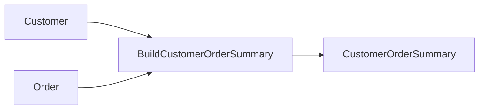

# SQL to SQL

!!! warning "Future design—not a Pipelantic 0.5 API guide"
    This page is a design study. It may describe packages, commands, or
    interfaces that are not installable yet. Use Current Capabilities, the
    runnable examples under `examples/`, the API reference, and the CLI
    reference for shipped behavior.


This example builds a complete Pipelantic pipeline that reads customer and
order data from SQL, performs the transformation **inside the database**, and
writes the resulting customer metrics to another SQL table.

The example demonstrates SQL-native execution as the preferred strategy for
SQL-to-SQL pipelines. Pipelantic keeps the logical transformation portable,
while the planner selects the SQL implementation when the database and dialect
can preserve the required semantics.

A Polars implementation may still exist as a fallback for unsupported SQL
features, cross-system joins, or hybrid execution.

## Goal

Build a pipeline that:

1. Reads customers from SQL.
2. Reads orders from SQL.
3. Validates both source contracts.
4. Joins and aggregates the data inside SQL.
5. Produces `CustomerOrderSummary` records.
6. Writes the result with `INSERT ... SELECT`, `CREATE TABLE AS SELECT`, or
   another supported SQL publication strategy.
7. Generates ODCS, DTCS, and DPCS artifacts.
8. Executes locally against SQLite.
9. Remains portable to PostgreSQL, DuckDB, Snowflake, BigQuery, Databricks SQL,
   and other supported SQL plugins.

## Architecture

```text
Customer SQL Relation ─────┐
                           ├──► SQL Transformation ───► Customer Summary Table
Order SQL Relation ────────┘
```

The preferred physical execution path is:

```text
Source Tables
      │
      ▼
Compiled SQL Query or CTE Graph
      │
      ▼
Contract Validation
      │
      ▼
Transactional SQL Publication
```

No intermediate dataframe needs to be materialized in Python.

## Project Structure

```text
sql-to-sql/
├── pyproject.toml
├── database/
│   ├── source.db
│   └── warehouse.db
├── src/
│   └── sql_to_sql/
│       ├── __init__.py
│       ├── contracts.py
│       ├── transformations.py
│       ├── sql_implementations.py
│       ├── dataframe_implementations.py
│       ├── pipeline.py
│       └── profiles.py
├── contracts/
│   ├── data/
│   ├── transformations/
│   └── pipelines/
├── docs/
└── tests/
    ├── test_sql_execution.py
    └── test_backend_equivalence.py
```

## Source Tables

The source database contains two tables.

### `customers`

```sql
CREATE TABLE customers (
    customer_id INTEGER PRIMARY KEY,
    full_name TEXT NOT NULL,
    email TEXT NOT NULL
);
```

Example rows:

```text
1 | Ada Lovelace | ada@example.com
2 | Grace Hopper | grace@example.com
3 | Alan Turing  | alan@example.com
```

### `orders`

```sql
CREATE TABLE orders (
    order_id INTEGER PRIMARY KEY,
    customer_id INTEGER NOT NULL,
    order_total NUMERIC NOT NULL,
    status TEXT NOT NULL
);
```

Example rows:

```text
1001 | 1 | 125.50 | paid
1002 | 1 | 80.00  | paid
1003 | 2 | 300.00 | paid
1004 | 3 | 50.00  | cancelled
```

## Step 1 — Define the Data Contracts

```python
# src/sql_to_sql/contracts.py

from decimal import Decimal
from typing import Annotated, Literal

from pydantic import Field

from pipelantic import DataContractModel


class Customer(DataContractModel):
    customer_id: Annotated[int, Field(strict=True, gt=0)]
    full_name: str
    email: str


class Order(DataContractModel):
    order_id: Annotated[int, Field(strict=True, gt=0)]
    customer_id: Annotated[int, Field(strict=True, gt=0)]
    order_total: Annotated[Decimal, Field(ge=0)]
    status: Literal["paid", "cancelled", "refunded"]


class CustomerOrderSummary(DataContractModel):
    customer_id: Annotated[int, Field(strict=True, gt=0)]
    full_name: str
    email: str
    paid_order_count: Annotated[int, Field(ge=0)]
    paid_order_total: Annotated[Decimal, Field(ge=0)]
```

The contracts describe logical records and guarantees.

They do not depend on:

- SQLite
- PostgreSQL
- Snowflake
- SQLAlchemy
- Polars
- Airflow
- Any particular SQL dialect

## Step 2 — Define the Transformation Contract

```python
# src/sql_to_sql/transformations.py

from typing import Literal

from pipelantic import Input, Output, Parameter, Transformation

from .contracts import Customer, CustomerOrderSummary, Order


class BuildCustomerOrderSummary(Transformation):
    customers: Input[Customer]
    orders: Input[Order]

    included_status: Parameter[
        Literal["paid", "cancelled", "refunded"]
    ] = "paid"

    result: Output[CustomerOrderSummary]
```

The transformation describes the logical operation.

It does not contain SQL text, dataframe logic, table names, or database
connections.

## Step 3 — Add the SQL Implementation

The SQL implementation should return a typed logical SQL query rather than an
unstructured string.

```python
# src/sql_to_sql/sql_implementations.py

from pipelantic.sql import (
    SqlQuery,
    SqlRelation,
    coalesce,
    count,
    parameter,
    select,
    sum_,
)

from .contracts import Customer, CustomerOrderSummary, Order
from .transformations import BuildCustomerOrderSummary


@BuildCustomerOrderSummary.implementation("sql")
def build_customer_order_summary_sql(
    customers: SqlRelation[Customer],
    orders: SqlRelation[Order],
    included_status: str,
) -> SqlQuery[CustomerOrderSummary]:
    paid_orders = (
        select(
            orders.customer_id,
            count(orders.order_id).alias("paid_order_count"),
            sum_(orders.order_total).alias("paid_order_total"),
        )
        .from_(orders)
        .where(
            orders.status == parameter(
                "included_status",
                included_status,
            )
        )
        .group_by(orders.customer_id)
        .cte("paid_orders")
    )

    return (
        select(
            customers.customer_id,
            customers.full_name,
            customers.email,
            coalesce(
                paid_orders.paid_order_count,
                0,
            ).alias("paid_order_count"),
            coalesce(
                paid_orders.paid_order_total,
                0,
            ).alias("paid_order_total"),
        )
        .from_(
            customers.left_join(
                paid_orders,
                on=(
                    customers.customer_id
                    == paid_orders.customer_id
                ),
            )
        )
    )
```

The exact SQL expression API may evolve.

The important requirements are:

- Inputs are typed `SqlRelation[T]` objects.
- The result is a typed `SqlQuery[T]`.
- Parameters are bound safely.
- The SQL plugin compiles the logical query for the selected dialect.
- The output remains governed by `CustomerOrderSummary`.

## Raw SQL Escape Hatch

Pipelantic may also support raw SQL for advanced or database-specific cases.

```python
from pipelantic.sql import RawSqlQuery


@BuildCustomerOrderSummary.implementation(
    "sql-raw",
    dialects={"postgresql"},
)
def build_customer_order_summary_postgres(
    included_status: str,
) -> RawSqlQuery[CustomerOrderSummary]:
    return RawSqlQuery(
        statement='''
        SELECT
            c.customer_id,
            c.full_name,
            c.email,
            COUNT(o.order_id) AS paid_order_count,
            COALESCE(SUM(o.order_total), 0) AS paid_order_total
        FROM customers AS c
        LEFT JOIN orders AS o
            ON c.customer_id = o.customer_id
           AND o.status = :included_status
        GROUP BY
            c.customer_id,
            c.full_name,
            c.email
        ''',
        parameters={
            "included_status": included_status,
        },
    )
```

Raw SQL should require:

- Bound parameters
- Explicit dialect expectations
- Declared input and output contracts
- Portability diagnostics
- No embedded credentials

## Step 4 — Add an Optional Polars Fallback

A dataframe implementation is useful when SQL execution is unavailable or when
the planner must cross a non-SQL boundary.

```python
# src/sql_to_sql/dataframe_implementations.py

import polars as pl

from .transformations import BuildCustomerOrderSummary


@BuildCustomerOrderSummary.implementation("polars")
def build_customer_order_summary_polars(
    customers: pl.DataFrame,
    orders: pl.DataFrame,
    included_status: str,
) -> pl.DataFrame:
    included_orders = (
        orders
        .filter(pl.col("status") == included_status)
        .group_by("customer_id")
        .agg(
            pl.len().alias("paid_order_count"),
            pl.col("order_total").sum().alias("paid_order_total"),
        )
    )

    return (
        customers
        .join(
            included_orders,
            on="customer_id",
            how="left",
        )
        .with_columns(
            pl.col("paid_order_count").fill_null(0),
            pl.col("paid_order_total").fill_null(0),
        )
        .select(
            "customer_id",
            "full_name",
            "email",
            "paid_order_count",
            "paid_order_total",
        )
    )
```

Both implementations satisfy the same DTCS transformation contract.

## Step 5 — Define the Pipeline

```python
# src/sql_to_sql/pipeline.py

from pipelantic import Pipeline, Sink, Source

from .contracts import Customer, CustomerOrderSummary, Order
from .transformations import BuildCustomerOrderSummary


class CustomerOrderPipeline(Pipeline):
    customers: Source[Customer] = Source(
        binding="customers_source",
    )

    orders: Source[Order] = Source(
        binding="orders_source",
    )

    summary = BuildCustomerOrderSummary.step(
        customers=customers,
        orders=orders,
        included_status="paid",
    )

    warehouse: Sink[CustomerOrderSummary] = Sink(
        input=summary.result,
        binding="customer_order_summary_sink",
    )
```

The pipeline remains independent of SQL syntax and database configuration.

## Step 6 — Define the Local SQL Profile

```python
# src/sql_to_sql/profiles.py

from pipelantic import Profile


local_sql = Profile(
    name="local-sql",
    orchestrator="local-python",
    transformation_engine="sql",
    bindings={
        "customers_source": {
            "plugin": "sqlite",
            "resource": "source_database",
            "table": "customers",
        },
        "orders_source": {
            "plugin": "sqlite",
            "resource": "source_database",
            "table": "orders",
        },
        "customer_order_summary_sink": {
            "plugin": "sqlite",
            "resource": "warehouse_database",
            "table": "customer_order_summary",
            "write_mode": "replace",
        },
    },
    resources={
        "source_database": {
            "provider": "sqlalchemy",
            "url": "sqlite:///database/source.db",
        },
        "warehouse_database": {
            "provider": "sqlalchemy",
            "url": "sqlite:///database/warehouse.db",
        },
    },
)
```

The exact Profile API may evolve.

The conceptual boundaries should remain:

- Bindings identify logical datasets.
- Resource Providers supply connections.
- The SQL plugin compiles and executes the transformation.
- Credentials remain outside the pipeline contract.

## Co-Located vs. Cross-Database Execution

Full SQL pushdown is simplest when all relations are accessible in one SQL
execution environment.

### Same database

```text
customers table ─┐
                 ├──► one compiled SQL query
orders table ────┘
```

### Different databases with federation

A plugin may push down the query if the target supports federated relations.

### Separate systems without federation

The planner may need to:

1. Materialize one or both inputs.
2. Move data through Arrow or a dataframe.
3. Use the Polars fallback.
4. Write the result through the SQL sink.

Cross-system movement should be explicit in the Pipeline Plan.

## Step 7 — Initialize the Databases

```python
from pathlib import Path
import sqlite3


source_path = Path("database/source.db")
warehouse_path = Path("database/warehouse.db")

source_path.parent.mkdir(parents=True, exist_ok=True)

with sqlite3.connect(source_path) as connection:
    connection.executescript(
        '''
        DROP TABLE IF EXISTS customers;
        DROP TABLE IF EXISTS orders;

        CREATE TABLE customers (
            customer_id INTEGER PRIMARY KEY,
            full_name TEXT NOT NULL,
            email TEXT NOT NULL
        );

        CREATE TABLE orders (
            order_id INTEGER PRIMARY KEY,
            customer_id INTEGER NOT NULL,
            order_total NUMERIC NOT NULL,
            status TEXT NOT NULL
        );
        '''
    )

    connection.executemany(
        '''
        INSERT INTO customers (
            customer_id,
            full_name,
            email
        )
        VALUES (?, ?, ?)
        ''',
        [
            (1, "Ada Lovelace", "ada@example.com"),
            (2, "Grace Hopper", "grace@example.com"),
            (3, "Alan Turing", "alan@example.com"),
        ],
    )

    connection.executemany(
        '''
        INSERT INTO orders (
            order_id,
            customer_id,
            order_total,
            status
        )
        VALUES (?, ?, ?, ?)
        ''',
        [
            (1001, 1, 125.50, "paid"),
            (1002, 1, 80.00, "paid"),
            (1003, 2, 300.00, "paid"),
            (1004, 3, 50.00, "cancelled"),
        ],
    )

warehouse_path.touch(exist_ok=True)
```

Database setup is operational configuration, not pipeline semantics.

## Step 8 — Validate the Pipeline

```python
from sql_to_sql.pipeline import CustomerOrderPipeline


report = CustomerOrderPipeline.validate()
report.raise_for_errors()
```

Definition and graph validation should verify:

- Both sources are valid.
- Both transformation inputs are bound.
- The output contract is valid.
- Step identities are unique.
- The graph is acyclic.
- Contract references resolve.

## Step 9 — Validate the SQL Profile

```python
from sql_to_sql.pipeline import CustomerOrderPipeline
from sql_to_sql.profiles import local_sql


profile_report = CustomerOrderPipeline.validate_profile(
    local_sql,
)
profile_report.raise_for_errors()
```

Capability validation should verify:

- A SQL implementation exists.
- The SQLite SQL plugin is installed.
- Required operations are supported.
- Source relations can participate in the same SQL region or be moved safely.
- Required type mappings are compatible.
- Output validation can be preserved.
- The sink write strategy is supported.
- Required transaction semantics are available.

## Step 10 — Build the Pipeline Plan

```python
plan = CustomerOrderPipeline.plan(
    profile=local_sql,
)
```

The plan should identify a SQL-capable region.

Conceptually:

```text
SQL Region: customer-order-summary

Inputs:
- customers_source
- orders_source

Logical operations:
- Filter orders by status
- Aggregate by customer_id
- Left join customers
- Coalesce missing metrics

Output:
- CustomerOrderSummary
```

## Step 11 — Inspect the Compiled SQL

```python
compiled = plan.compile(
    target="sql",
)

print(
    compiled.render(
        redact_parameters=True,
    )
)
```

A SQLite compilation may resemble:

```sql
WITH paid_orders AS (
    SELECT
        customer_id,
        COUNT(order_id) AS paid_order_count,
        SUM(order_total) AS paid_order_total
    FROM orders
    WHERE status = :included_status
    GROUP BY customer_id
)
SELECT
    c.customer_id,
    c.full_name,
    c.email,
    COALESCE(p.paid_order_count, 0) AS paid_order_count,
    COALESCE(p.paid_order_total, 0) AS paid_order_total
FROM customers AS c
LEFT JOIN paid_orders AS p
    ON c.customer_id = p.customer_id;
```

The query is inspectable before execution.

## Step 12 — Execute

Synchronous execution:

```python
result = CustomerOrderPipeline.run(
    profile=local_sql,
)
```

Asynchronous execution:

```python
result = await CustomerOrderPipeline.arun(
    profile=local_sql,
)
```

The SQL plugin should execute the query and publish the result transactionally
when supported.

## Publication Strategies

The sink plugin may compile the final publication as:

### Create table as select

```sql
CREATE TABLE customer_order_summary AS
SELECT ...;
```

### Insert select

```sql
INSERT INTO customer_order_summary (...)
SELECT ...;
```

### Replace through staging and swap

```text
Create staging table
      │
      ▼
Validate staging data
      │
      ▼
Swap or replace destination
```

### Merge or upsert

Useful for incremental pipelines when supported by the selected dialect.

The profile chooses the write strategy.

The strategy must not weaken the declared sink semantics.

## Expected Output

The destination table should contain:

| customer_id | full_name | email | paid_order_count | paid_order_total |
|---|---|---|---:|---:|
| 1 | Ada Lovelace | ada@example.com | 2 | 205.50 |
| 2 | Grace Hopper | grace@example.com | 1 | 300.00 |
| 3 | Alan Turing | alan@example.com | 0 | 0.00 |

## Contract Validation in SQL

The SQL plugin may validate `CustomerOrderSummary` using generated SQL.

Examples:

```sql
SELECT COUNT(*) AS invalid_count
FROM customer_order_summary_staging
WHERE customer_id <= 0;
```

```sql
SELECT COUNT(*) AS invalid_count
FROM customer_order_summary_staging
WHERE paid_order_count < 0
   OR paid_order_total < 0;
```

Validation may also include:

- Required column checks
- Type compatibility
- Nullability
- Decimal precision
- Allowed values
- Uniqueness
- Cross-field conditions

Unsupported rules should use a fallback validator or prevent planning.

## Transactional Publication

Recommended flow:

```text
Begin transaction
      │
      ▼
Execute transformation query
      │
      ▼
Materialize staging result
      │
      ▼
Validate output contract
      │
      ▼
Publish destination
      │
      ▼
Commit
```

On failure:

```text
Failure
   │
   ▼
Rollback
   │
   ▼
Cleanup temporary objects
   │
   ▼
Structured diagnostic
```

Plugins must not claim transactional behavior unsupported by the backend.

## Step Fusion

A larger SQL-to-SQL pipeline may contain multiple SQL-capable transformations.

```text
FilterOrders
      │
      ▼
JoinCustomers
      │
      ▼
AggregateMetrics
      │
      ▼
PublishSummary
```

The compiler may fuse them into one SQL program when it can preserve:

- Logical step identities
- Validation boundaries
- Retry boundaries
- Failure semantics
- Quality gates
- Lineage
- Observable outputs

One physical query may still represent several logical DTCS steps.

## SQL Pushdown

The planner should push down:

- Filters
- Projections
- Joins
- Aggregations
- Window functions
- Supported casts
- Supported validation predicates

Pushdown changes execution location, not pipeline meaning.

## Fallback to Polars

The planner may select Polars when:

- A required function is unsupported in the SQL dialect.
- Null or type semantics cannot be preserved.
- Inputs are in separate systems without federation.
- A custom Python validator requires materialization.
- A transformation has no SQL implementation.
- The profile explicitly disables SQL execution.

Conceptually:

```text
Can preserve semantics in SQL?
          │
     ┌────┴────┐
    Yes        No
     │          │
 SQL plan   Polars plan
```

Fallback should be visible in the plan and diagnostics.

## Hybrid Execution

A hybrid plan may look like:

```text
SQL sources
    │
    ▼
SQL filter and join
    │
    ▼
Arrow materialization
    │
    ▼
Polars-only transformation
    │
    ▼
SQL sink
```

Pipelantic should minimize physical transitions while preserving semantics.

## Step 13 — Generate Contracts

```python
CustomerOrderPipeline.write_contracts(
    "contracts/",
)
```

Expected output:

```text
contracts/
├── data/
│   ├── customer.odcs.yaml
│   ├── order.odcs.yaml
│   └── customer-order-summary.odcs.yaml
├── transformations/
│   └── build-customer-order-summary.dtcs.yaml
└── pipelines/
    └── customer-order-pipeline.dpcs.yaml
```

The generated contracts describe the logical workflow.

They should not embed:

- Connection strings
- Credentials
- Driver objects
- Compiled SQL containing secrets
- Runtime transaction identifiers

## Step 14 — Generate Documentation

```python
plan.write_html(
    "docs/customer-order-pipeline.html",
    self_contained=True,
)
```

Profile-aware documentation may include:

- Selected SQL implementation
- SQL plugin and dialect
- SQL-capable regions
- Pushdown decisions
- Materialization boundaries
- Redacted compiled SQL
- Validation strategy
- Transaction expectations

Logical pipeline documentation should remain distinct from runtime planning
details.

## Step 15 — Generate Lineage

```python
plan.write_mermaid(
    "docs/customer-order-lineage.mmd",
)
```

Logical lineage:



Even if the SQL compiler fuses the transformation and publication into one
statement, the logical lineage remains unchanged.

## Testing SQL Execution

Create `tests/test_sql_execution.py`:

```python
from decimal import Decimal
from pathlib import Path
import sqlite3

from sql_to_sql.pipeline import CustomerOrderPipeline
from sql_to_sql.profiles import local_sql


def create_source_database(path: Path) -> None:
    with sqlite3.connect(path) as connection:
        connection.executescript(
            '''
            CREATE TABLE customers (
                customer_id INTEGER PRIMARY KEY,
                full_name TEXT NOT NULL,
                email TEXT NOT NULL
            );

            CREATE TABLE orders (
                order_id INTEGER PRIMARY KEY,
                customer_id INTEGER NOT NULL,
                order_total NUMERIC NOT NULL,
                status TEXT NOT NULL
            );
            '''
        )

        connection.execute(
            '''
            INSERT INTO customers
            VALUES (1, 'Ada Lovelace', 'ada@example.com')
            '''
        )

        connection.executemany(
            '''
            INSERT INTO orders
            VALUES (?, ?, ?, ?)
            ''',
            [
                (1001, 1, 125.50, "paid"),
                (1002, 1, 80.00, "paid"),
            ],
        )


def test_sql_to_sql_pipeline(tmp_path: Path) -> None:
    source_path = tmp_path / "source.db"
    warehouse_path = tmp_path / "warehouse.db"

    create_source_database(source_path)

    profile = local_sql.with_resources(
        {
            "source_database": {
                "provider": "sqlalchemy",
                "url": f"sqlite:///{source_path}",
            },
            "warehouse_database": {
                "provider": "sqlalchemy",
                "url": f"sqlite:///{warehouse_path}",
            },
        }
    )

    CustomerOrderPipeline.run(
        profile=profile,
    )

    with sqlite3.connect(warehouse_path) as connection:
        rows = connection.execute(
            '''
            SELECT
                customer_id,
                full_name,
                email,
                paid_order_count,
                paid_order_total
            FROM customer_order_summary
            ORDER BY customer_id
            '''
        ).fetchall()

    assert rows == [
        (
            1,
            "Ada Lovelace",
            "ada@example.com",
            2,
            205.5,
        )
    ]
```

## Backend Equivalence Testing

Create `tests/test_backend_equivalence.py`:

```python
from sql_to_sql.pipeline import CustomerOrderPipeline


def test_sql_and_polars_are_equivalent(
    sql_profile,
    polars_profile,
) -> None:
    sql_result = CustomerOrderPipeline.run(
        profile=sql_profile,
    )

    polars_result = CustomerOrderPipeline.run(
        profile=polars_profile,
    )

    assert sql_result.outputs == polars_result.outputs
```

Real tests should normalize representation differences while comparing
contract-compatible values.

Equivalence testing is essential because SQL and dataframe backends may differ
in:

- Null behavior
- Decimal behavior
- Time handling
- Ordering
- String collation
- Aggregate return types

## Dialect Tests

Official SQL plugins should run the same example against supported dialects.

Suggested matrix:

- SQLite
- PostgreSQL
- DuckDB
- Snowflake
- BigQuery
- Databricks SQL

Each dialect should demonstrate either:

- Successful semantic equivalence
- A clear capability diagnostic
- A documented fallback path

## Production Profile Example

```python
production_sql = Profile(
    name="production-sql",
    orchestrator="airflow",
    transformation_engine="sql",
    sql_pushdown="automatic",
    bindings={
        "customers_source": {
            "plugin": "postgresql",
            "resource": "crm_database",
            "schema": "public",
            "table": "customers",
        },
        "orders_source": {
            "plugin": "postgresql",
            "resource": "commerce_database",
            "schema": "public",
            "table": "orders",
        },
        "customer_order_summary_sink": {
            "plugin": "snowflake",
            "resource": "analytics_warehouse",
            "schema": "CURATED",
            "table": "CUSTOMER_ORDER_SUMMARY",
            "write_mode": "merge",
        },
    },
)
```

Because these sources are in different systems, full SQL fusion may not be
possible unless a federation layer is available.

The planner may choose a hybrid plan.

## Single-Warehouse Production Example

Full SQL execution is most effective when all relations are in one warehouse.

```python
warehouse_sql = Profile(
    name="warehouse-sql",
    orchestrator="airflow",
    transformation_engine="sql",
    sql_pushdown="required",
    bindings={
        "customers_source": {
            "plugin": "snowflake",
            "resource": "analytics_warehouse",
            "schema": "RAW",
            "table": "CUSTOMERS",
        },
        "orders_source": {
            "plugin": "snowflake",
            "resource": "analytics_warehouse",
            "schema": "RAW",
            "table": "ORDERS",
        },
        "customer_order_summary_sink": {
            "plugin": "snowflake",
            "resource": "analytics_warehouse",
            "schema": "CURATED",
            "table": "CUSTOMER_ORDER_SUMMARY",
            "write_mode": "merge",
        },
    },
)
```

This profile can potentially compile the complete pipeline region into one
warehouse-native SQL program.

## Invalid Source Data

Examples include:

- Negative identifiers
- Negative totals
- Unsupported order status
- Null required fields
- Unexpected types
- Duplicate records when uniqueness is required

Source validation may use:

- Schema inspection
- SQL validation queries
- Database constraints
- ContractModel fallback

## Orphan Orders

The transformation should explicitly define how orders without matching
customers are handled.

Possible semantics include:

- Ignore them
- Reject them
- Quarantine them
- Fail the transformation
- Produce a separate output

This behavior belongs in DTCS.

It must not differ between SQL and Polars implementations.

## Ordering

Relational outputs are unordered unless order is explicitly required.

Tests and downstream transformations should not assume row order unless the
contract or transformation semantics declare one.

## Decimal Semantics

Financial totals should generally use `Decimal` rather than binary floating
point.

SQL plugins must preserve:

- Precision
- Scale
- Rounding
- Aggregate result type

A dialect that cannot preserve the required decimal semantics should not execute
the transformation silently.

## Null Semantics

SQL implementations must account for three-valued logic.

The SQL and Polars implementations should agree on:

- Join behavior
- Null filters
- Aggregate null handling
- Coalesce behavior
- Equality rules

## Retry and Idempotency

SQL writes should define whether retries are safe.

For example:

- Transactional `CREATE TABLE AS SELECT` may be safely retried after rollback.
- Plain append may duplicate rows.
- Merge may be idempotent only with a stable key.

The execution plan should consider write strategy and transaction behavior before
applying retries.

## Diagnostics

A SQL execution diagnostic may look like:

```text
PMSQL204

Pipeline: customer-order-pipeline
Step: build-customer-order-summary
Dialect: sqlite
Phase: compilation

The selected dialect cannot preserve the required decimal precision for
paid_order_total.

Suggested actions:
- Select a compatible decimal mapping.
- Use the Polars implementation.
- Use a database with exact numeric support.
```

## What This Example Demonstrates

This example now demonstrates:

- SQL-native transformation execution
- Typed `SqlRelation[T]` inputs
- Typed `SqlQuery[T]` outputs
- Parameterized SQL compilation
- Dialect-aware capability validation
- SQL pushdown
- SQL step fusion
- Transactional publication
- Contract validation inside SQL
- Polars fallback
- Hybrid execution
- Backend equivalence tests
- Logical and runtime lineage
- ODCS, DTCS, and DPCS generation

## Design Takeaways

The transformation contract remains:

```text
Customer + Order
        │
        ▼
BuildCustomerOrderSummary
        │
        ▼
CustomerOrderSummary
```

The planner may realize that contract as:

```text
SQL
```

or:

```text
Polars
```

or:

```text
Hybrid SQL + Polars
```

The pipeline author does not rewrite the pipeline to choose among them.

## Key Principle

> When a pipeline begins and ends in SQL, Pipelantic should prefer executing
> eligible transformations inside SQL. The database performs the work, while
> Pipelantic preserves portable contracts, validation, lineage, diagnostics,
> and fallback behavior.

## Next Step

Continue with [SQL to PySpark](SQL_TO_PYSPARK.md) to cross from a relational
source into distributed Spark execution.
