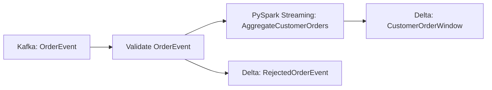

# Streaming PySpark

This example builds a complete Pipelantic pipeline that consumes customer
order events from Kafka with PySpark Structured Streaming, validates the events
against typed contracts, applies event-time aggregation with watermarks, and
publishes rolling customer summaries to Delta Lake.

The example demonstrates how Pipelantic extends the same portable contracts,
transformations, planning, validation, lineage, and execution model used for
batch pipelines into unbounded streaming workloads.

## Goal

Build a pipeline that:

1. Reads order events from Kafka.
2. Parses and validates each event.
3. Uses event time rather than processing time.
4. Applies a watermark for late data.
5. Aggregates paid orders by customer and event-time window.
6. Writes valid aggregates to Delta Lake.
7. Routes invalid and excessively late events to quarantine outputs.
8. Uses durable checkpoints for recovery.
9. Preserves exactly-once or at-least-once guarantees explicitly.
10. Generates ODCS, DTCS, DPCS, lineage, and documentation artifacts.

## Architecture

```text
Kafka Order Events
        │
        ▼
Parse and Validate
        │
        ├── invalid ─────► Quarantine Delta Table
        │
        ▼
Event-Time Watermark
        │
        ▼
Stateful Windowed Aggregation
        │
        ▼
foreachBatch Delta Merge
        │
        ▼
Customer Order Summary
```

## Project Structure

```text
streaming-pyspark/
├── pyproject.toml
├── src/
│   └── streaming_pyspark/
│       ├── contracts.py
│       ├── transformations.py
│       ├── pyspark_implementations.py
│       ├── pipeline.py
│       ├── callbacks.py
│       └── profiles.py
├── checkpoints/
├── contracts/
├── docs/
└── tests/
    ├── test_streaming_pipeline.py
    ├── test_late_data.py
    ├── test_checkpoint_recovery.py
    └── test_idempotent_foreach_batch.py
```

## Step 1 — Define the Event Contracts

```python
from datetime import datetime
from decimal import Decimal
from typing import Annotated, Literal

from pydantic import Field

from pipelantic import DataContractModel


class OrderEvent(DataContractModel):
    event_id: str
    order_id: Annotated[int, Field(strict=True, gt=0)]
    customer_id: Annotated[int, Field(strict=True, gt=0)]
    order_total: Annotated[Decimal, Field(ge=0)]
    status: Literal["paid", "cancelled", "refunded"]
    event_time: datetime


class RejectedOrderEvent(DataContractModel):
    event_id: str | None
    raw_payload: str
    reason_code: str
    reason: str
    observed_at: datetime


class CustomerOrderWindow(DataContractModel):
    customer_id: Annotated[int, Field(strict=True, gt=0)]
    window_start: datetime
    window_end: datetime
    paid_order_count: Annotated[int, Field(ge=0)]
    paid_order_total: Annotated[Decimal, Field(ge=0)]
    latest_event_time: datetime
```

These contracts are independent of Kafka, Spark, and Delta Lake.

## Step 2 — Define the Transformation Contract

```python
from pipelantic import Input, Output, Parameter, Transformation


class AggregateCustomerOrders(Transformation):
    orders: Input[OrderEvent]

    watermark_delay: Parameter[str] = "15 minutes"
    window_duration: Parameter[str] = "1 hour"

    result: Output[CustomerOrderWindow]
```

The transformation contract defines event-time semantics rather than Spark API
syntax.

## Step 3 — Add the PySpark Streaming Implementation

```python
from pyspark.sql import functions as F

from pipelantic.pyspark import SparkDataFrame

from .contracts import CustomerOrderWindow, OrderEvent
from .transformations import AggregateCustomerOrders


@AggregateCustomerOrders.implementation(
    "pyspark-streaming",
)
def aggregate_customer_orders(
    orders: SparkDataFrame[OrderEvent],
    watermark_delay: str,
    window_duration: str,
) -> SparkDataFrame[CustomerOrderWindow]:
    aggregated = (
        orders.native
        .filter(F.col("status") == F.lit("paid"))
        .withWatermark(
            "event_time",
            watermark_delay,
        )
        .groupBy(
            F.col("customer_id"),
            F.window(
                F.col("event_time"),
                window_duration,
            ),
        )
        .agg(
            F.count("order_id").alias(
                "paid_order_count"
            ),
            F.sum("order_total").alias(
                "paid_order_total"
            ),
            F.max("event_time").alias(
                "latest_event_time"
            ),
        )
        .select(
            F.col("customer_id"),
            F.col("window.start").alias(
                "window_start"
            ),
            F.col("window.end").alias(
                "window_end"
            ),
            F.col("paid_order_count"),
            F.col("paid_order_total"),
            F.col("latest_event_time"),
        )
    )

    return SparkDataFrame[
        CustomerOrderWindow
    ].from_native(aggregated)
```

The implementation builds a streaming logical plan and does not start the query.

## Step 4 — Define the Streaming Pipeline

```python
from pipelantic import Pipeline, Sink, Source

from .contracts import (
    CustomerOrderWindow,
    OrderEvent,
    RejectedOrderEvent,
)
from .transformations import AggregateCustomerOrders


class CustomerOrderStreamingPipeline(Pipeline):
    orders: Source[OrderEvent] = Source(
        binding="order_events",
    )

    aggregates = AggregateCustomerOrders.step(
        orders=orders.valid,
        watermark_delay="15 minutes",
        window_duration="1 hour",
    )

    curated: Sink[CustomerOrderWindow] = Sink(
        input=aggregates.result,
        binding="customer_order_windows",
    )

    quarantine: Sink[RejectedOrderEvent] = Sink(
        input=orders.invalid,
        binding="rejected_order_events",
    )
```

The source exposes valid and invalid streams through the normal typed
validation model.

## Step 5 — Define the Streaming Profile

```python
from pipelantic import Profile


production = Profile(
    name="production",
    orchestrator="local-python",
    transformation_engine="pyspark",
    execution={
        "mode": "structured-streaming",
        "trigger": {
            "type": "processing-time",
            "interval": "30 seconds",
        },
        "checkpoint": "customer-order-stream",
    },
    bindings={
        "order_events": {
            "plugin": "kafka-json",
            "resource": "orders_kafka",
            "topic": "order-events",
            "starting_offsets": "latest",
        },
        "customer_order_windows": {
            "plugin": "delta",
            "resource": "lakehouse",
            "table": "curated.customer_order_windows",
            "write_mode": "foreach-batch-merge",
            "merge_keys": [
                "customer_id",
                "window_start",
                "window_end",
            ],
        },
        "rejected_order_events": {
            "plugin": "delta",
            "resource": "lakehouse",
            "table": "quarantine.rejected_order_events",
            "write_mode": "append",
        },
    },
    resources={
        "spark": {
            "provider": "databricks",
            "runtime": "serverless",
            "session_timezone": "UTC",
        },
        "orders_kafka": {
            "provider": "kafka",
            "bootstrap_servers": "orders-kafka.internal:9092",
            "credential": "orders-kafka-access",
        },
        "lakehouse": {
            "provider": "databricks-catalog",
        },
        "checkpoints": {
            "provider": "cloud-storage",
            "root": "s3://company-checkpoints/pipelantic/",
        },
    },
)
```

The exact profile API may evolve.

The key separation remains:

- Event-time semantics belong to the transformation.
- Trigger cadence belongs to the execution profile.
- Kafka, Delta, and checkpoint locations belong to bindings and resources.
- Credentials remain external.

## Step 6 — Validate the Pipeline

```python
report = CustomerOrderStreamingPipeline.validate()
report.raise_for_errors()
```

Definition validation should verify:

- The source and sink contracts resolve.
- The streaming transformation interface is valid.
- The graph is acyclic.
- The valid and invalid branches are typed correctly.
- Watermark and window parameters are structurally valid.

## Step 7 — Validate the Streaming Profile

```python
profile_report = (
    CustomerOrderStreamingPipeline.validate_profile(
        production,
    )
)

profile_report.raise_for_errors()
```

Capability validation should verify:

- The PySpark plugin supports Structured Streaming.
- The implementation is streaming-compatible.
- The Kafka source plugin supports the required offset semantics.
- The Delta sink supports streaming writes and merge.
- Checkpoint storage is durable and writable.
- Event-time fields map correctly.
- Stateful aggregation is supported.
- The selected trigger is supported.
- Required delivery guarantees can be preserved.
- Quarantine publication is compatible with replay.

## Step 8 — Build the Streaming Plan

```python
plan = CustomerOrderStreamingPipeline.plan(
    profile=production,
)
```

The plan should identify:

```text
Streaming source:
- Kafka topic order-events
- JSON parsing
- OrderEvent validation

Streaming region:
- Filter paid orders
- Watermark event_time by 15 minutes
- Group into 1-hour windows
- Aggregate count and total

Streaming sinks:
- Delta merge for valid windows
- Delta append for rejected events
```

## Step 9 — Inspect the Plan

```python
compiled = plan.compile(
    target="pyspark",
)

print(
    compiled.optimization_report()
)
```

The report may include:

- Kafka source options
- Required packages
- Event-time field
- Watermark delay
- Window duration
- Stateful operators
- Output mode
- Trigger
- Checkpoint path
- Delta merge keys
- Replay and idempotency requirements

## Step 10 — Start the Streaming Query

```python
execution = CustomerOrderStreamingPipeline.run(
    profile=production,
)
```

A streaming run should return a managed query handle rather than block forever.

Conceptually:

```python
execution.query_id
execution.status()
execution.await_termination()
execution.stop()
```

An async application may use:

```python
execution = await CustomerOrderStreamingPipeline.arun(
    profile=production,
)
```

## Query Lifecycle

The execution layer should coordinate:

```text
Compile streaming plan
        │
        ▼
Acquire Spark session
        │
        ▼
Resolve checkpoint
        │
        ▼
Start streaming query
        │
        ▼
Monitor progress
        │
        ▼
Stop, fail, or recover
```

## Event Time

The pipeline uses `event_time` from the event payload.

Event time determines:

- Window membership
- Watermark progress
- State retention
- Late-data handling
- Finalized results

Processing time should not determine business correctness unless the contract
explicitly says so.

## Watermarks

The transformation declares:

```text
watermark_delay = 15 minutes
```

This allows Spark to finalize state after it believes no relevant events older
than the watermark should arrive.

Watermarks are not exact wall-clock lateness guarantees.

They describe state-management and late-data semantics.

## Late Data

An event may arrive after its event-time window has effectively been finalized.

The pipeline should define what happens to such data.

Possible policies include:

- Drop
- Quarantine
- Route to a late-events output
- Recompute through a correction pipeline
- Retain longer state

The initial example uses a quarantine path for events rejected by the streaming
source or validation layer. A separate typed late-event output may be added when
Spark and the source plugin can identify late drops precisely.

## Late-Event Contract

Conceptually:

```python
class LateOrderEvent(DataContractModel):
    event: OrderEvent
    watermark_at_arrival: datetime
    reason_code: str
```

Late events are business data and should not exist only in logs.

## Stateful Aggregation

The windowed aggregation stores state by:

- Customer ID
- Window start
- Window end

State grows until the watermark allows old windows to be removed.

The plugin should expose:

- State-store size
- Number of active keys
- Rows updated
- Rows removed
- Memory and disk usage
- Watermark progress

## Output Modes

Spark Structured Streaming supports output modes such as:

- Append
- Update
- Complete

The selected mode must match the operation and sink strategy.

A windowed aggregation with Delta `foreachBatch` may use update semantics while
the batch writer performs an idempotent merge.

## `foreachBatch` Delta Merge

The curated sink may use `foreachBatch`.

Conceptually:

```text
Micro-batch result
        │
        ▼
Validate CustomerOrderWindow
        │
        ▼
Delta MERGE by:
- customer_id
- window_start
- window_end
        │
        ▼
Commit target version
```

Each micro-batch should carry a stable batch identity.

## Idempotent Batch Replay

Structured Streaming may replay a micro-batch after failure.

The sink must ensure that replaying batch `N` does not duplicate or corrupt data.

Possible strategies include:

- Deterministic merge keys
- Transaction metadata
- Batch ledger table
- Idempotency key based on query ID and batch ID
- Delta application transaction identifiers

The execution report should record replay guarantees.

## Delivery Guarantees

The plugin should describe guarantees per source and sink combination.

Potential guarantees include:

- At-most-once
- At-least-once
- Effectively exactly-once
- Exactly-once within one transactional sink

The framework should avoid claiming universal exactly-once behavior.

Kafka plus checkpointed offsets plus idempotent Delta merge may provide
effectively exactly-once table results when all assumptions hold.

## Invalid Event Handling

Invalid events may include:

- Malformed JSON
- Missing fields
- Unsupported status
- Negative amount
- Invalid timestamp
- Contract-incompatible values

The source plugin may produce:

```text
valid stream
invalid stream
```

The invalid stream should retain:

- Raw payload
- Reason code
- Reason
- Observed timestamp
- Source partition and offset
- Pipeline and contract identities

## Kafka Metadata

Runtime lineage may include:

- Topic
- Partition
- Offset
- Kafka timestamp
- Consumer group
- Source cluster identity

Kafka metadata should supplement the logical `OrderEvent` contract.

## Source Offsets

The profile may configure:

- Earliest
- Latest
- Explicit offsets
- Timestamp-derived offsets
- Checkpoint recovery

When a valid checkpoint exists, it should normally take precedence over the
initial starting-offset configuration.

## Checkpointing

Structured Streaming requires durable checkpoints for:

- Source offsets
- Query progress
- Watermarks
- State stores
- Sink commit metadata

Checkpoint locations should be:

- Stable across restarts
- Unique per logical streaming query
- Durable
- Access controlled
- Versioned or migrated carefully
- Never shared accidentally between unrelated pipelines

## Checkpoint Identity

A checkpoint path may derive from:

```text
pipeline ID
pipeline version
profile
streaming query ID
```

Changing stateful semantics may require a new checkpoint identity or a formal
migration.

## State Schema Evolution

Stateful transformations may persist encoded state.

Changing:

- Grouping keys
- Window structure
- State value schema
- Watermark semantics

may make existing checkpoints incompatible.

Pipelantic should detect known incompatibilities before restart.

## Restart and Recovery

On restart:

1. Acquire the same checkpoint.
2. Restore source offsets.
3. Restore state.
4. Rebuild the same logical streaming plan.
5. Resume processing.
6. Replay incomplete batches safely.

The execution report should distinguish a fresh start from checkpoint recovery.

## Trigger Modes

Possible trigger modes include:

- Processing time
- Available now
- Once
- Continuous processing where supported

The trigger belongs in the profile.

The transformation's event-time and stateful semantics remain unchanged.

## Available-Now Mode

Available-now is useful for incremental batch-style processing of all currently
available data.

It can simplify:

- Backfills
- Scheduled incremental jobs
- Testing
- Controlled cost environments

The same streaming plan may execute repeatedly with checkpoint continuity.

## Backpressure and Rate Limits

Kafka source configuration may limit intake using settings such as maximum
offsets per trigger.

The profile may express:

```python
"max_offsets_per_trigger": 100000
```

Rate limits should protect:

- Spark state
- Sink throughput
- Cluster capacity
- Downstream Delta performance

## Partitioning

Kafka partitioning influences source parallelism.

The Spark plan may repartition by customer before stateful aggregation.

Partitioning is an execution concern unless it affects a required ordering or
state boundary.

## Streaming Joins

A more advanced pipeline may join:

- Stream to static data
- Stream to stream

Stream-stream joins require:

- Event-time conditions
- Watermarks on both sides
- Bounded state
- Clear late-data semantics

The planner should reject unbounded joins that cannot safely manage state.

## Static Enrichment

A static customer dimension may be joined to the order stream.

```text
Order stream
     │
     ├──► join static Customer dimension
     │
     ▼
Customer-enriched order stream
```

The plugin should define refresh semantics for the static side.

## Quality Gates

Streaming quality gates may operate:

- Per event
- Per micro-batch
- Per event-time window
- Over rolling metrics

A full-dataset quality gate is not meaningful for an unbounded stream unless it
is scoped to a finite interval.

## Streaming Callbacks

Possible callback events include:

- Query started
- Micro-batch started
- Micro-batch completed
- Watermark advanced
- Query idle
- Query failed
- Query terminated
- Checkpoint recovered

Avoid per-record callbacks for high-volume streams.

Use typed side outputs instead.

## Failure Handling

Potential failures include:

- Kafka connectivity failure
- Authentication failure
- JSON parsing failure
- Contract validation failure
- Spark analysis error
- State-store failure
- Checkpoint corruption
- Delta merge conflict
- Sink permission failure
- Cluster termination
- Query cancellation

Plugins should classify these failures and report retry guidance.

## Retry Semantics

Streaming retry may involve:

- Restarting the query from checkpoint
- Replaying the current micro-batch
- Reacquiring the Spark session
- Reconnecting to Kafka
- Retrying a Delta commit

Retry safety depends on checkpoint integrity and sink idempotency.

## Cancellation

A graceful stop should:

- Stop accepting new work
- Complete or cancel the active micro-batch according to policy
- Persist checkpoint progress
- Release provider-owned resources
- Emit a terminal event

Forced termination may require replay on restart.

## Observability

Streaming execution should expose:

- Query ID
- Run ID
- Spark application ID
- Input rows per second
- Processed rows per second
- Batch duration
- Kafka offsets
- Watermark
- State-store rows and bytes
- Sink commit version
- Invalid event count
- Late event count where available
- Last progress timestamp

## Diagnostics

Example:

```text
PMSTREAM412

Pipeline: customer-order-streaming-pipeline
Query: customer-order-stream
Batch: 1042

The Delta merge for batch 1042 failed after the source offsets were read.
The batch will be replayed from checkpoint.

Idempotency requirement:
- merge keys must be deterministic
- query ID and batch ID must be recorded
```

## Lineage

Logical lineage:

```text
OrderEvent
    │
    ▼
AggregateCustomerOrders
    │
    ▼
CustomerOrderWindow
```

Runtime lineage may add:

- Kafka topic, partition, and offsets
- Spark query ID
- Micro-batch ID
- Watermark
- Checkpoint
- Delta source or target version
- Quarantine table
- Streaming commit metadata

## Generate Contracts and Documentation

```python
CustomerOrderStreamingPipeline.write_contracts(
    "contracts/",
)

plan.write_html(
    "docs/customer-order-streaming.html",
    self_contained=True,
)

plan.write_mermaid(
    "docs/customer-order-streaming.mmd",
)
```

Expected contract output:

```text
contracts/
├── data/
│   ├── order-event.odcs.yaml
│   ├── rejected-order-event.odcs.yaml
│   └── customer-order-window.odcs.yaml
├── transformations/
│   └── aggregate-customer-orders.dtcs.yaml
└── pipelines/
    └── customer-order-streaming-pipeline.dpcs.yaml
```

Example diagram:



## Testing with Memory Streams

The SDK may provide test fixtures based on Spark memory streams or controlled
file-stream inputs.

Conceptually:

```python
def test_streaming_pipeline(
    streaming_test_runtime,
) -> None:
    query = CustomerOrderStreamingPipeline.run(
        profile=streaming_test_runtime.profile,
    )

    streaming_test_runtime.add_events(
        [
            valid_order_event(...),
            valid_order_event(...),
        ]
    )

    streaming_test_runtime.process_all_available()

    assert read_summary(...) == expected_summary
    query.stop()
```

## Test Late Data

```python
def test_late_event_policy(
    streaming_test_runtime,
) -> None:
    streaming_test_runtime.advance_watermark(
        "2026-07-15T12:00:00Z",
    )

    streaming_test_runtime.add_events(
        [
            event_at("2026-07-15T10:00:00Z"),
        ]
    )

    streaming_test_runtime.process_all_available()

    assert late_event_was_quarantined()
```

The exact result depends on the declared late-data policy and Spark's supported
observability.

## Test Checkpoint Recovery

```python
def test_checkpoint_recovery(
    streaming_test_runtime,
) -> None:
    first = streaming_test_runtime.start()
    streaming_test_runtime.add_events(first_batch())
    streaming_test_runtime.process_all_available()
    first.stop()

    second = streaming_test_runtime.restart()
    streaming_test_runtime.add_events(second_batch())
    streaming_test_runtime.process_all_available()

    assert no_events_were_reprocessed_incorrectly()
    second.stop()
```

## Test Idempotent `foreachBatch`

```python
def test_batch_replay_is_idempotent(
    streaming_test_runtime,
) -> None:
    streaming_test_runtime.run_batch(
        batch_id=42,
        events=sample_events(),
    )

    streaming_test_runtime.replay_batch(
        batch_id=42,
    )

    assert target_contains_one_logical_result()
```

## Test Invalid Events

```python
def test_invalid_event_is_quarantined(
    streaming_test_runtime,
) -> None:
    streaming_test_runtime.add_raw_payload(
        '{"order_id": -1}',
    )

    streaming_test_runtime.process_all_available()

    assert quarantine_count() == 1
```

## Production Best Practices

- Use event time for business semantics.
- Define watermarks explicitly.
- Use durable checkpoints.
- Treat late data as typed data.
- Keep source offsets and sink commits observable.
- Make replay idempotent.
- Separate trigger cadence from transformation semantics.
- Validate before publication.
- Use side outputs for invalid records.
- Test restart and replay.
- Monitor state-store growth.
- Record query, batch, and checkpoint identities.
- Pin Spark, connector, and Delta versions.

## Anti-Patterns

Avoid:

- Using processing time when event time is required.
- Starting a query inside the transformation implementation.
- Sharing checkpoints across pipelines.
- Claiming exactly-once without qualifying assumptions.
- Using non-idempotent `foreachBatch` writes.
- Hiding invalid or late records in logs.
- Performing per-record network callbacks.
- Using unbounded stream-stream joins.
- Changing stateful schemas without checkpoint migration.
- Disabling checkpointing.
- Treating a streaming query as a finite DataFrame.
- Calling `collect()` on an unbounded stream.

## Key Principle

> Streaming PySpark execution extends Pipelantic to unbounded event-time
> workflows while preserving typed contracts, explicit watermarks, bounded
> state, durable recovery, lineage, validation, and sink guarantees.

## Next Step

Continue with [End to End](END_TO_END.md) to review the complete modeling,
generation, planning, execution, and documentation lifecycle.
